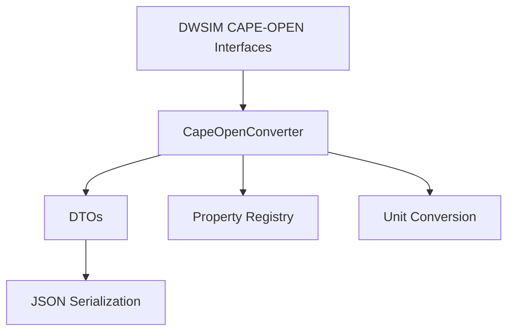

# Design Document

## Overview

This design introduces CAPE-OPEN DTOs and conversion utilities in the .NET worker. It standardizes how DWSIM CAPE-OPEN interfaces are mapped to JSON-serializable data structures with SI-normalized units, enabling future JSON-RPC requests/responses to use consistent, validated payloads.

## Steering Document Alignment

### Technical Standards (tech.md)
- Uses CAPE-OPEN as the primary domain model and maps through standard interface methods.
- Targets .NET Framework 4.8 and Newtonsoft.Json for DTO serialization.
- Maintains clear separation between converters, DTOs, and engine adapters.

### Project Structure (structure.md)
- DTO classes live in `mcp_service/dwsim_worker/DwsimWorker/Contracts/` (one class per file).
- Converter logic lives in `mcp_service/dwsim_worker/DwsimWorker/Converters/`.
- Utility functions (unit conversion, validation) live in `mcp_service/dwsim_worker/DwsimWorker/Utilities/`.
- Tests live in `mcp_service/dwsim_worker/DwsimWorker.Tests/`.

## Code Reuse Analysis

The design reuses the existing project structure and naming conventions for C# classes, converters, and utilities.

### Existing Components to Leverage
- **Converters/CapeOpenConverter.cs**: Extend or create to handle DTO <-> CAPE-OPEN conversions.
- **Utilities/ValidationHelper.cs**: Extend with DTO validation helpers.
- **Newtonsoft.Json**: Use for serialization compatibility tests.

### Integration Points
- **DWSIM CAPE-OPEN Interfaces**: ICapeThermoMaterialObject, ICapeThermoPropertyPackage, ICapeThermoEquilibriumServer.
- **Unit Operations and Flowsheet**: Uses CAPE-OPEN interface methods to extract data.

## Architecture

The mapping layer is composed of DTOs, a property name registry, converters, and unit conversion utilities. Converters use the registry to map known CAPE-OPEN property names to DTO fields, normalizing units via shared conversion utilities and validating DTOs before applying changes to DWSIM objects.

### Modular Design Principles
- **Single File Responsibility**: Each DTO and helper lives in a dedicated file.
- **Component Isolation**: DTOs are pure data classes; converters contain mapping logic only.
- **Service Layer Separation**: Converters do not invoke IPC or higher-level services.
- **Utility Modularity**: Unit conversion and validation are standalone utilities.



## Components and Interfaces

### CAPE-OPEN DTOs
- **Purpose:** Represent CAPE-OPEN data in JSON-serializable form.
- **Interfaces:** Plain data classes with explicit fields.
- **Dependencies:** None beyond base .NET types and Newtonsoft.Json attributes (if needed).
- **Reuses:** Naming conventions from structure.md.

### CapeOpenPropertyRegistry
- **Purpose:** Central mapping of CAPE-OPEN property names and expected units.
- **Interfaces:** Lookup methods (by property name).
- **Dependencies:** Static dictionaries or read-only collections.
- **Reuses:** CAPE-OPEN property name constants.

### CapeOpenConverter
- **Purpose:** Map between DWSIM CAPE-OPEN interfaces and DTOs (bidirectional).
- **Interfaces:** `ToDto(...)`, `ApplyDto(...)` methods for each DTO type.
- **Dependencies:** DWSIM CAPE-OPEN interfaces, DTOs, registry, unit conversion, validation.
- **Reuses:** Existing converter patterns and validation helpers.

### UnitConversion Utility
- **Purpose:** Normalize values to SI and validate supported units.
- **Interfaces:** Conversion methods per property (pressure, temperature, flow, etc.).
- **Dependencies:** Property registry metadata.
- **Reuses:** ValidationHelper for error formatting.

## Data Models

### MaterialStreamDto
```
- Id: string
- Name: string
- TemperatureK: double
- PressurePa: double
- TotalMolarFlowMolPerS: double
- Phases: List<PhaseDto>
```

### PhaseDto
```
- PhaseLabel: string
- PhaseFraction: double
- Composition: List<CompoundFractionDto>
- Properties: Dictionary<string, double>
```

### PropertyPackageDto
```
- Id: string
- Name: string
- PackageType: string
- Parameters: Dictionary<string, string>
```

### UnitOperationDto
```
- Id: string
- Name: string
- UnitType: string
- Parameters: Dictionary<string, double>
```

### FlashResultDto
```
- CalculationType: string
- TemperatureK: double
- PressurePa: double
- Phases: List<PhaseDto>
```

## Error Handling

### Error Scenarios
1. **Unsupported property name**
   - **Handling:** Return a typed error with property name and list of valid names.
   - **User Impact:** Clear message indicating unsupported property.

2. **Unit conversion failure**
   - **Handling:** Throw a conversion exception with unit details.
   - **User Impact:** Error message includes expected unit and received unit.

3. **Validation failure**
   - **Handling:** Collect validation errors and return a structured error list.
   - **User Impact:** User sees which field failed and why.

## Testing Strategy

### Unit Testing
- Validate DTO serialization with Newtonsoft.Json.
- Verify unit conversion for common units (K, Pa, mol/s).
- Test property registry lookups for known and unknown properties.

### Integration Testing
- Convert a DWSIM MaterialStream to DTO and back, verifying property equivalence.
- Validate CAPE-OPEN interface calls through converter methods.

### End-to-End Testing
- Use a three-phase separator setup from phase 1 specs and ensure DTOs round-trip with acceptable tolerance.
