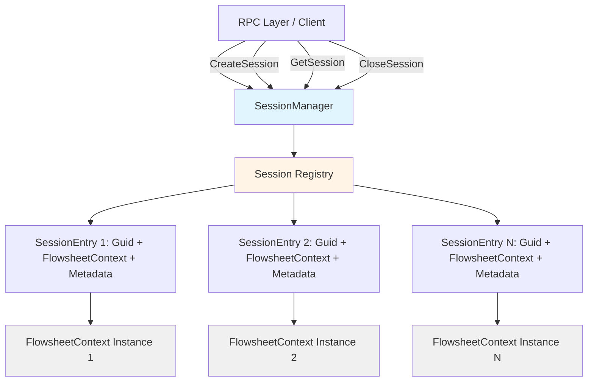

# Design Document

## Overview

The `SessionManager` class provides a thread-safe registry and lifecycle management layer for multiple concurrent `FlowsheetContext` instances. It acts as a factory and coordinator, creating isolated sessions with unique identifiers (GUIDs), maintaining a registry for retrieval, and ensuring proper resource cleanup on disposal.

**Architecture Pattern**: Registry pattern with factory methods and resource management
**Location**: `DwsimWorker/Engine/SessionManager.cs`
**Key Responsibility**: Manage multiple FlowsheetContext lifecycles without directly manipulating DWSIM objects

## Steering Document Alignment

### Technical Standards (tech.md)

**Language**: C# with .NET Framework 4.8
- Using `sealed` class to prevent inheritance (matches FlowsheetContext pattern)
- Implementing `IDisposable` for deterministic cleanup
- Using Serilog for structured logging

**Threading Model**:
- Thread-safe registry operations using `lock` statements
- Compatible with DWSIM's STA requirements (each FlowsheetContext remains on appropriate thread)
- No thread affinity enforced at SessionManager level (delegate to FlowsheetContext)

**Error Handling**:
- Follow existing exception patterns from `DwsimWorker.Exceptions`
- Use `OperationResult<T>` pattern for success/failure returns
- Structured error messages with context

**Logging**:
- Serilog structured logging with session IDs in log context
- Log lifecycle events: session created, retrieved, closed
- Log errors during disposal gracefully

### Project Structure (structure.md)

**File Organization**:
- `DwsimWorker/Engine/SessionManager.cs` - Main session manager class
- `DwsimWorker/Models/SessionInfo.cs` - Public session metadata model
- `DwsimWorker.Tests/Engine/SessionManagerTests.cs` - Unit tests
- `DwsimWorker.Tests/Integration/SessionConcurrencyTests.cs` - Concurrency integration tests

**Naming Conventions**:
- PascalCase for all public members
- Private fields prefixed with underscore: `_sessions`, `_logger`
- Method names: verb-based (`CreateSession`, `CloseSession`, `GetSession`)

**Single File Per Class**: Each class in its own file

## Code Reuse Analysis

### Existing Components to Leverage

- **FlowsheetContext** (`DwsimWorker/Engine/FlowsheetContext.cs`):
  - Already provides complete single-session functionality
  - Has `Initialize()`, `Dispose()`, `IsInitialized` members
  - SessionManager will instantiate and manage these contexts
  - No modifications needed to FlowsheetContext

- **FlowsheetContextConfig** (`DwsimWorker/Models/FlowsheetContextConfig.cs`):
  - Configuration object for FlowsheetContext creation
  - SessionManager will accept optional config per session
  - Default config can be provided in SessionManager constructor

- **Serilog ILogger**:
  - Already used throughout codebase
  - SessionManager will accept ILogger in constructor
  - Use child loggers with session ID enrichment

- **OperationResult Pattern** (`DwsimWorker/Models/OperationResult.cs`):
  - Already used for success/failure returns in adapters
  - SessionManager will return `OperationResult<Guid>` for CreateSession
  - SessionManager will return `OperationResult<FlowsheetContext>` for GetSession

### Integration Points

- **Adapter Classes** (CompoundAdapter, StreamAdapter, etc.):
  - Adapters will continue to receive FlowsheetContext in constructors
  - SessionManager doesn't depend on adapters (clean separation)
  - Future RPC layer will retrieve context from SessionManager, then pass to adapters

- **Future JSON-RPC Server** (Spec 3.1):
  - Will call `SessionManager.CreateSession()` for `session.create` RPC method
  - Will call `SessionManager.GetSession()` to retrieve context for operation routing
  - Will call `SessionManager.CloseSession()` for `session.close` RPC method

## Architecture

The SessionManager uses a **Registry Pattern** with thread-safe access:



**Design Principles**:
- **Single Responsibility**: SessionManager only manages lifecycle, doesn't perform DWSIM operations
- **Encapsulation**: Internal SessionEntry class hides implementation details
- **Thread Safety**: All public methods use locking for concurrent access
- **Resource Management**: IDisposable pattern ensures cleanup of all sessions
- **Fail-Safe**: Disposal errors are logged but don't prevent registry cleanup

## Components and Interfaces

### Component 1: SessionManager

**Purpose**: Manages lifecycle of multiple FlowsheetContext instances with unique session IDs

**Public Interface**:
```csharp
public sealed class SessionManager : IDisposable
{
    // Constructor
    public SessionManager(ILogger logger, FlowsheetContextConfig defaultConfig)

    // Session creation
    public OperationResult<Guid> CreateSession(string flowsheetName = null, FlowsheetContextConfig config = null)

    // Session retrieval
    public OperationResult<FlowsheetContext> GetSession(Guid sessionId)
    public bool SessionExists(Guid sessionId)
    public IReadOnlyList<SessionInfo> GetAllSessions()

    // Session disposal
    public OperationResult<bool> CloseSession(Guid sessionId)
    public void CloseAllSessions()

    // IDisposable
    public void Dispose()
}
```

**Dependencies**:
- `Serilog.ILogger` for logging
- `FlowsheetContext` for session instances
- `FlowsheetContextConfig` for configuration

**Reuses**:
- FlowsheetContext (creates and manages instances)
- OperationResult pattern (return types)
- Serilog logging infrastructure

**Thread Safety Strategy**:
- Private `readonly object _lock = new object();`
- All registry access (add/get/remove) protected by lock
- Lock-free operations: `SessionExists` (reads with lock), `GetAllSessions` (snapshot with lock)

### Component 2: SessionEntry (Private Inner Class)

**Purpose**: Internal data structure holding FlowsheetContext and metadata

**Structure**:
```csharp
private class SessionEntry
{
    public Guid SessionId { get; }
    public FlowsheetContext Context { get; }
    public DateTime CreatedAt { get; }
    public string FlowsheetName { get; }

    public SessionEntry(Guid sessionId, FlowsheetContext context, string flowsheetName)
}
```

**Rationale**: Encapsulates session data, keeps registry value type clean

### Component 3: SessionInfo (Public Model)

**Purpose**: Public-facing metadata about a session (no FlowsheetContext exposure)

**Location**: `DwsimWorker/Models/SessionInfo.cs`

**Structure**:
```csharp
public class SessionInfo
{
    public Guid SessionId { get; }
    public DateTime CreatedAt { get; }
    public string FlowsheetName { get; }
    public bool IsInitialized { get; }

    // Factory method
    internal static SessionInfo FromEntry(SessionEntry entry)
}
```

**Reuses**: Standard model pattern used in `DwsimWorker.Models` namespace

## Data Models

### SessionEntry (Internal)
```csharp
private class SessionEntry
{
    - SessionId: Guid (unique identifier)
    - Context: FlowsheetContext (the managed flowsheet instance)
    - CreatedAt: DateTime (timestamp of creation)
    - FlowsheetName: string (optional name from config or default)
}
```

### SessionInfo (Public)
```csharp
public class SessionInfo
{
    - SessionId: Guid (unique identifier)
    - CreatedAt: DateTime (timestamp of creation)
    - FlowsheetName: string (name of flowsheet)
    - IsInitialized: bool (whether context is initialized)
}
```

### Session Registry
```csharp
private readonly Dictionary<Guid, SessionEntry> _sessions;
```
- **Key**: Guid (session ID)
- **Value**: SessionEntry (context + metadata)
- **Access Pattern**: Create once, read many, delete once
- **Concurrency**: Protected by `_lock` object

## Error Handling

### Error Scenarios

1. **Session Creation Failure (FlowsheetContext.Initialize() throws)**
   - **Handling**: Catch exception, do NOT add to registry, dispose partial context
   - **Return**: `OperationResult<Guid>.Failure("Failed to initialize session: {exception.Message}")`
   - **User Impact**: RPC client receives error, can retry with different config

2. **Session Not Found**
   - **Handling**: Check registry, return failure if not exists
   - **Return**: `OperationResult<FlowsheetContext>.Failure($"Session {sessionId} not found")`
   - **User Impact**: RPC client receives clear error, should check session ID

3. **Session Already Closed (Double Close)**
   - **Handling**: Check if exists, if not, log warning and return success (idempotent)
   - **Return**: `OperationResult<bool>.Success(false)` with message "Session already closed"
   - **User Impact**: No error, idempotent operation

4. **FlowsheetContext Disposal Throws Exception**
   - **Handling**: Catch exception, log error with context, still remove from registry
   - **Rationale**: Prevent one bad disposal from blocking cleanup of other sessions
   - **User Impact**: Session removed from registry, error logged for diagnostics

5. **Concurrent Access to Same Session**
   - **Handling**: Lock ensures one operation at a time on registry
   - **Note**: FlowsheetContext itself is NOT thread-safe, caller must serialize operations
   - **User Impact**: Multiple threads can create/close different sessions concurrently

6. **SessionManager Disposed While Sessions Active**
   - **Handling**: Dispose() calls CloseAllSessions(), logs each disposal
   - **Return**: No return (Dispose pattern)
   - **User Impact**: Clean shutdown, all resources released

## Testing Strategy

### Unit Testing (DwsimWorker.Tests/Engine/SessionManagerTests.cs)

**Test Categories**:
1. **Session Creation**:
   - `CreateSession_WithDefaultConfig_ReturnsUniqueGuid`
   - `CreateSession_WithCustomConfig_UsesProvidedConfig`
   - `CreateSession_MultipleTimes_ReturnsUniqueGuids`
   - `CreateSession_WhenInitializationFails_DoesNotAddToRegistry`

2. **Session Retrieval**:
   - `GetSession_WithValidId_ReturnsContext`
   - `GetSession_WithInvalidId_ReturnsFailure`
   - `SessionExists_WithValidId_ReturnsTrue`
   - `SessionExists_WithInvalidId_ReturnsFalse`
   - `GetAllSessions_ReturnsAllActiveSessions`
   - `GetAllSessions_WhenEmpty_ReturnsEmptyList`

3. **Session Disposal**:
   - `CloseSession_WithValidId_RemovesFromRegistry`
   - `CloseSession_WithInvalidId_ReturnsFailure`
   - `CloseSession_CalledTwice_IsIdempotent`
   - `CloseAllSessions_RemovesAllSessions`
   - `Dispose_ClosesAllActiveSessions`

4. **Metadata**:
   - `CreateSession_RecordsCreationTime`
   - `GetAllSessions_ReturnsCorrectMetadata`
   - `SessionInfo_ReflectsInitializationStatus`

**Mocking Strategy**:
- Cannot mock FlowsheetContext (sealed), use real instances
- Use TestConfiguration.ValidateDwsimPath() to skip if DWSIM not available
- Tests may need [Trait("Category", "Integration")] if DWSIM required

### Integration Testing (DwsimWorker.Tests/Integration/SessionConcurrencyTests.cs)

**Test Scenarios**:
1. **Concurrent Session Creation**:
   - Create 10 sessions from 5 threads simultaneously
   - Verify all sessions have unique IDs
   - Verify all sessions are functional

2. **Session Isolation**:
   - Create 2 sessions
   - Add different compounds to each
   - Verify compounds don't cross-contaminate
   - Run different calculations in each
   - Verify independent results

3. **Stress Test**:
   - Create 100 sessions sequentially
   - Close all sessions
   - Verify memory released (before/after memory snapshot)

4. **Mixed Operations**:
   - 3 threads: one creating sessions, one using sessions, one closing sessions
   - Run for 10 seconds
   - Verify no deadlocks, race conditions, or exceptions

### Performance Testing (DwsimWorker.Tests/Performance/SessionManagerPerformanceTests.cs)

**Metrics to Validate**:
- Session creation time < 500ms (matches FlowsheetContext initialization)
- Session retrieval time < 1ms (dictionary lookup)
- Session disposal time < 100ms (FlowsheetContext cleanup)
- 20 concurrent sessions supported without performance degradation

**Test Pattern**:
```csharp
[Fact]
public void Performance_SessionRetrieval_UnderOneMillisecond()
{
    // Arrange: Create session
    var createResult = _sessionManager.CreateSession();
    var sessionId = createResult.Data;

    // Act: Measure retrieval time
    var sw = Stopwatch.StartNew();
    var getResult = _sessionManager.GetSession(sessionId);
    sw.Stop();

    // Assert
    Assert.True(getResult.Success);
    Assert.True(sw.ElapsedMilliseconds < 1);
}
```

## Implementation Notes

### Thread Safety Implementation

**Approach**: Coarse-grained locking with single lock object
```csharp
private readonly object _lock = new object();
private readonly Dictionary<Guid, SessionEntry> _sessions;

public OperationResult<Guid> CreateSession(...)
{
    lock (_lock)
    {
        // Create session, add to registry
    }
}
```

**Rationale**:
- Simple, correct, easy to reason about
- Session operations are not expected to be extremely high-frequency
- Lock contention acceptable for creation/disposal operations
- Avoids complex lock-free data structures

**Alternative Considered**: ConcurrentDictionary
- **Rejected**: Still need locking for compound operations (check-then-add)
- No significant benefit for this use case

### STA Threading Considerations

**Current Approach**: No thread affinity enforced at SessionManager level
- SessionManager is thread-safe for concurrent access
- FlowsheetContext instances remain single-threaded (caller responsibility)
- Future RPC layer will handle thread affinity if DWSIM requires STA

**Rationale**:
- FlowsheetContext already documents "NOT thread-safe - use one instance per thread/session"
- SessionManager focuses on registry management, not operation execution
- If STA required in future, add STA enforcement in RPC layer or within FlowsheetContext

### Disposal Pattern

**Two-Level Cleanup**:
1. `CloseSession(Guid)`: Closes specific session
   - Calls `Context.Dispose()`
   - Removes from registry
   - Errors logged but don't throw

2. `Dispose()`: Closes SessionManager itself
   - Calls `CloseAllSessions()`
   - Disposes all active sessions
   - Idempotent (safe to call multiple times)

**Error Resilience**:
```csharp
public void CloseAllSessions()
{
    List<Guid> sessionIds;
    lock (_lock)
    {
        sessionIds = _sessions.Keys.ToList();
    }

    foreach (var id in sessionIds)
    {
        try
        {
            CloseSession(id);
        }
        catch (Exception ex)
        {
            _logger.Error(ex, "Error closing session {SessionId}", id);
            // Continue closing other sessions
        }
    }
}
```

### Configuration Handling

**Default Configuration**:
- SessionManager constructor accepts `FlowsheetContextConfig defaultConfig`
- Used when `CreateSession()` called without explicit config
- Allows consistent settings across sessions

**Per-Session Override**:
- `CreateSession(config: customConfig)` allows per-session configuration
- Use case: Different assembly paths, validation settings, or flowsheet names

## Future Extensibility

**Timeout Enforcement** (Future):
- Add `DateTime LastAccessedAt` to SessionEntry
- Add background thread to check session age
- Call `CloseSession()` for expired sessions

**Quota Enforcement** (Future):
- Add `int MaxConcurrentSessions` to SessionManager constructor
- Check count before creating new session
- Return clear error when quota exceeded

**Session Usage Tracking** (Future):
- Add `int OperationCount` to SessionEntry
- Increment on each operation (via middleware)
- Use for billing or rate limiting

**Events** (Future):
- Add events: `SessionCreated`, `SessionClosed`
- Allow subscribers to react to lifecycle events
- Use for monitoring, logging, or metrics collection

All future additions can be made without breaking existing API.
