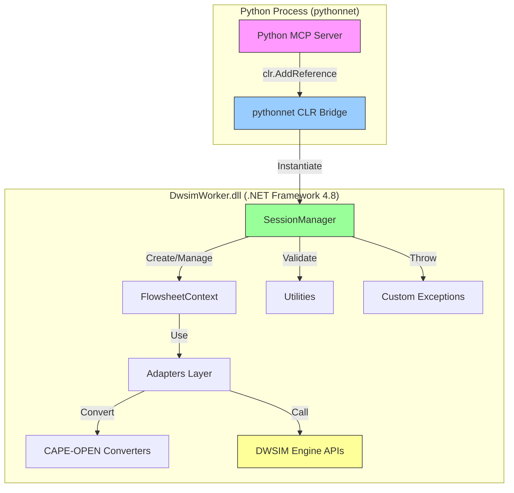

# Design Document

## Overview

This design converts DwsimWorker from a console application (Exe) to a class library (DLL) for pythonnet in-process interop. The conversion is minimal and surgical, preserving all existing functionality while removing console application artifacts and ensuring public APIs are properly exposed and documented for Python consumption.

The class library will be loaded directly by Python via pythonnet's `clr.AddReference()`, enabling zero-overhead method calls to DWSIM simulation functionality without IPC serialization.

## Steering Document Alignment

### Technical Standards (tech.md)

**Architecture Pattern Alignment:**
- Maintains single-process architecture as defined in tech.md (Python + .NET Framework 4.8 via pythonnet)
- Preserves session-based isolation pattern
- Keeps existing STA threading for DWSIM COM compatibility
- Maintains adapter pattern for DWSIM API wrappers

**Dependency Alignment:**
- No new dependencies introduced
- Existing dependencies unchanged (Newtonsoft.Json 13.0.4, Serilog 3.1.1)
- .NET Framework 4.8 target maintained (required for DWSIM)
- DWSIM assembly references preserved

**Technology Stack Compliance:**
- C# 10+ with .NET Framework 4.8 compatibility (LangVersion: latest)
- MSBuild via Visual Studio 2019/2022
- xUnit for unit testing (existing test project unchanged)

### Project Structure (structure.md)

**File Organization Preservation:**
```
DwsimWorker/
├── Engine/              # Session management, DWSIM lifecycle
├── Adapters/            # DWSIM operation wrappers
├── Converters/          # CAPE-OPEN data conversion
├── Models/              # Domain models and DTOs
├── Contracts/           # CAPE-OPEN DTO contracts
├── Utilities/           # Helpers (MassBalanceValidator, UnitConversion)
└── Exceptions/          # Custom exception types
```

No structural changes required - only project configuration modification.

## Code Reuse Analysis

### Existing Components to Leverage

**100% Code Reuse - No Modifications Required:**
- **SessionManager**: Core session lifecycle management (create, close, dispose)
- **FlowsheetContext**: Per-session DWSIM flowsheet context wrapper
- **Adapter Classes**: StreamAdapter, CalculationAdapter, CompoundAdapter, PropertyPackageAdapter, UnitOpAdapter, ConnectionAdapter
- **CAPE-OPEN Converters**: CapeOpenConverter, CapeOpenPropertyConverter, CapeOpenPropertyRegistry
- **Models & DTOs**: All CalculationResult, StreamResult, PhaseProperties, MaterialStreamDto, etc.
- **Utilities**: MassBalanceValidator, UnitConversion, ValidationHelper
- **Exceptions**: All custom exception types (DwsimException hierarchy)

**Single Component to Remove:**
- **Program.cs**: Console application entry point (Main method)

### Integration Points

**pythonnet Integration (New):**
- Python will use `clr.AddReference("DwsimWorker")` to load the DLL
- Python will instantiate `SessionManager` via `from DwsimWorker.Engine import SessionManager`
- All public methods will be callable directly from Python with type conversion handled by pythonnet

**Existing Test Integration (Unchanged):**
- DwsimWorker.Tests.csproj references DwsimWorker
- All unit tests remain valid and pass without modification
- Test project already treats DwsimWorker as a library via project reference

## Architecture

### Modular Design Principles

**No Architectural Changes Required:**
- **Single File Responsibility**: Already implemented (Engine/SessionManager.cs, Adapters/StreamAdapter.cs, etc.)
- **Component Isolation**: Already implemented (Adapters, Converters, Utilities are isolated)
- **Service Layer Separation**: Already implemented (Engine → Adapters → DWSIM)
- **Utility Modularity**: Already implemented (Utilities/ folder with focused helpers)

**Only Configuration Change:**
```
Console Application (Exe) → Class Library (DLL)
```

### Architecture Diagram



## Components and Interfaces

### Component 1: Project Configuration (DwsimWorker.csproj)

**Purpose:** Define build output as class library instead of executable

**Modifications:**
```xml
<!-- BEFORE -->
<OutputType>Exe</OutputType>

<!-- AFTER -->
<OutputType>Library</OutputType>
```

**Additional Changes:**
```xml
<!-- BEFORE -->
<Compile Include="Program.cs" />

<!-- AFTER -->
<!-- Program.cs removed from compilation -->
```

**Dependencies:** None (configuration file)

**Reuses:** Existing package references (Newtonsoft.Json, Serilog)

### Component 2: SessionManager (Engine/SessionManager.cs)

**Purpose:** Primary entry point for Python - manages DWSIM session lifecycle

**Interfaces (Already Public):**
```csharp
public sealed class SessionManager : IDisposable
{
    // Constructor
    public SessionManager(ILogger logger, FlowsheetContextConfig defaultConfig)

    // Session Lifecycle
    public Guid CreateSession(string flowsheetName = "default")
    public bool CloseSession(Guid sessionId)
    public SessionInfo GetSessionInfo(Guid sessionId)
    public IReadOnlyList<SessionInfo> GetAllSessions()

    // IDisposable
    public void Dispose()
}
```

**Design Changes:**
- ✅ **Already public** - no access modifier changes needed
- ✅ **Already has XML documentation** - will enhance with pythonnet usage examples
- ✅ **Constructor already public** - pythonnet can instantiate directly

**Reuses:** FlowsheetContext, SessionInfo model

### Component 3: Adapter Classes (Adapters/*.cs)

**Purpose:** Expose DWSIM operations (stream creation, calculations, compound management)

**Access Modifier Audit:**
- StreamAdapter: **Already public** ✅
- CalculationAdapter: **Already public** ✅
- CompoundAdapter: **Already public** ✅
- PropertyPackageAdapter: **Already public** ✅
- UnitOpAdapter: **Already public** ✅
- ConnectionAdapter: **Already public** ✅

**Design Changes:**
- Add XML documentation to all public methods
- No access modifier changes needed

**Dependencies:** FlowsheetContext, DWSIM engine APIs

**Reuses:** CAPE-OPEN converters, Models (StreamResult, CalculationResult, etc.)

### Component 4: CAPE-OPEN Converters (Converters/*.cs)

**Purpose:** Bidirectional conversion between DWSIM objects and CAPE-OPEN DTOs

**Access Modifier Audit:**
- CapeOpenConverter: **Already public** ✅
- CapeOpenPropertyConverter: **Already public** ✅
- CapeOpenPropertyRegistry: **Already public** ✅

**Design Changes:**
- Add XML documentation to conversion methods
- No access modifier changes needed

**Dependencies:** Contracts/CapeOpen/*.cs DTOs

**Reuses:** DWSIM CAPE-OPEN interfaces

### Component 5: Models and DTOs (Models/*.cs, Contracts/*.cs)

**Purpose:** Data transfer objects for simulation inputs/outputs

**Access Modifier Audit:**
- All model classes: **Already public** ✅
- All DTO classes: **Already public** ✅
- All properties: **Already public** ✅

**Design Changes:**
- Add XML documentation to classes and properties
- No structural changes needed

**Dependencies:** None (POCOs)

**Reuses:** Used by Adapters and Converters

### Component 6: Utilities (Utilities/*.cs)

**Purpose:** Helper functionality (mass balance validation, unit conversion)

**Access Modifier Audit:**
- MassBalanceValidator: **Already public** ✅
- UnitConversion: **Already public** ✅
- ValidationHelper: **Already public** ✅

**Design Changes:**
- Add XML documentation
- No access modifier changes needed

**Dependencies:** Models (for calculation validation)

**Reuses:** Used by CalculationAdapter

### Component 7: Program.cs Removal

**Purpose:** Remove console application entry point

**Strategy:**
- **Option A (Recommended)**: Remove `<Compile Include="Program.cs" />` from .csproj (file remains in folder for reference)
- **Option B**: Delete Program.cs entirely
- **Option C**: Move to docs/ folder as historical reference

**Rationale:** Option A preserves file history while excluding from compilation, making rollback easier if needed.

## Data Models

### No Data Model Changes

All existing data models remain unchanged:

```csharp
// Models/SessionInfo.cs (Example - Already Exists)
public class SessionInfo
{
    public Guid SessionId { get; set; }
    public string FlowsheetName { get; set; }
    public DateTime CreatedAt { get; set; }
    public bool IsInitialized { get; set; }
}

// Contracts/CapeOpen/MaterialStreamDto.cs (Example - Already Exists)
public class MaterialStreamDto
{
    public string Name { get; set; }
    public double Temperature { get; set; }
    public double Pressure { get; set; }
    public double MolarFlow { get; set; }
    public List<CompoundFractionDto> Composition { get; set; }
    // ... other properties
}
```

All DTOs are already public with public properties, suitable for pythonnet marshalling.

## Error Handling

### Error Scenarios

**Scenario 1: pythonnet Assembly Loading Failure**
- **Cause:** DwsimWorker.dll not found, DWSIM dependencies missing, .NET Framework version mismatch
- **Handling:** pythonnet raises CLR exception with detailed error message
- **User Impact:** Python script fails with clear exception traceback pointing to assembly loading issue
- **Mitigation:** Provide Python helper module to check dependencies before loading

**Scenario 2: Type Conversion Errors (Python ↔ C#)**
- **Cause:** Invalid Python type passed to C# method (e.g., string where Guid expected)
- **Handling:** pythonnet raises TypeError or ArgumentException
- **User Impact:** Python developer receives clear exception with expected type information
- **Mitigation:** Pydantic models in Python MCP server validate inputs before calling C#

**Scenario 3: DWSIM Calculation Exceptions**
- **Cause:** Invalid simulation parameters, convergence failures, DWSIM internal errors
- **Handling:** C# throws DwsimException hierarchy (CalculationException, CalculationTimeoutException, etc.)
- **User Impact:** Python catches .NET exceptions via pythonnet, logs error details, returns MCP error response
- **Mitigation:** All existing exception handling preserved; Python wraps C# calls in try/except

**Scenario 4: Session Management Errors**
- **Cause:** Invalid session ID, session already closed, resource exhaustion
- **Handling:** SessionManager throws InvalidOperationException or custom exceptions
- **User Impact:** Python receives descriptive exception, returns MCP error to agent
- **Mitigation:** Existing exception messages already descriptive

### Exception Hierarchy (Preserved)

```
Exception
└── DwsimException (custom base)
    ├── PropertySetException
    ├── CompoundNotFoundException
    ├── InvalidPropertyValueException
    ├── StreamNotFoundException
    ├── UnitNotFoundException
    ├── CalculationException
    ├── CalculationTimeoutException
    └── (others)
```

All exceptions already public with descriptive messages.

## Testing Strategy

### Unit Testing

**No Test Changes Required:**
- DwsimWorker.Tests.csproj already references DwsimWorker as a library (project reference)
- All existing tests (89 tests across multiple test classes) remain valid
- Test execution unchanged

**Test Categories (Existing):**
- `Engine/SessionManagerTests.cs`: Session lifecycle, concurrency
- `Adapters/CalculationAdapterTests.cs`: Calculation operations
- `CapeOpenConverterTests.cs`: DTO conversion round-trips
- `Models/CalculationModelsTests.cs`: Model validation
- `Utilities/MassBalanceValidatorTests.cs`: Validation logic
- `Integration/`: Three-phase separator, session concurrency
- `Performance/`: Calculation performance, session throughput

**Validation:**
1. Build DwsimWorker as library
2. Run all unit tests → Expect 100% pass rate
3. If any test fails, investigate and fix before proceeding

### Integration Testing

**New Integration Test Required:**

**Test: pythonnet Assembly Loading**
- **Setup:** Python script with pythonnet installed
- **Action:**
  ```python
  import clr
  clr.AddReference("DwsimWorker")
  from DwsimWorker.Engine import SessionManager
  from Serilog import Log

  # Test instantiation
  manager = SessionManager(Log.Logger, config)
  ```
- **Expected:** DwsimWorker.dll loads successfully, SessionManager instantiates, no exceptions
- **Validates:** DLL is pythonnet-compatible, public API accessible

**Test: Python-to-C# Type Marshalling**
- **Setup:** Create SessionManager from Python
- **Action:** Call CreateSession("test-session"), GetAllSessions(), CloseSession(guid)
- **Expected:** Methods execute correctly, return values marshalled to Python types
- **Validates:** pythonnet type conversion works bidirectionally

### End-to-End Testing

**Future E2E Test (Not in This Spec):**
- Python MCP Server → pythonnet → DwsimWorker.dll → DWSIM Engine
- Three-phase separator workflow end-to-end
- Validates complete integration chain

**Current Scope:** Validate DLL builds and loads via pythonnet only

## Implementation Notes

### Build Process Changes

**Before (Console Application):**
```bash
msbuild DwsimWorker.csproj /p:Configuration=Release
# Produces: bin\Release\DwsimWorker.exe
```

**After (Class Library):**
```bash
msbuild DwsimWorker.csproj /p:Configuration=Release
# Produces: bin\Release\DwsimWorker.dll
```

**No script changes required** - build.bat remains unchanged, just output type differs.

### XML Documentation Generation

**Enable XML Documentation Output:**
```xml
<PropertyGroup>
  <DocumentationFile>bin\$(Configuration)\DwsimWorker.xml</DocumentationFile>
</PropertyGroup>
```

This generates DwsimWorker.xml alongside DwsimWorker.dll, which pythonnet can use for IntelliSense hints.

### pythonnet Compatibility Checklist

- ✅ Public classes and methods
- ✅ No COM interop requirements (DWSIM handles internally)
- ✅ .NET Framework 4.8 compatible
- ✅ DTOs have parameterless constructors
- ✅ Properties have public getters/setters
- ✅ Exceptions are standard .NET types

All requirements already met by existing codebase.

## Summary

This is a **minimal, surgical change**:
- **1 line change** in DwsimWorker.csproj: `<OutputType>Exe</OutputType>` → `<OutputType>Library</OutputType>`
- **1 line removal** in DwsimWorker.csproj: Exclude Program.cs from compilation
- **Add XML documentation** to public APIs (non-breaking enhancement)
- **Enable XML doc file generation** (optional but recommended)

**Zero functional changes** - all existing code remains operational and tested.
