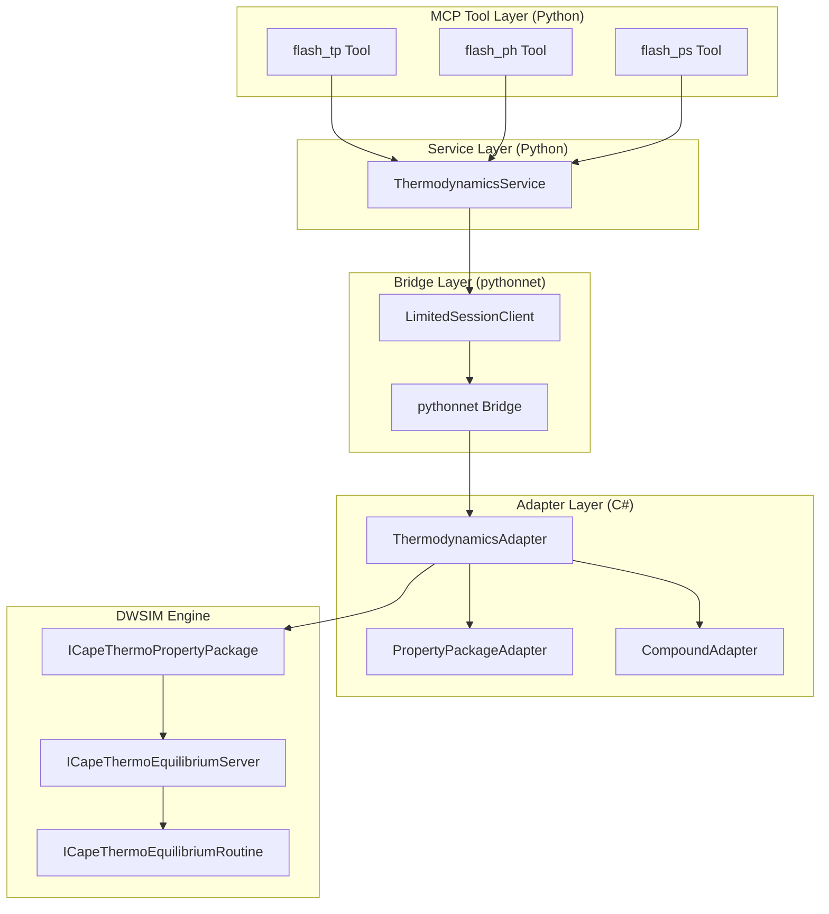

# Design Document: Thermodynamic Flash Calculation Tools

## Overview

This design document describes the implementation of standalone thermodynamic flash calculation MCP tools (`flash_tp`, `flash_ph`, `flash_ps`) for the DWSIM MCP Server. These tools expose phase equilibrium calculations directly to LLM agents without requiring a full flowsheet simulation, enabling faster property lookups and point calculations.

The flash tools build on the existing `flash_stream` functionality in the flowsheet tools but extend it to support standalone calculations with arbitrary mixtures, not just streams already in a flowsheet. They leverage DWSIM's property package thermodynamic engine and CAPE-OPEN interfaces.

## Steering Document Alignment

### Technical Standards (tech.md)

- **pythonnet In-Process Interop**: Flash calculations use the established pythonnet bridge to call DwsimWorker.dll, avoiding IPC overhead for low-latency thermodynamic calculations.
- **CAPE-OPEN Domain Model**: Flash inputs/outputs use CAPE-OPEN standard property names and interface methods (`ICapeThermoEquilibriumServer`, `ICapeThermoEquilibriumRoutine`).
- **Pydantic Validation**: All MCP tool inputs validated via Pydantic models before reaching the C# layer.
- **Session-Based Architecture**: Flash calculations operate within existing sessions, reusing configured property packages and compound databases.
- **Structured Logging**: All flash operations logged with correlation IDs (sessionId, requestId).

### Project Structure (structure.md)

- **Python MCP Tools**: New `analysis.py` file in `mcp_service/server/dwsim_mcp_server/tools/` for flash tools.
- **Python Service Layer**: New `ThermodynamicsService` class for high-level flash operations.
- **C# Adapter**: New `ThermodynamicsAdapter.cs` in `DwsimWorker/Adapters/` for DWSIM flash calculations.
- **Models**: New Pydantic models in `models/mcp_inputs/` and `models/responses/` for flash I/O.
- **One File Per Class**: Each new class in its own file per project conventions.

## Code Reuse Analysis

### Existing Components to Leverage

- **`StreamAdapter.FlashStream()`**: Existing flash calculation logic that calls DWSIM's `Calculate()` method on streams. Patterns for invoking flash and extracting results can be reused.
- **`PropertyPackageAdapter`**: Existing adapter for configuring and accessing property packages. Flash calculations will use the session's configured property package.
- **`CompoundAdapter`**: Existing compound database access for validating compound names and retrieving compound data.
- **`FlowsheetContext`**: Session state management for accessing property packages and managing flash calculation context.
- **`CapeOpenConverter`**: Existing converter for transforming DWSIM objects to CAPE-OPEN DTOs. Has `CreateFlashResult()` method already.
- **`FlashResultDto`**: Existing C# DTO for flash results with temperature, pressure, and phase data.
- **`LimitedSessionClient`**: Resource-limited session operations with timeout enforcement.
- **`FlowsheetService`**: Pattern for bridging MCP inputs to pythonnet worker adapters.

### Integration Points

- **Session Management**: Flash tools require an active session with configured property package (enforced at service layer).
- **Property Package**: Uses session's `ICapeThermoPropertyPackage` for thermodynamic calculations.
- **Compound Database**: Validates compound names against DWSIM's compound database via `CompoundAdapter`.
- **Observability**: Integrates with existing structured logging and metrics infrastructure.

## Architecture

The flash tools follow the established three-layer architecture:

1. **MCP Tool Layer** (`analysis.py`): Tool definitions, input validation, error handling
2. **Service Layer** (`ThermodynamicsService`): Business logic, session coordination, type conversion
3. **Adapter Layer** (`ThermodynamicsAdapter.cs`): Direct DWSIM API interaction via reflection



### Modular Design Principles

- **Single File Responsibility**: `analysis.py` handles only flash/analysis tools; `ThermodynamicsService` handles only thermodynamic calculations.
- **Component Isolation**: Flash calculations are isolated from flowsheet simulation; can be tested independently.
- **Service Layer Separation**: MCP tool layer handles protocol concerns; service layer handles business logic; adapter layer handles DWSIM interaction.
- **Utility Modularity**: Composition normalization and unit conversion extracted to reusable utility functions.

## Components and Interfaces

### Component 1: Flash MCP Tools (`analysis.py`)

- **Purpose**: Define MCP tool schemas and dispatch flash tool calls to ThermodynamicsService
- **Interfaces**:
  - `build_analysis_tools() -> list[types.Tool]`: Returns flash tool definitions
  - `handle_analysis_tool(tool_name, arguments, dependencies) -> Any`: Routes tool calls
- **Dependencies**: ThermodynamicsService, LimitedSessionClient, Pydantic models
- **Reuses**: Pattern from `simulation.py` for tool building and error handling

### Component 2: ThermodynamicsService (`thermodynamics_service.py`)

- **Purpose**: High-level Python service for thermodynamic calculations
- **Interfaces**:
  - `flash_tp(payload: FlashTPInput) -> FlashResult`: Temperature-pressure flash
  - `flash_ph(payload: FlashPHInput) -> FlashResult`: Pressure-enthalpy flash
  - `flash_ps(payload: FlashPSInput) -> FlashResult`: Pressure-entropy flash
- **Dependencies**: LimitedSessionClient, ThermodynamicsAdapter (via pythonnet)
- **Reuses**: Pattern from `FlowsheetService` for session operations

### Component 3: ThermodynamicsAdapter (`ThermodynamicsAdapter.cs`)

- **Purpose**: C# adapter for DWSIM thermodynamic calculations
- **Interfaces**:
  - `FlashTP(compounds, composition, temperature, pressure) -> FlashResultDto`
  - `FlashPH(compounds, composition, pressure, enthalpy) -> FlashResultDto`
  - `FlashPS(compounds, composition, pressure, entropy) -> FlashResultDto`
- **Dependencies**: FlowsheetContext, PropertyPackageAdapter, CompoundAdapter, CapeOpenConverter
- **Reuses**: Patterns from `StreamAdapter.FlashStream()` for invoking DWSIM flash

### Component 4: Flash Input/Output Models

- **Purpose**: Pydantic models for MCP tool validation and serialization
- **Files**:
  - `models/mcp_inputs/flash_inputs.py`: FlashTPInput, FlashPHInput, FlashPSInput
  - `models/responses/flash_result_response.py`: FlashResultResponse, PhaseResult
- **Dependencies**: Pydantic BaseModel
- **Reuses**: Pattern from existing `FlashStreamInput` model

## Data Models

The flash tools follow the existing C# data model for units, measurements, and physical quantities. Python classes mirror the C# hierarchy with Enums for all fixed string values.

### Clean Code Naming Conventions (per docs/standards)

Per the clean coding standards:
- **Class names**: Nouns/noun phrases, pluralized (e.g., `PhysicalQuantities`, `Measurements`)
- **Method names**: Verbs/verb phrases (e.g., `validate`, `convert`)
- **Enums**: PascalCase for enum class, UPPER_SNAKE_CASE for values
- **Single Responsibility**: Each class has one reason to change
- **No noise words**: Avoid `Info`, `Data`, `Manager` suffixes

### Existing C# Data Model (Reused)

The project has a well-designed hierarchy for physical quantities:

```
PhysicalQuantities (abstract)     # What is being measured
├── Temperatures
├── Pressures
├── FlowRates (abstract)
│   ├── MassFlowRates
│   ├── MolarFlowRates
│   └── VolumetricFlowRates
├── Distances
├── MolarEnthalpies (new)
└── MolarEntropies (new)

UnitsOfMeasure                    # How it's measured
├── UnitName: string              # e.g., "K", "Pa", "J/mol"
├── QuantityType: Type            # Links to PhysicalQuantities subclass
└── ValidRange: Ranges            # e.g., [0, ∞) for Kelvin

Measurements                      # A specific measurement
├── Quantity: PhysicalQuantities  # What (Temperatures, Pressures)
├── Value: double                 # Numeric value
└── Unit: UnitsOfMeasure          # Unit (K, Pa)

PhysicalProperties                # Named property with measurement
├── Name: string                  # e.g., "InletPressure"
└── Measurement: Measurements     # The value with unit
```

### Python Enums for Fixed Values

```python
# models/enums/flash_calculation_types.py
"""Enumeration of flash calculation types."""
from enum import Enum

class FlashCalculationTypes(str, Enum):
    """Types of thermodynamic flash calculations."""
    TEMPERATURE_PRESSURE = "TP"
    PRESSURE_ENTHALPY = "PH"
    PRESSURE_ENTROPY = "PS"
    TEMPERATURE_VAPOR_FRACTION = "TVF"
    PRESSURE_VAPOR_FRACTION = "PVF"
```

```python
# models/enums/phase_types.py
"""Enumeration of thermodynamic phase types."""
from enum import Enum

class PhaseTypes(str, Enum):
    """Types of thermodynamic phases in equilibrium."""
    VAPOR = "Vapor"
    LIQUID = "Liquid"
    LIQUID2 = "Liquid2"  # Second liquid phase (e.g., oil-water)
    AQUEOUS = "Aqueous"
    SOLID = "Solid"
```

```python
# models/enums/physical_quantity_types.py
"""Enumeration of physical quantity types mirroring C# PhysicalQuantities."""
from enum import Enum

class PhysicalQuantityTypes(str, Enum):
    """Types of physical quantities that can be measured."""
    TEMPERATURE = "Temperature"
    PRESSURE = "Pressure"
    MOLAR_ENTHALPY = "MolarEnthalpy"
    MOLAR_ENTROPY = "MolarEntropy"
    DENSITY = "Density"
    DYNAMIC_VISCOSITY = "DynamicViscosity"
    THERMAL_CONDUCTIVITY = "ThermalConductivity"
    MOLAR_HEAT_CAPACITY_CP = "MolarHeatCapacityCp"
    MOLAR_HEAT_CAPACITY_CV = "MolarHeatCapacityCv"
    MOLECULAR_WEIGHT = "MolecularWeight"
    COMPRESSIBILITY_FACTOR = "CompressibilityFactor"
    GIBBS_ENERGY = "GibbsEnergy"
    SURFACE_TENSION = "SurfaceTension"
    MOLAR_FLOW_RATE = "MolarFlowRate"
    MASS_FLOW_RATE = "MassFlowRate"
    VOLUMETRIC_FLOW_RATE = "VolumetricFlowRate"
```

```python
# models/enums/unit_symbols.py
"""Enumeration of unit symbols for physical quantities."""
from enum import Enum

class TemperatureUnits(str, Enum):
    """Temperature unit symbols."""
    KELVIN = "K"
    CELSIUS = "C"
    FAHRENHEIT = "F"
    RANKINE = "R"

class PressureUnits(str, Enum):
    """Pressure unit symbols."""
    PASCAL = "Pa"
    KILOPASCAL = "kPa"
    MEGAPASCAL = "MPa"
    BAR = "bar"
    ATMOSPHERE = "atm"
    PSI = "psi"

class MolarEnergyUnits(str, Enum):
    """Molar energy unit symbols (enthalpy, Gibbs energy)."""
    JOULE_PER_MOLE = "J/mol"
    KILOJOULE_PER_MOLE = "kJ/mol"
    BTU_PER_LBMOL = "BTU/lbmol"

class MolarEntropyUnits(str, Enum):
    """Molar entropy unit symbols."""
    JOULE_PER_MOLE_KELVIN = "J/(mol·K)"
    KILOJOULE_PER_MOLE_KELVIN = "kJ/(mol·K)"

class DensityUnits(str, Enum):
    """Density unit symbols."""
    KG_PER_CUBIC_METER = "kg/m³"
    G_PER_CUBIC_CM = "g/cm³"
    LB_PER_CUBIC_FT = "lb/ft³"

class ViscosityUnits(str, Enum):
    """Dynamic viscosity unit symbols."""
    PASCAL_SECOND = "Pa·s"
    CENTIPOISE = "cP"
    POISE = "P"
```

### Python Mirror Classes for C# Data Model

```python
# models/measurements/ranges.py
"""Range validation for physical quantity measurements."""
from pydantic import BaseModel
from typing import Optional

class Ranges(BaseModel):
    """Represents a valid range for a physical quantity measurement.
    
    Mirrors C# DwsimWorker.Models.Ranges struct.
    """
    min_value: float
    max_value: float
    
    def contains(self, value: float) -> bool:
        """Check if a value is within this range."""
        return self.min_value <= value <= self.max_value
```

```python
# models/measurements/units_of_measure.py
"""Unit of measure for physical quantities."""
from pydantic import BaseModel
from typing import Optional
from models.enums.physical_quantity_types import PhysicalQuantityTypes
from models.measurements.ranges import Ranges

class UnitsOfMeasure(BaseModel):
    """Represents a unit of measure for a specific physical quantity.
    
    Mirrors C# DwsimWorker.Models.UnitsOfMeasure class.
    """
    unit_name: str  # e.g., "K", "Pa", "J/mol"
    quantity_type: PhysicalQuantityTypes  # What this unit measures
    valid_range: Optional[Ranges] = None  # Valid value range
    
    def is_value_valid(self, value: float) -> bool:
        """Validate that a value is within the valid range for this unit."""
        if self.valid_range is None:
            return True
        return self.valid_range.contains(value)
```

```python
# models/measurements/measurements.py
"""Measurement combining value, quantity, and unit."""
from pydantic import BaseModel, field_validator
from typing import Optional
from models.enums.physical_quantity_types import PhysicalQuantityTypes
from models.measurements.units_of_measure import UnitsOfMeasure

class Measurements(BaseModel):
    """Represents a measurement of a physical quantity using a specific unit.
    
    Mirrors C# DwsimWorker.Models.Measurements class.
    """
    quantity_type: PhysicalQuantityTypes  # What is being measured
    value: float  # Numeric value
    unit: UnitsOfMeasure  # Unit of measure
    
    @field_validator("unit")
    @classmethod
    def validate_unit_matches_quantity(cls, unit, info):
        """Ensure unit's quantity type matches the measurement's quantity type."""
        if "quantity_type" in info.data:
            if unit.quantity_type != info.data["quantity_type"]:
                raise ValueError(
                    f"Unit type mismatch: Unit '{unit.unit_name}' is for "
                    f"{unit.quantity_type}, but quantity is {info.data['quantity_type']}"
                )
        return unit
```

```python
# models/measurements/physical_properties.py
"""Named physical property with measurement."""
from pydantic import BaseModel
from typing import Optional
from models.measurements.measurements import Measurements

class PhysicalProperties(BaseModel):
    """Represents a named physical property with its measurement.
    
    Mirrors C# DwsimWorker.Models.PhysicalProperties class.
    """
    name: str  # Property name (e.g., "InletPressure", "Density")
    measurement: Optional[Measurements] = None  # The measurement value
    
    @property
    def value(self) -> Optional[float]:
        """Get the numeric value of this property's measurement."""
        return self.measurement.value if self.measurement else None
    
    @property
    def unit_name(self) -> Optional[str]:
        """Get the unit name of this property's measurement."""
        return self.measurement.unit.unit_name if self.measurement else None
```

### Flash Input Models (using Measurements pattern)

```python
# models/mcp_inputs/flash_inputs.py
"""Input models for flash calculation MCP tools."""
from pydantic import BaseModel, Field, field_validator
from typing import List
from models.measurements.measurements import Measurements

class FlashTPInputs(BaseModel):
    """Input for temperature-pressure flash calculation."""
    session_id: str = Field(..., description="Session with configured property package")
    compounds: List[str] = Field(..., description="Compound names", min_length=1)
    composition: List[float] = Field(..., description="Mole fractions (must sum to 1.0)")
    temperature: Measurements = Field(..., description="Temperature measurement")
    pressure: Measurements = Field(..., description="Pressure measurement")
    
    @field_validator("composition")
    @classmethod
    def validate_composition_sum(cls, v, info):
        """Ensure composition sums to 1.0 within tolerance."""
        total = sum(v)
        if abs(total - 1.0) > 0.001:
            raise ValueError(f"Composition must sum to 1.0, got {total}")
        return v

class FlashPHInputs(BaseModel):
    """Input for pressure-enthalpy flash calculation."""
    session_id: str
    compounds: List[str] = Field(..., min_length=1)
    composition: List[float]
    pressure: Measurements
    enthalpy: Measurements  # Molar enthalpy

class FlashPSInputs(BaseModel):
    """Input for pressure-entropy flash calculation."""
    session_id: str
    compounds: List[str] = Field(..., min_length=1)
    composition: List[float]
    pressure: Measurements
    entropy: Measurements  # Molar entropy
```

### Flash Result Models (using Enums)

```python
# models/responses/flash_results.py
"""Response models for flash calculation results."""
from pydantic import BaseModel, Field
from typing import Dict, List, Optional
from models.enums.flash_calculation_types import FlashCalculationTypes
from models.enums.phase_types import PhaseTypes
from models.measurements.physical_properties import PhysicalProperties

class PhaseResults(BaseModel):
    """Results for a single phase in flash calculation."""
    phase_type: PhaseTypes  # Enum: VAPOR, LIQUID, etc.
    fraction: float = Field(..., ge=0.0, le=1.0, description="Phase mole fraction")
    composition: Dict[str, float] = Field(..., description="Component mole fractions")
    properties: List[PhysicalProperties] = Field(default_factory=list)

class FlashResults(BaseModel):
    """Complete results from a flash calculation."""
    calculation_type: FlashCalculationTypes  # Enum: TP, PH, PS
    temperature: PhysicalProperties  # Equilibrium temperature
    pressure: PhysicalProperties  # Equilibrium pressure
    converged: bool = Field(..., description="True if flash converged")
    phases: List[PhaseResults] = Field(default_factory=list)
    message: Optional[str] = Field(None, description="Error/warning message")
    iteration_count: Optional[int] = Field(None, description="Solver iterations")
```

### New Physical Quantities (C# - to be added)

```csharp
// Models/MolarEnthalpy.cs
/// <summary>
/// Represents the physical quantity of molar enthalpy.
/// </summary>
public sealed class MolarEnthalpy : PhysicalQuantities
{
    public override string QuantityName => "MolarEnthalpy";
}

// Models/MolarEntropy.cs
/// <summary>
/// Represents the physical quantity of molar entropy.
/// </summary>
public sealed class MolarEntropy : PhysicalQuantities
{
    public override string QuantityName => "MolarEntropy";
}

// Models/Density.cs
/// <summary>
/// Represents the physical quantity of density.
/// </summary>
public sealed class Density : PhysicalQuantities
{
    public override string QuantityName => "Density";
}

// Models/DynamicViscosity.cs
/// <summary>
/// Represents the physical quantity of dynamic viscosity.
/// </summary>
public sealed class DynamicViscosity : PhysicalQuantities
{
    public override string QuantityName => "DynamicViscosity";
}

// Models/ThermalConductivity.cs
/// <summary>
/// Represents the physical quantity of thermal conductivity.
/// </summary>
public sealed class ThermalConductivity : PhysicalQuantities
{
    public override string QuantityName => "ThermalConductivity";
}

// Models/MolarHeatCapacity.cs
/// <summary>
/// Represents the physical quantity of molar heat capacity.
/// </summary>
public sealed class MolarHeatCapacity : PhysicalQuantities
{
    public override string QuantityName => "MolarHeatCapacity";
}
```

### Standard Units Registry

| Physical Quantity | SI Unit | Enum Value | Valid Range |
|-------------------|---------|------------|-------------|
| TEMPERATURE | K | `TemperatureUnits.KELVIN` | [0, ∞) |
| PRESSURE | Pa | `PressureUnits.PASCAL` | [0, ∞) |
| MOLAR_ENTHALPY | J/mol | `MolarEnergyUnits.JOULE_PER_MOLE` | (-∞, ∞) |
| MOLAR_ENTROPY | J/(mol·K) | `MolarEntropyUnits.JOULE_PER_MOLE_KELVIN` | (-∞, ∞) |
| DENSITY | kg/m³ | `DensityUnits.KG_PER_CUBIC_METER` | [0, ∞) |
| DYNAMIC_VISCOSITY | Pa·s | `ViscosityUnits.PASCAL_SECOND` | [0, ∞) |
| THERMAL_CONDUCTIVITY | W/(m·K) | N/A | [0, ∞) |
| MOLAR_HEAT_CAPACITY_CP | J/(mol·K) | N/A | [0, ∞) |
| MOLECULAR_WEIGHT | kg/mol | N/A | [0, ∞) |
| COMPRESSIBILITY_FACTOR | - | N/A (dimensionless) | [0, ∞) |

## Error Handling

### Error Scenarios

1. **Property Package Not Configured**
   - **Handling**: Check session state before flash calculation; return clear error
   - **User Impact**: Error message: "Property package must be configured before flash calculations. Use set_property_package tool."

2. **Invalid Compound Name**
   - **Handling**: Validate compounds against database before calculation
   - **User Impact**: Error message: "Compound 'xyz' not found in database. Did you mean: 'xylene'?"

3. **Composition Mismatch**
   - **Handling**: Pydantic validator checks compounds/composition array lengths match
   - **User Impact**: Validation error: "Composition array length (3) does not match compounds array length (4)"

4. **Composition Not Normalized**
   - **Handling**: Check if sum within tolerance (±0.001); optionally normalize with warning
   - **User Impact**: Warning: "Composition normalized from sum=0.998 to 1.0"

5. **Flash Non-Convergence**
   - **Handling**: Return result with `converged=false` and diagnostic message
   - **User Impact**: Error message: "Flash calculation did not converge after 100 iterations. Residual: 1.2e-4. Try different conditions."

6. **Thermodynamic Constraint Violation**
   - **Handling**: Catch DWSIM exception, translate to user-friendly message
   - **User Impact**: Error message: "Enthalpy value -50000 J/mol is outside valid range for mixture at 1 bar."

7. **Timeout**
   - **Handling**: ResourceLimitViolation exception caught by tool layer
   - **User Impact**: Error message: "Flash calculation timed out after 30s."

## Testing Strategy

### Unit Testing

**Python (`tests/unit/`):**
- Test input validation for all flash input models
- Test composition normalization logic
- Test compound validation with mock database
- Test error message formatting
- Test ThermodynamicsService with mocked adapter

**C# (`DwsimWorker.Tests/`):**
- Test ThermodynamicsAdapter with real DWSIM assemblies
- Test FlashResultDto serialization/deserialization
- Test phase property extraction
- Test error handling for non-converging cases

### Integration Testing

**Python-C# Integration (`tests/integration/`):**
- Test flash_tp with methane-ethane mixture (known conditions)
- Test flash_ph with water-steam transition
- Test flash_ps with ideal gas behavior validation
- Test property package dependency enforcement
- Test timeout enforcement with slow calculations
- Verify round-trip: Python → pythonnet → DWSIM → Python

### End-to-End Testing

**MCP Protocol Tests:**
- Test tool discovery (flash tools appear in tool list)
- Test full workflow: create_session → set_property_package → add_compound → flash_tp
- Test error propagation through MCP protocol
- Test structured output format matches schema

### Golden Test Cases

| Test Case | Compounds | T (K) | P (Pa) | Expected |
|-----------|-----------|-------|--------|----------|
| Pure methane vapor | CH4 | 200 | 101325 | Single vapor phase |
| Pure water liquid | H2O | 298 | 101325 | Single liquid phase |
| Methane-ethane VLE | CH4, C2H6 (50/50) | 200 | 2000000 | Two-phase VLE |
| Steam-water | H2O | 373.15 | 101325 | Two-phase at boiling |

## Implementation Sequence

1. **Phase 1: C# Adapter**
   - Create `ThermodynamicsAdapter.cs`
   - Implement `FlashTP` using existing `StreamAdapter.FlashStream` patterns
   - Add unit tests for C# adapter

2. **Phase 2: Python Models**
   - Create flash input models in `models/mcp_inputs/flash_inputs.py`
   - Create flash output models in `models/responses/flash_result_response.py`
   - Add validators for composition, temperature, pressure

3. **Phase 3: Python Service**
   - Create `ThermodynamicsService` class
   - Implement `flash_tp`, `flash_ph`, `flash_ps` methods
   - Add integration with pythonnet bridge

4. **Phase 4: MCP Tools**
   - Create `analysis.py` with tool definitions
   - Wire tools to server dispatcher
   - Add structured logging

5. **Phase 5: Testing**
   - Unit tests for all new components
   - Integration tests with real DWSIM
   - End-to-end MCP protocol tests
