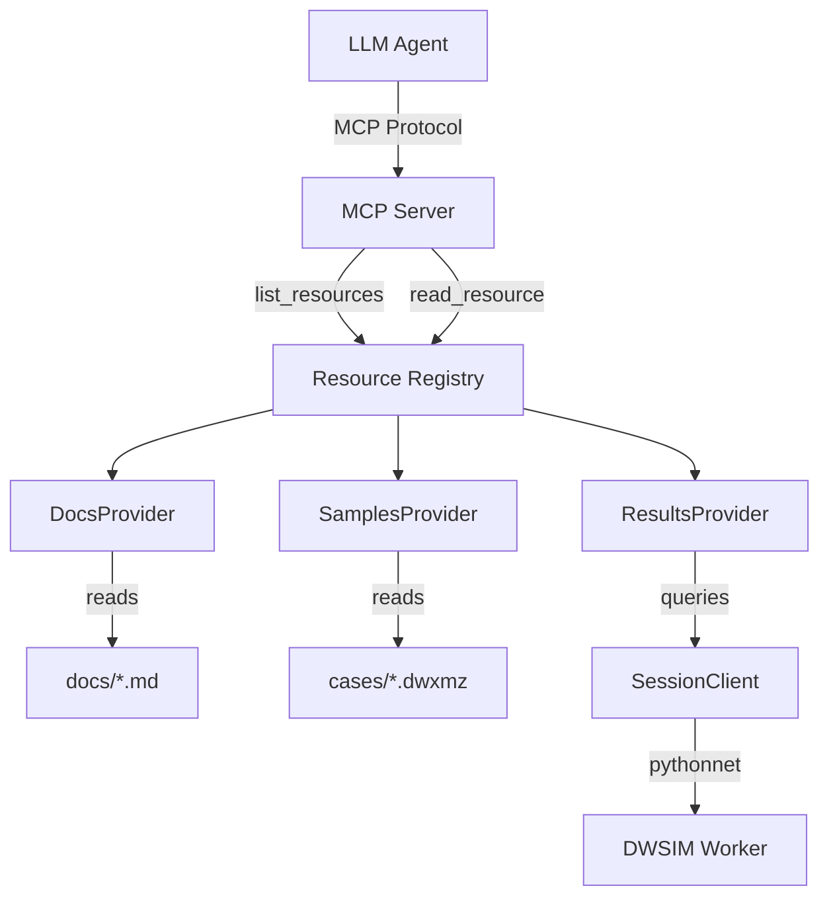

# Design Document: MCP Resource Providers

## Overview

The MCP Resource Providers feature implements three resource categories for the DWSIM MCP Server: session results, documentation, and sample cases. These resources enable LLM agents to access data beyond tool responses, including large result sets, reference documentation, and pre-built flowsheet examples.

Resources follow the MCP protocol's resource specification, providing URIs that agents can read to obtain contextual information. This complements the existing tool-based interface by handling scenarios where data is too large for tool responses or where agents need discoverable reference materials.

## Steering Document Alignment

### Technical Standards (tech.md)

- **Single-Process Architecture**: Resources are served from the Python MCP server, accessing DWSIM data through the existing pythonnet bridge
- **Pydantic Models**: Resource metadata and content use Pydantic for validation and serialization
- **CAPE-OPEN Domain Model**: Result resources format data using CAPE-OPEN standard property names
- **Structured Logging**: All resource access is logged with correlation IDs using structlog
- **Façade Pattern**: Resource providers present clean interfaces hiding pythonnet complexity

### Project Structure (structure.md)

Resources are implemented in `mcp_service/server/dwsim_mcp_server/resources/` following the existing module organization:
- `docs.py` - Documentation resource provider
- `samples.py` - Sample cases resource provider  
- `results.py` - Session results resource provider
- `registry.py` - Resource registration with MCP server

## Code Reuse Analysis

### Existing Components to Leverage

- **`LimitedSessionClient`**: Access session data and validate session existence
- **`FlowsheetClient`**: Retrieve flowsheet structure and object properties
- **`SessionClient`**: Direct pythonnet calls for extracting detailed results
- **`ServerSettings`**: Configuration for case storage roots and documentation paths
- **`get_logger`**: Structured logging for resource access tracking
- **`resolve_case_path`**: Path validation for sample case file access

### Integration Points

- **MCP Server (`server.py`)**: Register resource handlers via `@server.list_resources()` and `@server.read_resource()`
- **`ServerDependencies`**: Inject resource providers alongside existing services
- **`SessionClient.get_calculation_results()`**: Extract detailed stream/unit properties for results resources

## Architecture

The resource system uses a provider pattern where each resource category has its own provider class implementing a common interface. Providers are registered with the MCP server at startup and receive dependency injection for access to session clients and configuration.



### Resource URI Scheme

| Category | URI Pattern | Description |
|----------|-------------|-------------|
| Results | `resource://session/{sessionId}/results` | All objects in session |
| Results | `resource://session/{sessionId}/results/{objectId}` | Specific object details |
| Docs | `resource://docs` | List documentation topics |
| Docs | `resource://docs/{topic}` | Specific documentation topic |
| Cases | `resource://cases` | List available sample cases |
| Cases | `resource://cases/{caseName}` | Sample case metadata |
| Cases | `resource://cases/{caseName}/flowsheet` | Sample case flowsheet structure |

## Components and Interfaces

### ResourceProvider Protocol

```python
from typing import Protocol, List, Optional
from mcp import types

class ResourceProvider(Protocol):
    """Protocol for MCP resource providers."""
    
    def get_resource_templates(self) -> List[types.ResourceTemplate]:
        """Return resource templates for discovery."""
        ...
    
    async def list_resources(self) -> List[types.Resource]:
        """Return all available resources."""
        ...
    
    async def read_resource(self, uri: str) -> types.ResourceContents:
        """Read resource content by URI."""
        ...
```

### DocsProvider

- **Purpose**: Serve DWSIM documentation and reference materials from markdown files
- **Interfaces**:
  - `list_topics() -> List[str]` - Return available documentation topics
  - `get_topic(topic: str) -> str` - Return markdown content for a topic
- **Dependencies**: `ServerSettings` (for docs path configuration)
- **Reuses**: File I/O utilities, caching for repeated access

### SamplesProvider

- **Purpose**: Serve sample case metadata and flowsheet structures
- **Interfaces**:
  - `list_cases() -> List[SampleCaseInfo]` - Return available sample cases
  - `get_case_metadata(name: str) -> SampleCaseInfo` - Return case metadata
  - `get_case_flowsheet(name: str) -> FlowsheetStructure` - Return flowsheet topology
- **Dependencies**: `ServerSettings` (case_storage_roots), file system access
- **Reuses**: `resolve_case_path()`, DWSIM case file parsing

### ResultsProvider

- **Purpose**: Serve detailed simulation results for active sessions
- **Interfaces**:
  - `list_session_resources(session_id: str) -> List[types.Resource]` - List result resources for session
  - `get_results(session_id: str, object_id: Optional[str]) -> Dict` - Get result data
- **Dependencies**: `LimitedSessionClient`, `SessionClient`
- **Reuses**: `SessionClient.get_calculation_results()`, existing DTO converters

### ResourceRegistry

- **Purpose**: Coordinate resource providers and register with MCP server
- **Interfaces**:
  - `register_resources(server: Server, dependencies: ServerDependencies)` - Wire up handlers
- **Dependencies**: All resource providers, MCP Server instance
- **Reuses**: Pattern from `tools/registry.py`

## Data Models

### ResourceMetadata

```python
class ResourceMetadata(BaseModel):
    """Metadata for an MCP resource."""
    uri: str
    name: str
    description: str
    mime_type: str = "application/json"
```

### SampleCaseInfo

```python
class SampleCaseInfo(BaseModel):
    """Information about a sample simulation case."""
    name: str
    description: str
    compounds: List[str]
    unit_operations: List[str]
    complexity: str  # "simple", "moderate", "complex"
    file_path: str
```

### DocumentationTopic

```python
class DocumentationTopic(BaseModel):
    """Documentation topic metadata."""
    topic: str
    title: str
    description: str
    sections: List[str]
```

### FlowsheetStructure

```python
class FlowsheetStructure(BaseModel):
    """Flowsheet topology for sample cases."""
    streams: List[StreamInfo]
    units: List[UnitInfo]
    connections: List[ConnectionInfo]
```

### SessionResultResource

```python
class SessionResultResource(BaseModel):
    """Detailed results for a session object."""
    session_id: str
    object_id: Optional[str]
    object_type: str  # "stream", "unit", "flowsheet"
    properties: Dict[str, Any]
    units: Dict[str, str]  # Property name -> SI unit
```

## Error Handling

### Error Scenarios

1. **Session Not Found**
   - **Handling**: Return MCP error with code `NotFound`, message "Session {sessionId} not found or expired"
   - **User Impact**: Agent receives clear error, can retry with valid session

2. **Object Not Found in Session**
   - **Handling**: Return MCP error with code `NotFound`, message "Object {objectId} not found in session {sessionId}"
   - **User Impact**: Agent receives error with suggestion to list objects first

3. **Documentation Topic Not Found**
   - **Handling**: Return MCP error with code `NotFound`, include list of available topics
   - **User Impact**: Agent can discover valid topics from error response

4. **Sample Case Not Found**
   - **Handling**: Return MCP error with code `NotFound`, include list of available cases
   - **User Impact**: Agent can discover valid cases from error response

5. **Results Not Available (Simulation Not Run)**
   - **Handling**: Return MCP error with code `InvalidState`, message "No simulation results available. Run simulation first."
   - **User Impact**: Clear guidance on required workflow

6. **Resource Content Too Large**
   - **Handling**: Return truncated content with pagination info, offer subresource URIs
   - **User Impact**: Agent can request specific subsections

## Testing Strategy

### Unit Testing

- **DocsProvider**: Test topic listing, content retrieval, missing topic handling
- **SamplesProvider**: Test case listing, metadata extraction, flowsheet parsing
- **ResultsProvider**: Test result extraction, object filtering, error cases
- **ResourceRegistry**: Test registration, URI routing, provider delegation

Key test files:
- `tests/unit/test_docs_provider.py`
- `tests/unit/test_samples_provider.py`
- `tests/unit/test_results_provider.py`

### Integration Testing

- **MCP Protocol**: Test list_resources and read_resource via MCP client
- **Session Results**: Create session, run simulation, verify results resource
- **Sample Cases**: Load case via tool, verify resource reflects loaded state

Key test files:
- `tests/integration/test_resource_protocol.py`

### End-to-End Testing

- **Agent Workflow**: Simulate agent discovering resources, reading docs, loading sample case
- **Large Result Sets**: Verify handling of simulations with many streams/units
- **Concurrent Access**: Multiple sessions accessing resources simultaneously

## File Structure

```
mcp_service/server/dwsim_mcp_server/resources/
├── __init__.py              # Module exports
├── base.py                  # ResourceProvider protocol
├── docs.py                  # DocsProvider implementation
├── samples.py               # SamplesProvider implementation
├── results.py               # ResultsProvider implementation
└── registry.py              # Resource registration

docs/
├── resources/               # Documentation content
│   ├── unit-operations.md
│   ├── property-packages.md
│   ├── compounds.md
│   └── index.md

models/
├── resources/               # Resource-specific models
│   ├── __init__.py
│   ├── resource_metadata.py
│   ├── sample_case_info.py
│   ├── documentation_topic.py
│   └── session_result_resource.py
```

## Configuration

New settings in `ServerSettings`:

```python
class ServerSettings(BaseSettings):
    # Existing settings...
    
    docs_path: str = Field(
        "./docs/resources",
        validation_alias="DWSIM_DOCS_PATH",
        description="Path to documentation markdown files.",
    )
    sample_cases_path: str = Field(
        "./cases/samples",
        validation_alias="DWSIM_SAMPLE_CASES_PATH", 
        description="Path to sample case files.",
    )
    max_resource_size_kb: int = Field(
        100,
        validation_alias="DWSIM_MAX_RESOURCE_SIZE_KB",
        description="Maximum resource content size before pagination.",
    )
```

## Implementation Notes

1. **Resource Caching**: Documentation resources should be cached after first read since they don't change during runtime
2. **Session Lifecycle**: Results resources must check session validity and handle expired sessions gracefully
3. **MIME Types**: Use `application/json` for structured data, `text/markdown` for documentation
4. **URI Parsing**: Use `urllib.parse` for safe URI parsing and validation
5. **Async/Await**: Resource reads should be async to avoid blocking the server event loop

