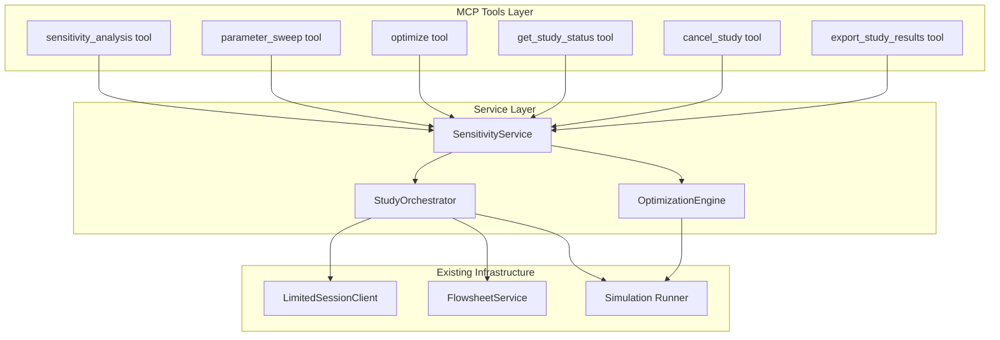

# Design Document

## Overview

The `mcp-sensitivity-tools` feature adds MCP tools for systematic parameter studies, sensitivity analysis, and optimization. These tools orchestrate multiple simulation runs, collect results into structured tables, and enable LLM agents to explore design spaces and find optimal operating conditions.

The implementation follows the existing MCP tool patterns established in `analysis.py`, `simulation.py`, and `flowsheet.py`, with a new `SensitivityService` coordinating multi-run studies.

## Steering Document Alignment

### Technical Standards (tech.md)

- **Python MCP Server with pythonnet**: Tools implemented in Python, calling C# adapters via pythonnet for simulation execution.
- **Pydantic Models**: All tool inputs/outputs defined as Pydantic models in `models/mcp_inputs/` and `models/responses/`.
- **CAPE-OPEN Domain Model**: Variable references use CAPE-OPEN property names (e.g., `temperature`, `pressure`, `molarFlow`).
- **Structured Logging**: All study operations logged with `session_id`, `study_id`, and step progress.
- **Resource Limits**: Studies respect session timeouts and memory limits via `LimitedSessionClient`.

### Project Structure (structure.md)

- **Tools**: `mcp_service/server/dwsim_mcp_server/tools/sensitivity.py`
- **Service**: `mcp_service/server/dwsim_mcp_server/services/sensitivity_service.py`
- **Models**: `models/mcp_inputs/sensitivity_inputs.py`, `models/responses/sensitivity_results.py`
- **Tests**: `mcp_service/server/tests/unit/test_sensitivity_tools.py`, `tests/integration/test_sensitivity_integration.py`

## Code Reuse Analysis

### Existing Components to Leverage

- **`LimitedSessionClient`**: Session operations with resource limits; reuse for running individual simulation steps.
- **`handle_simulation_tool` / `_handle_run`**: Internal simulation execution; sensitivity service calls this per step.
- **`FlowsheetService.set_object_parameter`**: Used to vary parameters between study steps.
- **`resolve_case_path`**: File path validation for result export.
- **`ResourceLimitViolation` / `_resource_limit_error`**: Error handling patterns for limit breaches.
- **Existing Pydantic patterns**: `FlashTPInputs`, `RunSimulationRequest` as templates for new models.

### Integration Points

- **Tool Registry**: Register new tools in `registry.py` alongside existing tool sets.
- **ServerDependencies**: Inject `SensitivityService` into dependency container.
- **Session State**: Studies operate on existing sessions; no new session types needed.

## Architecture

The sensitivity tools follow a **study orchestrator** pattern where the service manages multi-step execution while delegating individual simulations to existing infrastructure.

### Modular Design Principles

- **Single File Responsibility**: `sensitivity.py` defines tools; `sensitivity_service.py` handles orchestration logic.
- **Component Isolation**: Study state tracked in-memory per study; no persistent storage required.
- **Service Layer Separation**: Tools validate input and format output; service contains business logic.
- **Utility Modularity**: Result formatting and CSV export in dedicated helpers.



## Components and Interfaces

### Component 1: Sensitivity Tools (`sensitivity.py`)

- **Purpose**: Define MCP tool schemas and dispatch to `SensitivityService`.
- **Interfaces**:
  - `build_sensitivity_tools() → list[types.Tool]`
  - `handle_sensitivity_tool(tool_name, arguments, dependencies) → dict | CallToolResult`
- **Dependencies**: `SensitivityService` from `dependencies`.
- **Reuses**: Error handling patterns from `analysis.py`.

### Component 2: SensitivityService (`sensitivity_service.py`)

- **Purpose**: Orchestrate multi-run studies, track progress, manage cancellation.
- **Interfaces**:
  - `async run_sensitivity_analysis(request: SensitivityAnalysisRequest) → SensitivityStudyResult`
  - `async run_parameter_sweep(request: ParameterSweepRequest) → SensitivityStudyResult`
  - `async run_optimization(request: OptimizationRequest) → OptimizationResult`
  - `get_study_status(study_id: str) → StudyStatus`
  - `cancel_study(study_id: str) → SensitivityStudyResult`
  - `export_results(study_id: str, file_path: str) → bool`
- **Dependencies**: `LimitedSessionClient`, `FlowsheetService`.
- **Reuses**: `set_object_parameter` for varying inputs, `run_calculation` for simulation.

### Component 3: StudyOrchestrator (internal class)

- **Purpose**: Execute study steps, collect results, handle partial failures.
- **Interfaces**:
  - `async execute_steps(session_id, steps: list[dict], outputs: list[str]) → list[ResultRow]`
  - `report_progress() → StudyProgress`
  - `request_cancellation() → None`
- **Dependencies**: `LimitedSessionClient`.
- **Reuses**: Existing simulation execution path.

### Component 4: OptimizationEngine (internal class)

- **Purpose**: Wrap optimization algorithm (scipy.optimize or DWSIM's built-in).
- **Interfaces**:
  - `async optimize(session_id, objective, variables, constraints) → OptimizationResult`
- **Dependencies**: `LimitedSessionClient`, `scipy.optimize.minimize`.
- **Reuses**: Simulation runner for objective evaluation.

## Data Models

### SensitivityAnalysisRequest

```python
class SensitivityAnalysisRequest(BaseModel):
    session_id: str
    variable: VariableSpec          # object_id, property_name
    range: RangeSpec                # min_value, max_value
    steps: int = Field(ge=2, le=100)
    outputs: list[OutputSpec]       # object_id, property_name for each output
```

### ParameterSweepRequest

```python
class ParameterSweepRequest(BaseModel):
    session_id: str
    variables: list[VariableWithRange]   # Each has object_id, property_name, range, steps
    outputs: list[OutputSpec]
    max_combinations: int = 100           # Safety limit
```

### OptimizationRequest

```python
class OptimizationRequest(BaseModel):
    session_id: str
    objective: ObjectiveSpec              # object_id, property_name, direction (min/max)
    variables: list[VariableWithBounds]   # object_id, property_name, lower, upper, initial
    constraints: list[ConstraintSpec] = []  # property >= value, etc.
    max_iterations: int = 50
```

### SensitivityStudyResult

```python
class SensitivityStudyResult(BaseModel):
    study_id: str
    status: Literal["completed", "partial", "cancelled", "failed"]
    rows: list[ResultRow]                  # Each row: inputs dict, outputs dict, converged bool
    completed_steps: int
    total_steps: int
    elapsed_seconds: float
    cancelled: bool = False
    error_message: Optional[str] = None
```

### OptimizationResult

```python
class OptimizationResult(BaseModel):
    study_id: str
    status: Literal["converged", "max_iterations", "failed"]
    optimal_values: dict[str, float]       # variable_name → optimal value
    objective_value: float
    iterations: int
    converged: bool
    message: Optional[str] = None
```

### StudyStatus

```python
class StudyStatus(BaseModel):
    study_id: str
    is_running: bool
    completed_steps: int
    total_steps: int
    elapsed_seconds: float
    estimated_remaining_seconds: Optional[float]
```

## Error Handling

### Error Scenarios

1. **Invalid variable reference**
   - **Handling**: Validate `object_id` exists in session before starting study.
   - **User Impact**: Return `VALIDATION_ERROR` with message "Object 'X' not found in session."

2. **Simulation step fails to converge**
   - **Handling**: Record `null` outputs for that step, log warning, continue with next step.
   - **User Impact**: Partial results returned with `status: "partial"`.

3. **Study size exceeds limit**
   - **Handling**: Reject before execution with `VALIDATION_ERROR`.
   - **User Impact**: "Parameter sweep would create 500 combinations; limit is 100. Reduce steps or variables."

4. **Session timeout during study**
   - **Handling**: Return partial results collected so far with `status: "failed"`.
   - **User Impact**: Error message includes completed steps count.

5. **Optimization does not converge**
   - **Handling**: Return best solution found with `status: "max_iterations"`.
   - **User Impact**: Warning message suggests increasing iteration limit or adjusting bounds.

6. **Export path invalid**
   - **Handling**: Use `resolve_case_path` to validate; return `INVALID_PATH` error.
   - **User Impact**: "Path not in allowed directories."

## Testing Strategy

### Unit Testing

- **Tools tests** (`test_sensitivity_tools.py`):
  - Mock `SensitivityService` to verify tool dispatch and input validation.
  - Test error result formatting for validation failures.
  - Test unknown tool name handling.

- **Service tests** (`test_sensitivity_service.py`):
  - Mock `LimitedSessionClient` and `FlowsheetService`.
  - Test single-variable sensitivity with 5 steps, verify result structure.
  - Test cancellation mid-study returns partial results.
  - Test step failure handling (one step fails, others succeed).

- **Model tests**:
  - Pydantic validation for `SensitivityAnalysisRequest` (steps bounds, required fields).
  - Serialization round-trip for result models.

### Integration Testing

- **End-to-end sensitivity** (`test_sensitivity_integration.py`):
  - Create session, add three-phase separator, run 5-point pressure sensitivity.
  - Verify all 5 rows returned with valid outputs.
  - Verify mass balance still closes for each point.

- **Parameter sweep**:
  - 2 variables × 3 steps each = 9 combinations.
  - Verify 9 result rows with correct input combinations.

- **Optimization**:
  - Simple test case: optimize separator pressure to maximize vapor fraction.
  - Verify converged result within expected bounds.

### End-to-End Testing

- **Golden case**: Sensitivity on separator inlet temperature (5 points from 300K to 400K).
  - Expected outputs: vapor fraction increases with temperature.
  - Verify trend in results matches physical expectation.

- **Export test**: Run study, export to CSV, verify file readable and columns correct.
