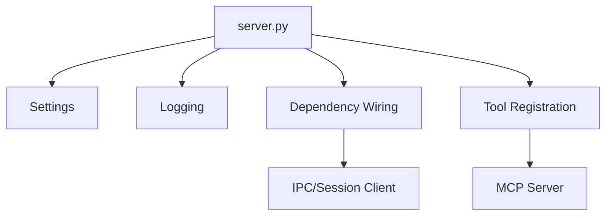

# Design Document

## Overview

This design defines the MCP server bootstrap layer for the Python service. It introduces a `server.py` entry point that loads configuration, sets up logging, wires dependencies, registers tools/resources, and manages startup/shutdown lifecycles.

## Steering Document Alignment

### Technical Standards (tech.md)
- Uses Python MCP SDK for stdio transport.
- Uses Pydantic settings for configuration.
- Uses structured logging patterns for observability.

### Project Structure (structure.md)
- Entry point lives in `mcp_service/server/dwsim_mcp_server/server.py`.
- Configuration modules live in `mcp_service/server/dwsim_mcp_server/config/`.
- Tool registration is in `mcp_service/server/dwsim_mcp_server/tools/`.

## Code Reuse Analysis

### Existing Components to Leverage
- **Config module**: `mcp_service/server/dwsim_mcp_server/config/resource_limit_settings.py` can be extended or mirrored for server settings.
- **IPC session client**: `mcp_service/server/dwsim_mcp_server/ipc/session_client.py` provides the bridge dependency for tools.

### Integration Points
- **MCP SDK**: `mcp` package for stdio server and tool registration.
- **Tool packages**: `mcp_service/server/dwsim_mcp_server/tools/` for tool definitions.

## Architecture

The bootstrap layer orchestrates server startup and shutdown using a small set of modules: settings, logging, dependency container, and tool registration. The server only manages lifecycle and wiring; tool logic remains in tool modules.



### Modular Design Principles
- **Single File Responsibility**: `server.py` handles lifecycle only.
- **Component Isolation**: Settings, logging, and tool registration are separate modules.
- **Service Layer Separation**: Tools depend on service abstractions (session client).
- **Utility Modularity**: Logging and settings are standalone.

## Components and Interfaces

### Server Bootstrap (server.py)
- **Purpose:** Start MCP server, register tools, and manage lifecycle.
- **Interfaces:** `main()` entry point, `create_server()` helper.
- **Dependencies:** Settings, logging, tool registration.
- **Reuses:** Existing IPC session client and resource limits config.

### Settings Module
- **Purpose:** Centralized server configuration via Pydantic settings.
- **Interfaces:** `ServerSettings` class.
- **Dependencies:** Pydantic settings.
- **Reuses:** Mirrors existing patterns from resource limit settings.

### Logging Setup
- **Purpose:** Configure structured logging for startup and tool calls.
- **Interfaces:** `configure_logging(settings)` helper.
- **Dependencies:** structlog/logging.
- **Reuses:** Existing observability patterns.

### Tool Registration
- **Purpose:** Register MCP tools and resources for the server.
- **Interfaces:** `register_tools(server, dependencies)`.
- **Dependencies:** MCP SDK and tool modules.
- **Reuses:** Tool modules under `tools/`.

## Data Models

### ServerSettings
```
- log_level: str
- enable_pythonnet: bool
- worker_assembly_path: Optional[str]
- resource_limits: ResourceLimitSettings
```

## Error Handling

### Error Scenarios
1. **Misconfiguration**
   - **Handling:** Raise config error and exit non-zero.
   - **User Impact:** Clear startup failure message.

2. **Dependency Initialization Failure**
   - **Handling:** Log error and exit non-zero.
   - **User Impact:** Server does not start; logs show missing dependency.

## Testing Strategy

### Unit Testing
- Validate settings loading and default values.
- Verify tool registration runs without errors with mocked dependencies.

### Integration Testing
- Start server in test mode and verify tool listing.

### End-to-End Testing
- Defer to later spec phases covering MCP tools.
