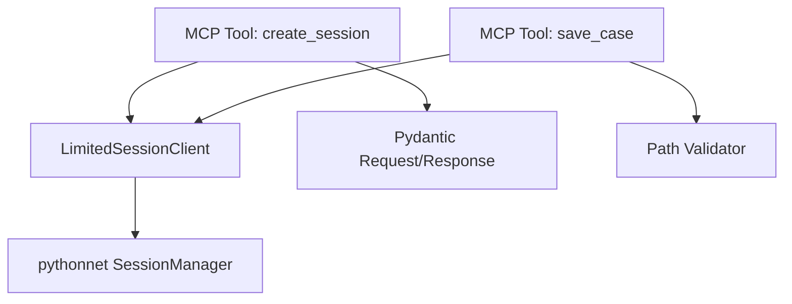

# Design Document

## Overview

This design adds MCP session management tools for the DWSIM MCP Server. The tools are thin, validated wrappers around the existing Python interop client and resource limit guard. The implementation registers four MCP tools: `create_session`, `close_session`, `save_case`, and `load_case`. Each tool uses Pydantic request/response models, maps errors to structured responses, and enforces path allowlists for case persistence.

## Steering Document Alignment

### Technical Standards (tech.md)
- Uses Python 3.11+, Pydantic models for validation, and structlog-style logging.
- Maintains pythonnet in-process interop via `SessionClient`/`LimitedSessionClient`.
- Adheres to session-based isolation and explicit lifecycle management.

### Project Structure (structure.md)
- Tool implementations live in `mcp_service/server/dwsim_mcp_server/tools/`.
- Pydantic request/response models live in `models/requests/` and `models/responses/`.
- Configuration remains under `mcp_service/server/dwsim_mcp_server/config/`.
- Validation helpers are placed in a focused utility module (one responsibility per file).

## Code Reuse Analysis

### Existing Components to Leverage
- **`dwsim_mcp_server.ipc.limited_session_client.LimitedSessionClient`**: Enforces session/resource limits; used for all session operations.
- **`dwsim_mcp_server.ipc.session_client.SessionClient`**: Handles pythonnet calls and .NET exception mapping.
- **`models/requests/create_session_request.py`**: Already defines create_session input schema.
- **`models/responses/create_session_response.py`**: Provides a richer response model; at minimum `sessionId` will be returned.
- **`dwsim_mcp_server.ipc.exceptions`**: Maps .NET exceptions to domain-specific errors.
- **`dwsim_mcp_server.observability.logging`**: Structured logging patterns.

### Integration Points
- **MCP Server**: `dwsim_mcp_server.server.create_server()` registers tools via `tools.registry.register_tools`.
- **Resource Limits**: `LimitedSessionClient` integrates session lifetime tracking and memory guard.
- **Path Validation**: New utility ensures `save_case` and `load_case` only access allowed roots.

## Architecture

The session tools are implemented as MCP tool handlers that:
1. Validate input via Pydantic request models.
2. Enforce file path allowlists for save/load operations.
3. Call `LimitedSessionClient` for session operations.
4. Return Pydantic response models or structured errors.



### Modular Design Principles
- **Single File Responsibility**: Each request/response model in its own file.
- **Component Isolation**: Tools do not import each other; they share only clients/utilities.
- **Service Layer Separation**: Tool handlers delegate to interop client methods.
- **Utility Modularity**: Path validation encapsulated in a dedicated helper module.

## Components and Interfaces

### Session Tool Module
- **Purpose:** Implement MCP tool handlers for session lifecycle and persistence.
- **Interfaces:** `create_session`, `close_session`, `save_case`, `load_case`.
- **Dependencies:** `LimitedSessionClient`, request/response models, path validator.
- **Reuses:** `CreateSessionRequest` and existing session error mapping.

### Path Validation Utility
- **Purpose:** Validate `filePath` inputs against configured allowlist roots.
- **Interfaces:** `validate_case_path(path: str, allowed_roots: list[str]) -> Path`.
- **Dependencies:** `pathlib`, server settings.
- **Reuses:** None (new focused utility).

### Request/Response Models
- **Purpose:** Define Pydantic schemas for tool inputs/outputs.
- **Interfaces:** `CloseSessionRequest`, `SaveCaseRequest`, `LoadCaseRequest`, and responses.
- **Dependencies:** Pydantic BaseModel.
- **Reuses:** Existing `CreateSessionRequest`/`CreateSessionResponse`.

## Data Models

### CloseSessionRequest
```
- session_id: str
```

### CloseSessionResponse
```
- success: bool
```

### SaveCaseRequest
```
- session_id: str
- file_path: str
```

### SaveCaseResponse
```
- success: bool
```

### LoadCaseRequest
```
- session_id: str
- file_path: str
```

### LoadCaseResponse
```
- session_id: str
```

## Error Handling

### Error Scenarios
1. **Session not found**
   - **Handling:** Return NotFound-style error with code and sessionId.
   - **User Impact:** Agent receives clear message to create a new session.

2. **Invalid path**
   - **Handling:** Reject request before calling worker; include InvalidPath code.
   - **User Impact:** Agent knows to use an allowed root directory.

3. **Worker failure or exception**
   - **Handling:** Map exception to structured error; log with sessionId.
   - **User Impact:** Agent receives actionable error without stack trace leakage.

## Testing Strategy

### Unit Testing
- Validate request models and path validator behavior.
- Mock `LimitedSessionClient` to test tool handlers without DWSIM.

### Integration Testing
- Register tools and call via MCP server harness with stubbed session client.
- Verify tool schema metadata is exposed.

### End-to-End Testing
- MCP client invokes create/close/save/load against a live worker (optional in CI).
