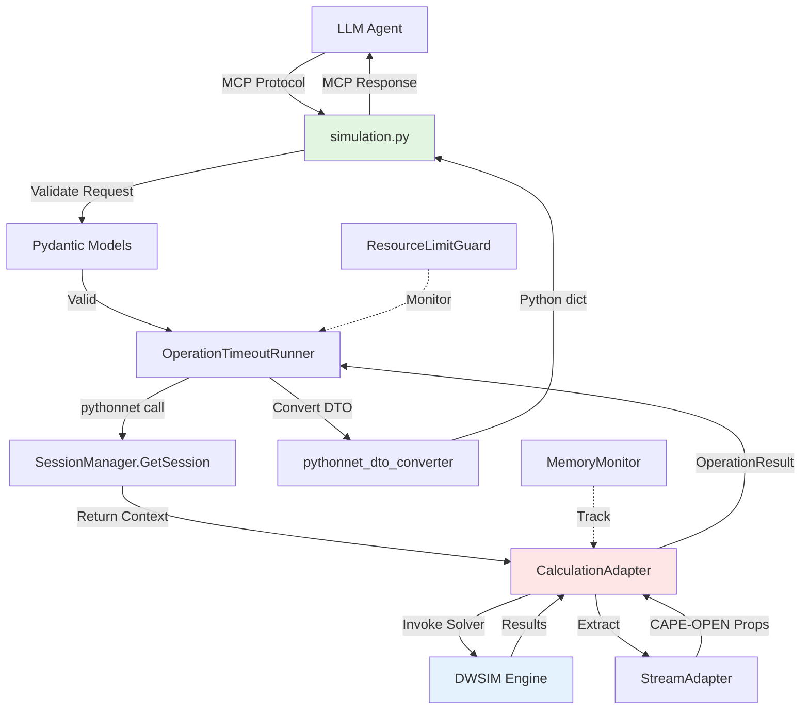

# Design Document

## Overview

The Simulation Execution MCP Tools feature provides three MCP tools (`run`, `get_status`, `get_results`) that enable LLM agents to execute DWSIM simulations and retrieve results. This feature builds on the existing C# `CalculationAdapter` infrastructure and follows the established pythonnet bridge pattern used by session and flowsheet tools.

The design leverages:
- **Existing C# Adapters**: `CalculationAdapter` already implements core calculation logic, result extraction, and mass balance validation
- **Established Python Tool Pattern**: Follows the same registration and handler pattern as `session.py` and `flowsheet.py`
- **CAPE-OPEN DTOs**: Reuses existing `MaterialStreamDto` and creates new `SimulationResultDto` for standardized data exchange
- **Resource Limits**: Integrates with existing `ResourceLimitGuard` and `OperationTimeoutRunner` for safe execution

This design ensures consistency with the existing codebase while providing a complete simulation execution workflow for agents.

## Steering Document Alignment

### Technical Standards (tech.md)

**Polyglot Architecture (Python + C#):**
- Python MCP tools in `dwsim_mcp_server/tools/simulation.py` provide LLM-facing interface
- C# `CalculationAdapter` in `DwsimWorker/Adapters/` handles DWSIM solver invocation
- pythonnet bridge enables in-process interop (zero IPC overhead)

**CAPE-OPEN as Domain Model:**
- Simulation results formatted using CAPE-OPEN standard property names
- `MaterialStreamDto` and `PhaseDto` provide standardized stream property representation
- Enables future multi-simulator support (not just DWSIM)

**Single Responsibility Principle:**
- `simulation.py` handles MCP tool registration and request validation
- `CalculationAdapter.cs` handles solver invocation and result extraction
- `SimulationResultDto` encapsulates all calculation outputs in structured format

**Resource Limits:**
- Simulation timeouts enforced via `OperationTimeoutRunner` (Python-side)
- Memory monitoring via `MemoryMonitor` during calculation
- Configurable limits per deployment environment

### Project Structure (structure.md)

**File Organization:**
- Python tool: `mcp_service/server/dwsim_mcp_server/tools/simulation.py`
- C# adapter: `mcp_service/dwsim_worker/DwsimWorker/Adapters/CalculationAdapter.cs` (already exists)
- Request models: `models/requests/run_simulation_request.py`, `models/requests/get_results_request.py`
- Response models: `models/responses/simulation_result_response.py`, `models/responses/stream_properties_response.py`
- Error models: `models/errors/simulation_error.py`

**Naming Conventions:**
- Python: `snake_case` for files, functions, variables; `PascalCase` for classes
- C#: `PascalCase` for classes, methods, properties; `_camelCase` for private fields
- Request DTOs: `{Action}Request` (e.g., `RunSimulationRequest`)
- Response DTOs: `{Action}Response` (e.g., `SimulationResultResponse`)

**One File Per Class:**
- Each model class in its own file within `models/` directory
- Each adapter in its own file within `Adapters/` directory

## Code Reuse Analysis

### Existing Components to Leverage

**C# Components (DwsimWorker):**
- **CalculationAdapter**: Core calculation logic already implemented
  - `RunCalculation(TimeSpan timeout)`: Runs solver with timeout support
  - `ExtractStreamResults()`: Retrieves calculated stream properties
  - `ValidateMassBalance()`: Validates mass balance closure
  - `GetUnitMetrics(string unitId)`: Gets unit operation-specific metrics
- **SessionManager**: Session lifecycle management (create, retrieve, close)
- **FlowsheetContext**: Per-session flowsheet state and object registry
- **StreamAdapter**: Stream property extraction using CAPE-OPEN interfaces
- **CapeOpenConverter**: DTO ↔ DWSIM object conversion
- **OperationResult<T>**: Consistent result pattern with success/failure states

**Python Components (dwsim_mcp_server):**
- **session_client.py**: pythonnet bridge for calling C# SessionManager
- **flowsheet_client.py**: Flowsheet operation client (add_stream, add_unit, etc.)
- **OperationTimeoutRunner**: Timeout enforcement wrapper for async operations
- **ResourceLimitGuard**: Memory and lifetime limit enforcement
- **pythonnet_dto_converter.py**: Python dict ↔ C# DTO conversion helpers
- **Existing Tool Pattern**: `session.py` and `flowsheet.py` provide reference implementations

**Shared Models (models/):**
- **MaterialStreamDto**: CAPE-OPEN material stream representation (already exists)
- **PhaseDto**: Phase data with composition and properties (already exists)
- **FlashResultDto**: Flash calculation results (already exists, can be extended)

### Integration Points

**Python → C# Flow:**
1. LLM agent calls MCP tool (`run`, `get_status`, `get_results`)
2. Python handler validates request via Pydantic model
3. `OperationTimeoutRunner` wraps C# call with timeout enforcement
4. pythonnet bridge invokes C# method on `SessionManager` or `CalculationAdapter`
5. C# performs calculation, returns `OperationResult<SimulationResultDto>`
6. Python converts C# DTO to dict, formats as MCP tool response
7. Errors caught and converted to MCP error messages

**Session Context Integration:**
- Each session maintains a `FlowsheetContext` in `SessionManager`
- `CalculationAdapter` created per-session with injected dependencies
- Results cached in session context for repeated `get_results` calls
- Cache invalidated when flowsheet modified (stream properties changed, units added/removed)

**Error Propagation:**
- C# exceptions → caught in Python → converted to structured MCP errors
- Typed error codes: `InvalidState`, `Timeout`, `EngineFault`, `NotFound`
- Diagnostic messages from DWSIM solver propagated to agent

## Architecture

### Modular Design Principles

**Single File Responsibility:**
- `simulation.py`: MCP tool definitions and handler dispatch only
- Request/response models: One file per model in `models/` directory
- C# adapters: One adapter per domain (`CalculationAdapter` for calculations)

**Component Isolation:**
- Python tools depend on abstract `session_client` interface, not concrete implementation
- C# adapters depend on injected `ILogger`, `FlowsheetContext`, not global state
- DTOs are pure data classes with no business logic

**Service Layer Separation:**
- **Presentation Layer**: MCP tools (`simulation.py`) handle request validation and response formatting
- **Business Logic Layer**: C# adapters (`CalculationAdapter`) orchestrate solver invocation
- **Data Access Layer**: DWSIM API calls wrapped in adapters

### Architecture Diagram



## Components and Interfaces

### Component 1: simulation.py (Python MCP Tools)

- **Purpose**: Register MCP tools for simulation execution and result retrieval
- **Interfaces**:
  - `build_simulation_tools() -> list[types.Tool]`: Returns tool definitions for MCP SDK registration
  - `async handle_simulation_tool(tool_name, arguments, dependencies) -> dict`: Dispatches tool calls to appropriate handlers
- **Dependencies**:
  - `session_client`: Python client wrapping C# SessionManager via pythonnet
  - `flowsheet_client`: Client for flowsheet operation helpers
  - `OperationTimeoutRunner`: Timeout enforcement
  - `ResourceLimitGuard`: Memory/lifetime limits
  - Pydantic request/response models from `models/`
- **Reuses**:
  - Tool registration pattern from `session.py`
  - Error handling pattern from `flowsheet.py`
  - Timeout runner from `limits/operation_timeout_runner.py`

### Component 2: CalculationAdapter.cs (C# Calculation Engine)

- **Purpose**: Execute DWSIM solver and extract results (already implemented, minor enhancements needed)
- **Interfaces**:
  - `OperationResult<CalculationResult> RunCalculation(TimeSpan timeout)`: Runs simulation with timeout
  - `IDictionary<string, object> GetUnitMetrics(string unitId)`: Gets unit operation metrics
  - **New**: `ConvergenceStatus GetCurrentStatus()`: Returns current/cached convergence status
  - **New**: `CalculationResult GetCachedResult()`: Returns most recent calculation result without re-running
- **Dependencies**:
  - `ILogger`: Structured logging
  - `FlowsheetContext`: Session flowsheet state
  - `StreamAdapter`: Extract stream properties
  - DWSIM assemblies (Thermodynamics, FlowsheetSolver, UnitOperations)
- **Reuses**:
  - Existing `RunCalculation` method (already complete)
  - `StreamAdapter.GetCalculatedProperties` for result extraction
  - `MassBalanceValidator.Validate` for validation
  - `ConvergenceStatus` and `CalculationTiming` models

### Component 3: Request/Response Models (Pydantic)

- **Purpose**: Validate MCP tool inputs and provide typed outputs
- **Interfaces**:
  - `RunSimulationRequest`: Validate `session_id`, optional `timeout_seconds`
  - `GetStatusRequest`: Validate `session_id`
  - `GetResultsRequest`: Validate `session_id`, optional `object_id` filter
  - `SimulationResultResponse`: Format calculation results with status, timing, stream data
  - `StreamPropertiesResponse`: Format individual stream properties
  - `SimulationStatusResponse`: Format current simulation status
- **Dependencies**:
  - `pydantic.BaseModel` for validation
  - `typing` for type hints
- **Reuses**:
  - Pattern from `CreateSessionRequest`, `AddStreamRequest` in existing models

### Component 4: SimulationResultDto.cs (C# DTO)

- **Purpose**: Transfer simulation results from C# to Python via pythonnet
- **Interfaces**:
  - Properties: `Status`, `ConvergenceState`, `ElapsedMilliseconds`, `StreamResults`, `Messages`, `MassBalanceValid`
  - Serializable to JSON for cross-language compatibility
- **Dependencies**:
  - `ConvergenceStatus`, `CalculationTiming`, `StreamResult` (existing models)
  - `MaterialStreamDto` for stream properties
- **Reuses**:
  - Existing DTO pattern from `MaterialStreamDto`, `FlashResultDto`
  - `Newtonsoft.Json` attributes for serialization control

## Data Models

### RunSimulationRequest (Python)

```python
class RunSimulationRequest(BaseModel):
    """Request to run a simulation."""
    session_id: str = Field(..., description="Session ID")
    timeout_seconds: Optional[int] = Field(
        default=120,
        description="Max calculation time in seconds"
    )
```

### GetStatusRequest (Python)

```python
class GetStatusRequest(BaseModel):
    """Request to get simulation status."""
    session_id: str = Field(..., description="Session ID")
```

### GetResultsRequest (Python)

```python
class GetResultsRequest(BaseModel):
    """Request to get simulation results."""
    session_id: str = Field(..., description="Session ID")
    object_id: Optional[str] = Field(
        default=None,
        description="Optional object ID to filter results (stream or unit)"
    )
```

### SimulationResultResponse (Python)

```python
class SimulationResultResponse(BaseModel):
    """Response containing simulation results."""
    status: str = Field(..., description="Simulation status: converged, failed, timeout, not_run")
    convergence_state: str = Field(..., description="Convergence state: Converged, NotConverged, Error")
    elapsed_ms: float = Field(..., description="Calculation duration in milliseconds")
    stream_results: List[StreamPropertiesResponse] = Field(default_factory=list)
    messages: List[str] = Field(default_factory=list)
    mass_balance_valid: Optional[bool] = Field(None, description="Mass balance validation result")
    mass_balance_error_percent: Optional[float] = Field(None, description="Mass balance error percentage")
```

### StreamPropertiesResponse (Python)

```python
class StreamPropertiesResponse(BaseModel):
    """CAPE-OPEN stream properties in SI units."""
    id: str
    name: str
    temperature_k: float
    pressure_pa: float
    total_molar_flow_mol_per_s: float
    phases: List[PhaseProperties]
```

### SimulationStatusResponse (Python)

```python
class SimulationStatusResponse(BaseModel):
    """Current simulation status."""
    status: str = Field(..., description="idle, running, converged, failed, timeout")
    is_running: bool
    last_run_timestamp: Optional[str] = Field(None, description="ISO 8601 timestamp")
    elapsed_ms: Optional[float] = Field(None, description="Elapsed time if running")
```

### SimulationResultDto (C#)

```csharp
public sealed class SimulationResultDto
{
    public string Status { get; set; } // "converged", "failed", "timeout"
    public string ConvergenceState { get; set; } // "Converged", "NotConverged", "Error"
    public double ElapsedMilliseconds { get; set; }
    public List<MaterialStreamDto> StreamResults { get; set; }
    public List<string> Messages { get; set; }
    public bool? MassBalanceValid { get; set; }
    public double? MassBalanceErrorPercent { get; set; }
}
```

## Error Handling

### Error Scenarios

1. **Session Not Found**
   - **Handling**: Check session exists in `SessionManager` before invoking calculation
   - **User Impact**: Agent receives `NotFound` error with message "Session {id} does not exist"

2. **Invalid Flowsheet State (No Units/Streams)**
   - **Handling**: `CalculationAdapter` validates flowsheet has at least one unit operation before solving
   - **User Impact**: Agent receives `InvalidState` error with message "Flowsheet must contain at least one unit operation"

3. **Simulation Timeout**
   - **Handling**: `OperationTimeoutRunner` cancels C# call after timeout; `CalculationAdapter` throws `CalculationTimeoutException`
   - **User Impact**: Agent receives `Timeout` error with message "Simulation exceeded timeout of {N} seconds"

4. **Convergence Failure**
   - **Handling**: `CalculationAdapter` checks `ConvergenceStatus.State == NotConverged`, returns failure result with solver messages
   - **User Impact**: Agent receives `EngineFault` error with DWSIM diagnostic messages (e.g., "Unit X failed to converge: insufficient inlet properties")

5. **DWSIM Engine Crash**
   - **Handling**: C# catches all exceptions in `RunCalculation`, wraps in `OperationResult.FailureResult`
   - **User Impact**: Agent receives `EngineFault` error with exception message and stack trace (sanitized)

6. **No Results Available (get_results before run)**
   - **Handling**: Check if `CalculationResult` cached in session context; return error if null
   - **User Impact**: Agent receives `InvalidState` error with message "No simulation results available. Run a simulation first."

7. **Object Not Found (get_results with invalid objectId)**
   - **Handling**: Check if objectId exists in flowsheet registry; return error if not found
   - **User Impact**: Agent receives `NotFound` error with message "Object {id} not found in flowsheet"

8. **Memory Limit Exceeded**
   - **Handling**: `MemoryMonitor` tracks process memory; `ResourceLimitGuard` terminates simulation if exceeded
   - **User Impact**: Agent receives `ResourceLimitViolation` error with message "Simulation exceeded memory limit of {N} MB"

## Testing Strategy

### Unit Testing

**Python Unit Tests (`tests/unit/tools/test_simulation.py`):**
- Test `build_simulation_tools()` returns correct tool definitions
- Test `handle_simulation_tool` dispatches to correct handler
- Test Pydantic validation for invalid inputs (missing session_id, negative timeout)
- Mock `session_client` to test Python layer in isolation
- Test error handling for all error scenarios (session not found, timeout, etc.)

**C# Unit Tests (`DwsimWorker.Tests/Adapters/CalculationAdapterTests.cs`):**
- Test `RunCalculation` with mock flowsheet (already exists)
- Test `GetCurrentStatus` returns correct convergence state
- Test `GetCachedResult` returns cached data without re-running
- Test timeout behavior with `CalculationTimeoutException`
- Test error handling for null flowsheet, invalid state

### Integration Testing

**Python-C# Integration Tests (`tests/integration/test_simulation_integration.py`):**
- Load DwsimWorker.dll via pythonnet
- Create session, add compounds, add streams, add separator
- Call `run` tool, verify success response
- Call `get_status` tool, verify "converged" status
- Call `get_results` tool, verify stream properties returned
- Call `get_results` with specific stream ID, verify filtered results
- Test timeout scenario (create slow-converging flowsheet, set short timeout)
- Test convergence failure scenario (missing inlet properties)

**Golden Case Tests (`integration-tests/golden-cases/three_phase_separator_test.py`):**
- Load reference DWSIM case file
- Run simulation via MCP tools
- Compare results to known-good values (temperature, pressure, flow within tolerance)
- Validate mass balance closure (<1% error)

### End-to-End Testing

**MCP Client E2E Tests (`integration-tests/test_mcp_e2e.py`):**
- Start MCP server process
- Connect MCP client (stdio transport)
- Execute full workflow:
  1. create_session
  2. add_compound (methane, ethane, propane)
  3. set_property_package (Peng-Robinson)
  4. add_stream (inlet with properties)
  5. add_unit (separator)
  6. connect streams
  7. **run** simulation
  8. **get_status** (verify converged)
  9. **get_results** (extract all stream properties)
  10. close_session
- Verify each tool returns expected response format
- Test agent workflow: Agent builds separator from natural language instructions, runs simulation, analyzes results
