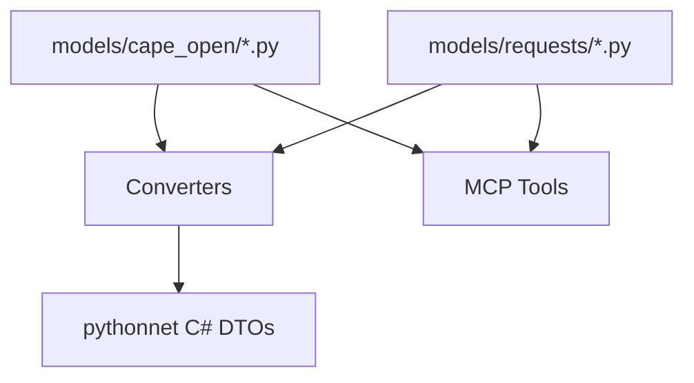

# Design Document

## Overview

This design introduces Pydantic models for CAPE-OPEN domain objects and MCP tool inputs, plus conversion helpers that map validated Python data into C# DTOs for pythonnet interop. The implementation follows the one-file-per-class convention and keeps converters isolated from models to preserve layering.

## Steering Document Alignment

### Technical Standards (tech.md)
- Uses Pydantic for runtime validation and schema generation.
- Emphasizes CAPE-OPEN domain objects as the canonical model.
- Maintains strict type hints and mypy compatibility.

### Project Structure (structure.md)
- Places domain models in `models/cape_open/`.
- Places MCP request models in `models/requests/` (one class per file).
- Adds conversion utilities under `mcp_service/server/dwsim_mcp_server/converters/`.

## Code Reuse Analysis

### Existing Components to Leverage
- **MaterialStream model**: `models/cape_open/material_stream.py` provides an established pattern for CAPE-OPEN model fields and schema metadata.
- **CreateSessionRequest**: `models/requests/create_session_request.py` demonstrates Pydantic request patterns and validation constraints.
- **Error models**: `models/errors/session_error.py` and `models/errors/resource_limit_error.py` provide structured error conventions.

### Integration Points
- **MCP tools**: Pydantic request models will be consumed by `mcp_service/server/dwsim_mcp_server/tools/`.
- **pythonnet interop**: Converters will be used by `mcp_service/server/dwsim_mcp_server/ipc/pythonnet_bridge.py` or a future service layer.

## Architecture

The design separates domain models, MCP request models, and conversion helpers. Models are pure Pydantic classes. Converters handle mapping to/from pythonnet C# DTOs without introducing dependencies from models back into interop layers.



### Modular Design Principles
- **Single File Responsibility**: Each model or converter has its own file.
- **Component Isolation**: Models do not import pythonnet or tool code.
- **Service Layer Separation**: Converters are the only layer aware of pythonnet DTOs.
- **Utility Modularity**: Each conversion function targets a specific DTO type.

## Components and Interfaces

### CAPE-OPEN Models
- **Purpose:** Represent DWSIM domain objects in a CAPE-OPEN-aligned schema.
- **Interfaces:** Pydantic models with field validators and schema examples.
- **Dependencies:** Pydantic only.
- **Reuses:** `models/cape_open/material_stream.py` patterns for metadata and examples.

### MCP Request Models
- **Purpose:** Validate MCP tool inputs before interop calls.
- **Interfaces:** Pydantic request DTOs for session, flowsheet, and simulation tools.
- **Dependencies:** Pydantic only.
- **Reuses:** `models/requests/create_session_request.py` constraints and schema style.

### DTO Converters
- **Purpose:** Map Python models or dicts to C# DTOs and back.
- **Interfaces:** Explicit conversion functions, e.g. `to_csharp_material_stream` and `from_csharp_material_stream`.
- **Dependencies:** pythonnet types and Pydantic models.
- **Reuses:** Error conventions from `models/errors/`.

## Data Models

### ThermoPropertyPackage
```
- name: str
- description: Optional[str]
- parameters: Dict[str, float]
- options: Dict[str, str]
```

### UnitOperation
```
- id: str
- name: str
- unit_type: str
- parameters: Dict[str, float]
- connections: Dict[str, str]
```

### Session and Simulation Requests
```
- CreateSessionRequest: name?, temp_dir?, timeout?
- CloseSessionRequest: session_id
- AddStreamRequest: session_id, name, temperature?, pressure?, flow?, composition?
- AddUnitRequest: session_id, unit_type, name, parameters?
- ConnectRequest: session_id, source_id, target_id, port_name
- RunSimulationRequest: session_id
- GetResultsRequest: session_id, object_id?
```

## Error Handling

### Error Scenarios
1. **Invalid physical value (e.g., negative pressure)**  
   - **Handling:** Pydantic validation error with field-specific details.  
   - **User Impact:** Tool call fails with a structured validation message.

2. **Missing conversion mapping for a field**  
   - **Handling:** Raise a descriptive conversion error naming the missing field and DTO type.  
   - **User Impact:** Tool call fails with actionable message for maintainers.

## Testing Strategy

### Unit Testing
- Validate each model’s constraints and defaults.
- Test converter functions with representative CAPE-OPEN and request DTOs.

### Integration Testing
- Light integration tests in the tool layer to confirm validated models are accepted and converted.

### End-to-End Testing
- Deferred to spec 4.2, which will exercise tool flows through the service layer.
