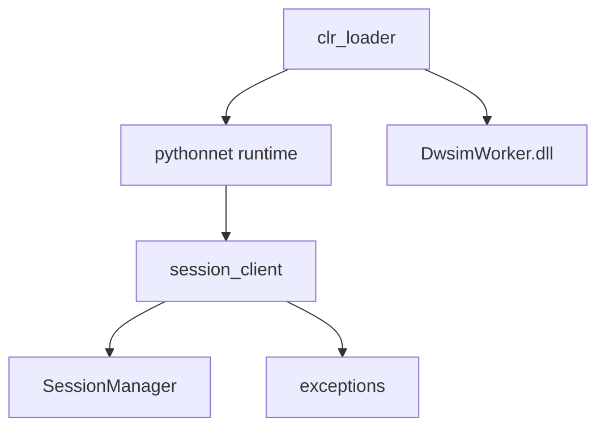

# Design Document

## Overview

Implement a Python-side pythonnet bridge that loads `DwsimWorker.dll` and exposes a minimal, typed API for session lifecycle operations. The design separates assembly loading, .NET exception mapping, and session wrapper logic into focused modules under `mcp_service/server/dwsim_mcp_server/ipc/` to align with the established layered architecture and prepare for higher-level services.

## Steering Document Alignment

### Technical Standards (tech.md)
- Uses pythonnet for in-process interop with the .NET Framework 4.8 class library.
- Keeps Python as the MCP faÇõade language with typed, testable modules.
- Follows structured logging expectations and clear error handling.

### Project Structure (structure.md)
- Adds IPC/interop-specific modules under `dwsim_mcp_server/ipc/`.
- Keeps one class per file and single-responsibility modules.
- Avoids cross-layer coupling with tools or MCP server bootstrap.

## Code Reuse Analysis

The current repository contains only scaffolding in `dwsim_mcp_server/` and a pythonnet smoke test under `tests/smoke/`. The design reuses the existing smoke test pattern and extends it with reusable fixtures to validate the bridge.

### Existing Components to Leverage
- **`tests/smoke/test_pythonnet_loading.py`**: Demonstrates pythonnet usage and DwsimWorker load; will be adapted to test the bridge.
- **`tests/conftest.py`**: Provides `pythonnet_clr` and DLL path resolution for tests.

### Integration Points
- **DwsimWorker.dll**: Loaded via pythonnet and used as the primary .NET API surface.
- **Python logging**: Standard library logging (or project logging utilities if introduced later).

## Architecture

The bridge is split into small modules with clear responsibilities:

- `clr_loader.py`: Resolve DLL path, initialize pythonnet, load assembly, and expose .NET types.
- `session_client.py`: Wraps `DwsimWorker.Engine.SessionManager` and exposes `create_session`/`close_session`.
- `exceptions.py`: Defines Python exception types for interop errors and provides mapping helpers.
- `type_converters.py` (optional in this spec): Handles conversion helpers for primitive/dict <-> .NET DTOs.



### Modular Design Principles
- **Single File Responsibility**: Loader, client, errors are separate modules.
- **Component Isolation**: No MCP tool logic in the bridge layer.
- **Service Layer Separation**: Bridge is a lower-level dependency for future services.
- **Utility Modularity**: Error mapping and type conversion are isolated helpers.

## Components and Interfaces

### `ClrLoader` (in `clr_loader.py`)
- **Purpose:** Resolve assembly path, initialize pythonnet, and load DwsimWorker.
- **Interfaces:**
  - `load_dwsim_worker() -> object`: Loads the assembly and returns a module handle or type registry.
  - `resolve_dll_path() -> Path`: Determines the DLL location based on config and defaults.
- **Dependencies:** `pythonnet`, `pathlib`, environment/config.
- **Reuses:** Test fixtures for DLL path assumptions.

### `SessionClient` (in `session_client.py`)
- **Purpose:** Provide a thin Python wrapper around `SessionManager`.
- **Interfaces:**
  - `create_session(name: str | None) -> str`
  - `close_session(session_id: str) -> bool`
  - `dispose() -> None`
- **Dependencies:** `ClrLoader`, `exceptions`.
- **Reuses:** `SessionManager` .NET class, smoke test patterns.

### `InteropError` and specialized exceptions (in `exceptions.py`)
- **Purpose:** Normalize .NET errors to Python exceptions.
- **Interfaces:**
  - `map_dotnet_exception(exc: Exception) -> InteropError`
  - `flatten_exception_messages(exc: Exception) -> str`
- **Dependencies:** None beyond standard library.
- **Reuses:** N/A.

### `type_converters.py` (optional, if needed by early API)
- **Purpose:** Convert dicts/primitive values to .NET DTOs and vice versa.
- **Interfaces:**
  - `to_dotnet(value: object, target_type: object) -> object`
  - `to_python(value: object) -> object`
- **Dependencies:** pythonnet type inspection.

## Data Models

### Session Options (Python)
```
SessionOptions
- name: Optional[str]
```

### Error Types (Python)
```
InteropError
- message: str
- kind: str (e.g., "assembly_load", "session", "conversion")
```

## Error Handling

### Error Scenarios
1. **Assembly load failure**
   - **Handling:** Raise `InteropError(kind="assembly_load")` with path and guidance.
   - **User Impact:** Clear error explaining missing DLL or pythonnet setup.

2. **SessionManager instantiation failure**
   - **Handling:** Map .NET exception and raise `InteropError(kind="session")`.
   - **User Impact:** Error includes .NET message and inner exception summary.

3. **Type conversion failure**
   - **Handling:** Raise `InteropError(kind="conversion")` with field/type details.
   - **User Impact:** Actionable message describing expected types.

## Testing Strategy

### Unit Testing
- Mock path resolution and error mapping functions.
- Verify exception mapping preserves message context.

### Integration Testing
- Use `tests/smoke` to load DLL and instantiate SessionManager through the bridge.
- Skip tests gracefully if pythonnet or DLL is not available.

### End-to-End Testing
- Not in scope for this spec; covered by later service/tool tests.
