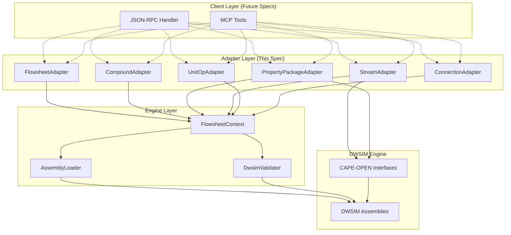
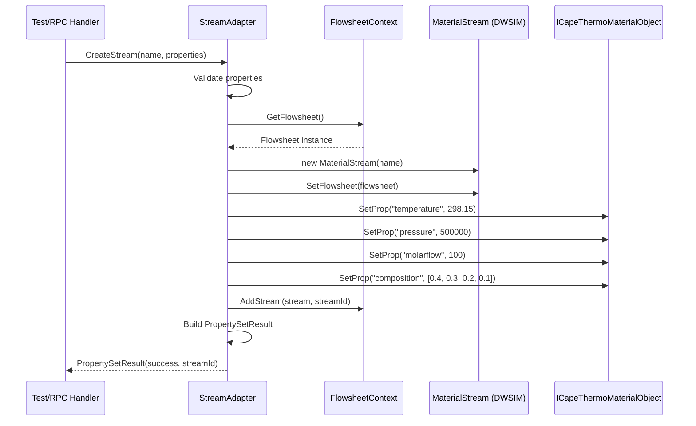

# Design Document

## Overview

This design document describes the implementation approach for Spec 1.2 (three-phase-separator-properties), which builds property-setting capabilities on top of the assembly loading infrastructure established in Spec 1.1 (dwsim-assembly-loader).

The implementation introduces a new layer of **Adapters** that wrap DWSIM's programmatic API, providing clean, testable interfaces for flowsheet manipulation. These adapters enable setting properties on DWSIM objects (compounds, property packages, streams, unit operations, connections) using a consistent, type-safe pattern that will later be exposed via JSON-RPC (Spec 3.x) and MCP tools (Spec 5.x).

The design follows the established patterns from Spec 1.1: one file per class, dependency injection with Serilog logging, immutable configuration objects, result-based error handling, and comprehensive unit/integration testing.

## Steering Document Alignment

### Technical Standards (tech.md)

This design adheres to the technical standards documented in tech.md:

1. **Polyglot Architecture**: Continues building the .NET Framework 4.8 engine worker that will communicate with the Python MCP server via JSON-RPC (future specs).

2. **CAPE-OPEN as Domain Model**: All property get/set operations use CAPE-OPEN interfaces where possible:
   - `ICapeThermoMaterialObject` for material streams (SetProp, GetProp methods)
   - `ICapeThermoPropertyPackage` for thermodynamic property packages
   - `ICapeThermoCompounds` for compound management
   - Standard CAPE-OPEN property names: "temperature", "pressure", "flow", "composition"

3. **Dependency Inversion**: Adapters depend on abstractions (ILogger), not concrete implementations. Flowsheet context is injected, not globally accessed.

4. **Layered Architecture**:
   ```
   Adapters Layer (new)         ← FlowsheetAdapter, StreamAdapter, PropertyAdapter
   ↓
   Engine Layer (existing)      ← AssemblyLoader, DwsimValidator
   ↓
   DWSIM Engine (external)      ← DWSIM.SharedClasses, DWSIM.Thermodynamics
   ```

5. **Session-Based Isolation (future)**: While this spec doesn't implement full session management (covered in Spec 2.2), the design prepares for it by encapsulating all state in a `FlowsheetContext` object that can later be managed by a `SessionManager`.

6. **Technology Stack Compliance**:
   - .NET Framework 4.8
   - Serilog for logging
   - xUnit for testing
   - Follows C# naming conventions (PascalCase classes, _camelCase fields)

### Project Structure (structure.md)

The implementation follows the project structure conventions:

1. **One File Per Class**: Each adapter, config, result object, and exception is in its own file.

2. **Directory Organization**:
   ```
   DwsimWorker/
   ├── Engine/
   │   ├── AssemblyLoader.cs (existing)
   │   ├── DwsimValidator.cs (existing)
   │   ├── FlowsheetContext.cs (new)
   │   └── FlowsheetContextConfig.cs (new)
   ├── Adapters/ (new folder)
   │   ├── FlowsheetAdapter.cs
   │   ├── CompoundAdapter.cs
   │   ├── PropertyPackageAdapter.cs
   │   ├── StreamAdapter.cs
   │   ├── UnitOpAdapter.cs
   │   └── ConnectionAdapter.cs
   ├── Models/ (new folder)
   │   ├── StreamProperties.cs
   │   ├── Composition.cs
   │   └── UnitOpConfig.cs
   ├── Converters/ (new folder)
   │   ├── CapeOpenPropertyConverter.cs
   │   └── UnitConverter.cs
   ├── Exceptions/ (new folder)
   │   ├── PropertySetException.cs
   │   ├── CompoundNotFoundException.cs
   │   └── InvalidPropertyValueException.cs
   └── Utilities/
       └── PathResolver.cs (existing)
   ```

3. **Namespace Structure**:
   - `DwsimWorker.Engine`: Core engine hosting (FlowsheetContext)
   - `DwsimWorker.Adapters`: DWSIM API wrappers
   - `DwsimWorker.Models`: Data models and DTOs
   - `DwsimWorker.Converters`: CAPE-OPEN and unit conversions
   - `DwsimWorker.Exceptions`: Custom exception types
   - `DwsimWorker.Utilities`: Shared utilities

4. **Testing Organization**:
   ```
   DwsimWorker.Tests/
   ├── Engine/
   │   ├── AssemblyLoaderTests.cs (existing)
   │   ├── DwsimValidatorTests.cs (existing)
   │   └── FlowsheetContextTests.cs (new)
   ├── Adapters/ (new folder)
   │   ├── CompoundAdapterTests.cs
   │   ├── PropertyPackageAdapterTests.cs
   │   ├── StreamAdapterTests.cs
   │   ├── UnitOpAdapterTests.cs
   │   └── ConnectionAdapterTests.cs
   ├── Integration/
   │   ├── ThreePhaseSeparatorWorkflowTests.cs (new - golden test)
   │   └── PropertyRoundTripTests.cs (new)
   └── Performance/
       └── PropertySetPerformanceTests.cs (new)
   ```

## Code Reuse Analysis

### Existing Components to Leverage

The implementation builds directly on infrastructure from Spec 1.1:

1. **AssemblyLoader** (`Engine/AssemblyLoader.cs`):
   - **How it will be used**: Called once during FlowsheetContext initialization to ensure all DWSIM assemblies are loaded before attempting to instantiate DWSIM objects.
   - **Pattern to follow**: Use the same `LoadResult` pattern for adapter operations (return result objects, not throw exceptions for expected failures).

2. **DwsimValidator** (`Engine/DwsimValidator.cs`):
   - **How it will be extended**: Add new validation methods: `ValidatePropertyPackage()`, `ValidateThreePhaseSeparator()` to verify these DWSIM types can be instantiated.
   - **Integration**: FlowsheetContext will optionally call DwsimValidator after flowsheet setup to verify all configured objects are valid.

3. **PathResolver** (`Utilities/PathResolver.cs`):
   - **How it will be used**: Already handles DWSIM path resolution transparently. No changes needed; AssemblyLoader uses it.

4. **Logging Infrastructure** (Serilog):
   - **How it will be used**: All adapters accept `ILogger` via constructor injection. Use structured logging: `logger.Information("property_set", streamId=..., propertyName=..., value=...)`.

5. **Configuration Pattern** (`AssemblyLoaderConfig`, `AssemblyLoaderConfigBuilder`):
   - **How it will be extended**: Create `FlowsheetContextConfig` and `FlowsheetContextConfigBuilder` following the same immutable config + builder pattern.

6. **Result Pattern** (`LoadResult`, `ValidationResult`):
   - **How it will be extended**: Create new result types: `PropertySetResult`, `ConnectionResult` for adapter operations. All follow the same pattern: Success property, Message, optional Error.

7. **Exception Pattern** (`DwsimLoadException`):
   - **How it will be extended**: Create domain-specific exceptions: `PropertySetException`, `CompoundNotFoundException`, `InvalidPropertyValueException`. All inherit from `DwsimException` (new base class).

### Integration Points

1. **DWSIM API Integration**:
   - **Flowsheet Management**: `DWSIM.SharedClasses.Flowsheet` for flowsheet lifecycle
   - **Compound Database**: `DWSIM.Thermodynamics.Databases.ChemSepDatabase` for compound lookups
   - **Property Packages**: `DWSIM.Thermodynamics.PropertyPackages.*` (PengRobinsonPropertyPackage, SRKPropertyPackage, etc.)
   - **Material Streams**: `DWSIM.Thermodynamics.Streams.MaterialStream` (implements ICapeThermoMaterialObject)
   - **Unit Operations**: `DWSIM.UnitOperations.Separators.Separator3Phase` for three-phase separator
   - **CAPE-OPEN Interfaces**: Use `ICapeThermoMaterialObject.SetProp()` and `GetProp()` for property operations

2. **Future RPC Integration** (Spec 3.x):
   - Adapters will be called by JSON-RPC method handlers
   - Models (StreamProperties, Composition) will be serialized to/from JSON
   - FlowsheetContext will be managed by SessionManager (Spec 2.2)

3. **Future MCP Tools** (Spec 5.x):
   - Each adapter method maps to one or more MCP tools:
     - `CompoundAdapter.AddCompound()` → `flowsheet.add_compound` MCP tool
     - `PropertyPackageAdapter.SetPropertyPackage()` → `flowsheet.set_property_package` MCP tool
     - `StreamAdapter.CreateStream()` → `flowsheet.add_stream` MCP tool
     - `UnitOpAdapter.AddThreePhaseSeparator()` → `flowsheet.add_unit` MCP tool
     - `ConnectionAdapter.ConnectStreams()` → `flowsheet.connect` MCP tool

## Architecture

### Modular Design Principles

1. **Single File Responsibility**: Each file handles one specific concern:
   - `FlowsheetAdapter.cs`: Flowsheet-level operations (create, dispose, query state)
   - `CompoundAdapter.cs`: Compound addition and retrieval only
   - `PropertyPackageAdapter.cs`: Property package configuration only
   - `StreamAdapter.cs`: Stream creation and property get/set only
   - `UnitOpAdapter.cs`: Unit operation addition only
   - `ConnectionAdapter.cs`: Stream connection management only

2. **Component Isolation**: Adapters are independent; they don't call each other directly. They all operate on a shared `FlowsheetContext` object that encapsulates the DWSIM flowsheet state.

3. **Service Layer Separation**:
   - **Models**: Data classes with no behavior (StreamProperties, Composition, UnitOpConfig)
   - **Adapters**: Business logic for DWSIM operations
   - **Converters**: Unit conversions and CAPE-OPEN property name mapping
   - **Exceptions**: Error types for domain-specific failures

4. **Utility Modularity**: Converters are single-purpose:
   - `CapeOpenPropertyConverter`: Maps CAPE-OPEN property names ("temperature") to DWSIM internal representations
   - `UnitConverter`: SI unit conversions (K ↔ °C, Pa ↔ bar, etc.) if needed

### Architecture Diagram



### Data Flow Example: Creating a Material Stream



## Components and Interfaces

### Component 1: FlowsheetContext

- **Purpose**: Encapsulates the DWSIM flowsheet and all associated state (compounds, streams, units, connections). Acts as the single source of truth for a simulation session.

- **Interfaces**:
  ```csharp
  public sealed class FlowsheetContext : IDisposable
  {
      // Initialization
      public FlowsheetContext(ILogger logger, FlowsheetContextConfig config);
      public void Initialize();

      // Flowsheet access
      public Flowsheet GetFlowsheet();
      public bool IsInitialized { get; }

      // State management
      public void AddCompound(string compoundName);
      public IReadOnlyList<string> GetCompounds();
      public void AddStream(MaterialStream stream, string streamId);
      public MaterialStream GetStream(string streamId);
      public void AddUnit(UnitOperation unit, string unitId);
      public UnitOperation GetUnit(string unitId);

      // Lifecycle
      public void Dispose();
  }
  ```

- **Dependencies**: AssemblyLoader (to ensure assemblies loaded), DwsimValidator (optional validation), Serilog ILogger

- **Reuses**: Assembly loading from Spec 1.1 (calls AssemblyLoader.LoadDwsimAssemblies())

### Component 2: CompoundAdapter

- **Purpose**: Handles compound database access and compound addition to the flowsheet.

- **Interfaces**:
  ```csharp
  public sealed class CompoundAdapter
  {
      public CompoundAdapter(ILogger logger, FlowsheetContext context);

      // Add compound by name from DWSIM database
      public Result<bool> AddCompound(string compoundName);

      // Get list of compounds in flowsheet
      public Result<IReadOnlyList<string>> GetCompounds();

      // Validate compound name exists in database
      public bool ValidateCompoundName(string compoundName);
  }
  ```

- **Dependencies**: FlowsheetContext, ILogger

- **Reuses**: Logging pattern from Spec 1.1, Result pattern

### Component 3: PropertyPackageAdapter

- **Purpose**: Configures the thermodynamic property package for the flowsheet.

- **Interfaces**:
  ```csharp
  public sealed class PropertyPackageAdapter
  {
      public PropertyPackageAdapter(ILogger logger, FlowsheetContext context);

      // Set property package by name (e.g., "Peng-Robinson", "SRK")
      public Result<bool> SetPropertyPackage(string packageName);

      // Get currently configured property package name
      public Result<string> GetPropertyPackageName();

      // List available property packages
      public Result<IReadOnlyList<string>> GetAvailablePackages();
  }
  ```

- **Dependencies**: FlowsheetContext, ILogger

- **Reuses**: Logging pattern, Result pattern

### Component 4: StreamAdapter

- **Purpose**: Creates material streams and sets/gets their thermodynamic properties using CAPE-OPEN interfaces.

- **Interfaces**:
  ```csharp
  public sealed class StreamAdapter
  {
      public StreamAdapter(ILogger logger, FlowsheetContext context);

      // Create a new material stream with properties
      public Result<string> CreateStream(string name, StreamProperties properties);

      // Set individual property (temperature, pressure, flow, composition)
      public Result<bool> SetProperty(string streamId, string propertyName, object value);

      // Get individual property
      public Result<object> GetProperty(string streamId, string propertyName);

      // Set all properties at once
      public Result<bool> SetProperties(string streamId, StreamProperties properties);

      // Get all properties
      public Result<StreamProperties> GetProperties(string streamId);

      // Validate property value before setting
      private bool ValidatePropertyValue(string propertyName, object value);
  }
  ```

- **Dependencies**: FlowsheetContext, ILogger, CapeOpenPropertyConverter (for property name mapping)

- **Reuses**: Logging pattern, Result pattern, CAPE-OPEN interfaces

### Component 5: UnitOpAdapter

- **Purpose**: Adds unit operations to the flowsheet and configures their parameters.

- **Interfaces**:
  ```csharp
  public sealed class UnitOpAdapter
  {
      public UnitOpAdapter(ILogger logger, FlowsheetContext context);

      // Add three-phase separator
      public Result<string> AddThreePhaseSeparator(string name, UnitOpConfig config);

      // Set unit operation parameter
      public Result<bool> SetParameter(string unitId, string parameterName, object value);

      // Get unit operation parameter
      public Result<object> GetParameter(string unitId, string parameterName);

      // Get unit operation ports (inlet, outlets)
      public Result<IReadOnlyDictionary<string, string>> GetPorts(string unitId);
  }
  ```

- **Dependencies**: FlowsheetContext, ILogger

- **Reuses**: Logging pattern, Result pattern

### Component 6: ConnectionAdapter

- **Purpose**: Connects material streams to unit operation ports.

- **Interfaces**:
  ```csharp
  public sealed class ConnectionAdapter
  {
      public ConnectionAdapter(ILogger logger, FlowsheetContext context);

      // Connect stream to unit port
      public Result<bool> ConnectStream(string streamId, string unitId, string portName);

      // Disconnect stream from port
      public Result<bool> DisconnectStream(string streamId);

      // Get connection info for a stream
      public Result<ConnectionInfo> GetConnection(string streamId);

      // List all connections in flowsheet
      public Result<IReadOnlyList<ConnectionInfo>> GetAllConnections();
  }
  ```

- **Dependencies**: FlowsheetContext, ILogger

- **Reuses**: Logging pattern, Result pattern

## Data Models

### Model 1: StreamProperties

Represents all thermodynamic properties of a material stream.

```csharp
public sealed class StreamProperties
{
    // Temperature in Kelvin
    public double TemperatureK { get; set; }

    // Pressure in Pascal
    public double PressurePa { get; set; }

    // Molar flow in mol/s
    public double MolarFlowMolPerSec { get; set; }

    // Composition as mole fractions (must sum to 1.0)
    public Composition Composition { get; set; }

    // Validation method
    public bool IsValid(out string errorMessage);
}
```

### Model 2: Composition

Represents the composition of a material stream (mole fractions for each compound).

```csharp
public sealed class Composition
{
    // Mole fractions (order corresponds to compounds in flowsheet)
    public IReadOnlyList<double> MoleFractions { get; }

    // Constructor validates sum = 1.0 ± tolerance
    public Composition(IReadOnlyList<double> moleFractions);

    // Validation
    public bool IsValid(int expectedCompoundCount);
    public bool SumsToOne(double tolerance = 1e-6);
}
```

### Model 3: UnitOpConfig

Configuration for a unit operation (e.g., three-phase separator).

```csharp
public sealed class UnitOpConfig
{
    // Operating parameters (key-value pairs)
    public IReadOnlyDictionary<string, object> Parameters { get; }

    // Constructor
    public UnitOpConfig(IDictionary<string, object> parameters);

    // Helper methods
    public bool TryGetParameter<T>(string key, out T value);
}
```

### Model 4: ConnectionInfo

Represents a stream connection to a unit operation.

```csharp
public sealed class ConnectionInfo
{
    public string StreamId { get; }
    public string UnitId { get; }
    public string PortName { get; }
    public DateTime ConnectedAt { get; }

    public ConnectionInfo(string streamId, string unitId, string portName);
}
```

### Model 5: FlowsheetContextConfig

Configuration for FlowsheetContext initialization.

```csharp
public sealed class FlowsheetContextConfig
{
    // Assembly loading config (reuses Spec 1.1)
    public AssemblyLoaderConfig AssemblyConfig { get; }

    // Whether to validate after initialization
    public bool ValidateAfterInit { get; }

    // Flowsheet name
    public string FlowsheetName { get; }

    // Constructor (private, use builder)
    private FlowsheetContextConfig(/* params */);

    // Factory method
    public static FlowsheetContextConfig CreateDefault();
}
```

### Model 6: Result Types

Following Spec 1.1 pattern, create result types for adapter operations:

```csharp
public sealed class PropertySetResult
{
    public bool Success { get; }
    public string Message { get; }
    public string StreamId { get; }
    public Exception Error { get; }

    public static PropertySetResult SuccessResult(string streamId);
    public static PropertySetResult FailureResult(string message, Exception error);
}

public sealed class ConnectionResult
{
    public bool Success { get; }
    public string Message { get; }
    public ConnectionInfo Connection { get; }
    public Exception Error { get; }

    public static ConnectionResult SuccessResult(ConnectionInfo connection);
    public static ConnectionResult FailureResult(string message, Exception error);
}
```

## Error Handling

### Error Scenarios

1. **Scenario: Invalid compound name provided**
   - **Handling**: CompoundAdapter.ValidateCompoundName() returns false. AddCompound() returns Result with success=false, message="Compound '{name}' not found in database", no exception thrown.
   - **User Impact**: Clear error message indicating the compound name is invalid. Suggest checking spelling or available compounds.

2. **Scenario: Property value out of valid range (e.g., negative temperature)**
   - **Handling**: StreamAdapter.ValidatePropertyValue() detects invalid value. SetProperty() returns Result with success=false, message="Temperature must be > 0 K. Provided: -50 K".
   - **User Impact**: Clear error message with valid range and provided value. User can correct input.

3. **Scenario: Composition mole fractions don't sum to 1.0**
   - **Handling**: Composition constructor validates sum. Throws `InvalidPropertyValueException` with message="Composition mole fractions must sum to 1.0 ± 1e-6. Provided sum: 0.95".
   - **User Impact**: Clear error indicating composition validation failure with actual sum value.

4. **Scenario: DWSIM API call throws exception (e.g., SetProp fails)**
   - **Handling**: StreamAdapter catches exception, logs error with context (streamId, propertyName, value), returns Result with success=false, error=caughtException.
   - **User Impact**: Error message includes operation details and DWSIM exception message for debugging.

5. **Scenario: Stream or unit not found (invalid ID)**
   - **Handling**: FlowsheetContext.GetStream() returns null. Adapter checks for null, returns Result with success=false, message="Stream '{streamId}' not found in flowsheet".
   - **User Impact**: Clear error indicating the ID is invalid or object doesn't exist.

6. **Scenario: Connection already exists on port**
   - **Handling**: ConnectionAdapter checks port state before connecting. If occupied, returns Result with success=false, message="Port '{portName}' on unit '{unitId}' is already connected to stream '{existingStreamId}'".
   - **User Impact**: User informed of conflict, can disconnect existing connection first.

7. **Scenario: Assembly loading fails during FlowsheetContext initialization**
   - **Handling**: FlowsheetContext.Initialize() calls AssemblyLoader. If loading fails, Initialize() throws `DwsimLoadException` (propagated from Spec 1.1).
   - **User Impact**: Initialization fails fast with clear error from AssemblyLoader (e.g., "DWSIM assemblies not found").

8. **Scenario: Property round-trip validation fails (value doesn't match after get)**
   - **Handling**: Test detects mismatch. Not an exception, but logged as a warning. Test fails with assertion error showing expected vs. actual.
   - **User Impact**: Developer/tester alerted to potential DWSIM API issue or floating-point precision problem.

### Exception Hierarchy

```csharp
// Base exception for all DWSIM worker exceptions
public abstract class DwsimException : Exception
{
    public DwsimException(string message) : base(message) { }
    public DwsimException(string message, Exception innerException) : base(message, innerException) { }
}

// Existing from Spec 1.1
public sealed class DwsimLoadException : DwsimException { /* ... */ }

// New exceptions for Spec 1.2
public sealed class PropertySetException : DwsimException
{
    public string PropertyName { get; }
    public object ProvidedValue { get; }

    public PropertySetException(string message, string propertyName, object providedValue)
        : base(message)
    {
        PropertyName = propertyName;
        ProvidedValue = providedValue;
    }
}

public sealed class CompoundNotFoundException : DwsimException
{
    public string CompoundName { get; }

    public CompoundNotFoundException(string compoundName)
        : base($"Compound '{compoundName}' not found in DWSIM database")
    {
        CompoundName = compoundName;
    }
}

public sealed class InvalidPropertyValueException : DwsimException
{
    public string PropertyName { get; }
    public object ProvidedValue { get; }
    public string ValidRange { get; }

    public InvalidPropertyValueException(string propertyName, object providedValue, string validRange)
        : base($"Invalid value for '{propertyName}': {providedValue}. Valid range: {validRange}")
    {
        PropertyName = propertyName;
        ProvidedValue = providedValue;
        ValidRange = validRange;
    }
}

public sealed class StreamNotFoundException : DwsimException
{
    public string StreamId { get; }

    public StreamNotFoundException(string streamId)
        : base($"Stream '{streamId}' not found in flowsheet")
    {
        StreamId = streamId;
    }
}

public sealed class UnitNotFoundException : DwsimException
{
    public string UnitId { get; }

    public UnitNotFoundException(string unitId)
        : base($"Unit operation '{unitId}' not found in flowsheet")
    {
        UnitId = unitId;
    }
}
```

## Testing Strategy

### Unit Testing

**Approach**: Test each adapter in isolation using a real FlowsheetContext but minimal DWSIM objects.

**Test Organization** (following Spec 1.1 pattern):
- One test file per adapter: `CompoundAdapterTests.cs`, `StreamAdapterTests.cs`, etc.
- Use xUnit framework with test fixtures for shared setup
- Test class structure:
  ```csharp
  public class StreamAdapterTests : IDisposable
  {
      private readonly FlowsheetContext _context;
      private readonly StreamAdapter _adapter;
      private readonly ILogger _logger;

      public StreamAdapterTests()
      {
          // Setup shared context
          _logger = TestConfiguration.CreateLogger();
          _context = new FlowsheetContext(_logger, FlowsheetContextConfig.CreateDefault());
          _context.Initialize();
          _adapter = new StreamAdapter(_logger, _context);
      }

      [Fact]
      public void CreateStream_WithValidProperties_ReturnsSuccess() { /* ... */ }

      [Fact]
      public void SetProperty_Temperature_RoundTripValidation() { /* ... */ }

      public void Dispose() => _context.Dispose();
  }
  ```

**Key Components to Test**:

1. **CompoundAdapter**:
   - AddCompound with valid name succeeds
   - AddCompound with invalid name fails with clear error
   - GetCompounds returns added compounds
   - Multiple compounds can be added

2. **PropertyPackageAdapter**:
   - SetPropertyPackage with valid name ("Peng-Robinson") succeeds
   - GetPropertyPackageName returns configured package
   - SetPropertyPackage with invalid name fails

3. **StreamAdapter**:
   - CreateStream with valid properties returns success and stream ID
   - SetProperty/GetProperty for each property type (temperature, pressure, flow, composition)
   - Round-trip validation: set value, get value, assert equality within tolerance
   - SetProperty with invalid values (negative temp, invalid composition sum) fails
   - Boundary value testing (min/max valid values)

4. **UnitOpAdapter**:
   - AddThreePhaseSeparator returns success and unit ID
   - SetParameter/GetParameter for separator parameters
   - GetPorts returns inlet and outlet port names

5. **ConnectionAdapter**:
   - ConnectStream succeeds with valid stream and unit IDs
   - GetConnection returns connection info
   - Duplicate connection to same port fails (or replaces, depending on DWSIM behavior)

### Integration Testing

**Approach**: Test the complete workflow end-to-end, from assembly loading to fully configured three-phase separator.

**Key Flows to Test**:

1. **Golden Test: Three-Phase Separator Workflow**:
   - File: `ThreePhaseSeparatorWorkflowTests.cs`
   - Workflow (from Requirements validation test):
     1. Initialize FlowsheetContext (loads assemblies)
     2. Add compounds: Methane, Ethane, Propane, Water
     3. Set Peng-Robinson property package
     4. Create inlet stream with properties (298.15 K, 500 kPa, 100 mol/s, composition)
     5. Create three outlet streams (vapor, liquid, water)
     6. Add three-phase separator
     7. Connect inlet to separator inlet
     8. Connect outlets to separator outlets
     9. Set separator pressure drop parameter
     10. Verify all round-trip validations pass
     11. Assert no exceptions during entire workflow
   - Success criteria: All steps complete, all properties match expected values

2. **Property Round-Trip Test**:
   - File: `PropertyRoundTripTests.cs`
   - For each property type (temperature, pressure, flow, composition):
     - Set property to test value
     - Get property back
     - Assert equality within tolerance
   - Tests multiple values (min, typical, max)

3. **Error Handling Integration Test**:
   - Test that adapter errors don't corrupt flowsheet state
   - Verify failed operations leave flowsheet in consistent state

### End-to-End Testing

**Approach**: Validate performance and reliability under realistic conditions.

**Performance Testing** (`PropertySetPerformanceTests.cs`):
- Measure latency for each operation type:
  - AddCompound: target < 100 ms
  - SetPropertyPackage: target < 500 ms
  - CreateStream: target < 200 ms
  - SetProperty (single): target < 50 ms
  - AddThreePhaseSeparator: target < 300 ms
  - ConnectStream: target < 100 ms
- Test with multiple streams/units to detect scaling issues

**User Scenarios**:
1. **Typical Simulation Setup**: Small flowsheet (4 compounds, 4 streams, 1 separator) completes in < 2 seconds total
2. **Large Composition**: Stream with 20 compounds, verify composition handling
3. **Multiple Units**: Flowsheet with 10 unit operations, verify no performance degradation

**Test Coverage Goals**:
- Adapters: > 85% line coverage
- Models: > 90% line coverage (mostly property validation)
- Integration tests: Cover all 6 requirements from requirements.md

**Test Data and Fixtures**:
- Create `TestData.cs` with constants for:
  - Standard test compounds (METHANE, ETHANE, PROPANE, WATER)
  - Standard test property values (STANDARD_TEMP_K = 298.15, STANDARD_PRESSURE_PA = 101325, etc.)
  - Standard compositions (HYDROCARBON_MIX_COMPOSITION)
- Use consistent test data across all tests for reproducibility

## Implementation Notes

### CAPE-OPEN Property Mapping

The StreamAdapter will use CapeOpenPropertyConverter to map between human-readable property names and CAPE-OPEN standard names:

| User-Friendly Name | CAPE-OPEN Name | DWSIM Property | Unit |
|--------------------|----------------|----------------|------|
| temperature | "temperature" | ICapeThermoMaterialObject.SetProp("temperature", value) | K |
| pressure | "pressure" | ICapeThermoMaterialObject.SetProp("pressure", value) | Pa |
| molarFlow | "totalFlow" | ICapeThermoMaterialObject.SetProp("totalFlow", value) | mol/s |
| composition | "composition" | ICapeThermoMaterialObject.SetProp("composition", array) | mole fractions |

### Floating-Point Tolerance

All property round-trip validations will use appropriate tolerance:
- Dimensionless values (mole fractions): ±1e-6
- Temperatures: ±1e-3 K
- Pressures: ±1e-3 Pa (or ±1e-6 relative error for large pressures)
- Flows: ±1e-6 relative error

### Thread Safety

This spec does not address thread safety (covered in Spec 2.2 session management). For now:
- FlowsheetContext and all adapters are **not thread-safe**
- Single-threaded usage assumed (one test/operation at a time)
- Future: Add locking or STA thread management for concurrent sessions

### Disposal and Resource Cleanup

- FlowsheetContext implements IDisposable
- Dispose() cleans up DWSIM Flowsheet object and all associated COM objects (if any)
- Tests must call Dispose() in teardown (use `using` statements or IDisposable pattern)
- No memory leaks: verify with dotMemory profiling in performance tests

### Logging Strategy

All adapters log at appropriate levels:
- **Debug**: Detailed property values, DWSIM API call parameters
- **Information**: Operation start/completion (e.g., "Stream created: streamId=S1, name=Inlet")
- **Warning**: Non-fatal issues (e.g., property value near boundary)
- **Error**: Operation failures with full context (streamId, propertyName, value, exception)

Structured logging format:
```csharp
_logger.Information("stream_created",
    streamId: streamId,
    name: name,
    temperature: properties.TemperatureK,
    pressure: properties.PressurePa);
```

### Configuration Flexibility

FlowsheetContextConfig allows customization:
- Assembly path (override auto-detection)
- Validation toggle (for faster tests)
- Flowsheet name (for debugging/logging)

Use FlowsheetContextConfigBuilder for fluent API:
```csharp
var config = new FlowsheetContextConfigBuilder()
    .WithFlowsheetName("Test-ThreePhaseSeparator")
    .WithValidation(enabled: true)
    .Build();
```

## Dependencies

### New NuGet Packages

No new NuGet packages required beyond Spec 1.1 dependencies:
- Serilog (existing)
- xUnit (existing)
- DWSIM assemblies referenced locally

### DWSIM API Version

- Tested against DWSIM 8.x (latest stable as of 2024)
- Minimum: DWSIM 6.x (property package and unit operation APIs stable since v6)
- Document any version-specific behaviors in code comments

## Success Criteria

This design is considered complete when:

1. **All adapters implemented**: 6 adapter classes created, each in its own file
2. **All models defined**: StreamProperties, Composition, UnitOpConfig, ConnectionInfo, FlowsheetContextConfig
3. **FlowsheetContext operational**: Can initialize, manage state, dispose cleanly
4. **Unit tests pass**: > 85% coverage on adapters, all property round-trip tests pass
5. **Integration test passes**: Golden three-phase separator workflow completes successfully
6. **Performance targets met**: All operations meet latency targets from NFRs
7. **No memory leaks**: Profiling confirms proper disposal
8. **Code review approved**: Adheres to structure.md conventions (one file per class, namespaces, logging)
9. **Ready for Spec 1.3**: Configured separator is ready for calculation execution (next spec)
