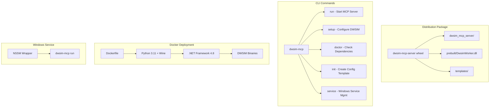

# Design Document: Deployment Packaging and Distribution

## Overview

This design document describes the architecture and implementation approach for packaging and distributing the DWSIM MCP Server. The solution extends the existing Python package infrastructure with CLI commands for setup and diagnostics, Docker containerization, Windows service support, and automated release pipelines.

The design prioritizes ease of installation while maintaining the existing codebase patterns and leveraging infrastructure already in place (pyproject.toml, setup.ps1, ServerSettings).

## Steering Document Alignment

### Technical Standards (tech.md)

- **Python Stack**: Uses typer (already a dependency) for CLI framework, pydantic-settings for configuration
- **Polyglot Architecture**: Maintains separation between Python MCP server and .NET worker DLL
- **pythonnet Integration**: Pre-built DwsimWorker.dll bundled in package, loaded via clr_loader.py
- **Structured Logging**: All CLI commands use structlog for consistent output
- **Windows-First**: Primary target is Windows with .NET Framework 4.8; Docker provides cross-platform development environment

### Project Structure (structure.md)

Implementation follows existing conventions:
- CLI commands in `dwsim_mcp_server/cli/` (new module)
- Configuration templates in `dwsim_mcp_server/templates/` (new module)
- Docker files in `deployments/docker/` (existing empty directory)
- Documentation in `docs/deployment/` (new directory)

## Code Reuse Analysis

### Existing Components to Leverage

- **`prebuilt/setup.ps1`**: Reference implementation for setup logic; Python CLI will mirror its functionality
- **`pyproject.toml`**: Existing package configuration; extend with new entry points
- **`dwsim_mcp_server/config/server_settings.py`**: Pydantic settings for configuration validation
- **`dwsim_mcp_server/ipc/clr_loader.py`**: .NET assembly loading; reuse for dependency validation
- **`mcp_service/dwsim_worker/build.bat`**: C# build orchestration; integrate with release pipeline

### Integration Points

- **Entry Point Extension**: Current `dwsim-mcp` command runs server directly; redesign as typer CLI with subcommands
- **Configuration System**: Extend ServerSettings to support config file generation and validation
- **Assembly Loading**: Reuse clr_loader validation for `doctor` command diagnostics

## Architecture

### High-Level Design



### Modular Design Principles

- **Single File Responsibility**: Each CLI command in separate module under `cli/`
- **Component Isolation**: Setup, doctor, and service logic independent of MCP server
- **Service Layer Separation**: CLI layer calls into service/config layers
- **Utility Modularity**: Shared utilities in `cli/utils.py`

## Components and Interfaces

### Component 1: CLI Framework (`dwsim_mcp_server/cli/`)

- **Purpose**: Unified command-line interface with subcommands
- **Interfaces**:
  ```python
  # cli/main.py
  app = typer.Typer(name="dwsim-mcp")

  @app.command()
  def run(log_level: str = "INFO") -> None: ...

  @app.command()
  def setup(dwsim_path: Path = None, download: bool = False) -> None: ...

  @app.command()
  def doctor(verbose: bool = False) -> None: ...

  @app.command()
  def init(output: Path = Path(".env.example")) -> None: ...

  @app.command()
  def version() -> None: ...
  ```
- **Dependencies**: typer, rich (console output), structlog
- **Reuses**: ServerSettings for config validation, clr_loader for assembly checks

### Component 2: Setup Command (`dwsim_mcp_server/cli/setup.py`)

- **Purpose**: Configure DWSIM binaries and generate config files
- **Interfaces**:
  ```python
  class SetupManager:
      def detect_dwsim_path(self) -> Optional[Path]: ...
      def download_dwsim_binaries(self, target_dir: Path) -> None: ...
      def validate_dwsim_installation(self, path: Path) -> ValidationResult: ...
      def create_config_file(self, dwsim_path: Path, output: Path) -> None: ...
      def update_app_config(self, dwsim_path: Path) -> None: ...
  ```
- **Dependencies**: httpx (downloads), zipfile, pathlib
- **Reuses**: Logic from `prebuilt/setup.ps1`, adapted for Python

### Component 3: Doctor Command (`dwsim_mcp_server/cli/doctor.py`)

- **Purpose**: Comprehensive dependency and configuration validation
- **Interfaces**:
  ```python
  class DoctorCheck:
      name: str
      status: Literal["pass", "fail", "warn"]
      message: str
      remediation: Optional[str]

  class DoctorRunner:
      def check_python_version(self) -> DoctorCheck: ...
      def check_dotnet_framework(self) -> DoctorCheck: ...
      def check_pythonnet(self) -> DoctorCheck: ...
      def check_dwsim_worker_dll(self) -> DoctorCheck: ...
      def check_dwsim_assemblies(self) -> DoctorCheck: ...
      def check_config_file(self) -> DoctorCheck: ...
      def run_all_checks(self) -> List[DoctorCheck]: ...
  ```
- **Dependencies**: psutil, platform, clr (pythonnet)
- **Reuses**: clr_loader.py validation logic

### Component 4: Service Manager (`dwsim_mcp_server/cli/service.py`)

- **Purpose**: Windows service installation and management using NSSM
- **Interfaces**:
  ```python
  class WindowsServiceManager:
      SERVICE_NAME = "DwsimMcpServer"

      def is_nssm_available(self) -> bool: ...
      def install(self, python_path: Path, args: List[str]) -> None: ...
      def uninstall(self) -> None: ...
      def start(self) -> None: ...
      def stop(self) -> None: ...
      def status(self) -> ServiceStatus: ...
  ```
- **Dependencies**: subprocess (NSSM calls), winreg (service registry)
- **Reuses**: None (new functionality)

### Component 5: Configuration Templates (`dwsim_mcp_server/templates/`)

- **Purpose**: Store template files for config generation
- **Files**:
  ```
  templates/
  ├── env.example.j2       # .env template with all options
  ├── dwsim.config.json.j2 # DWSIM path config template
  └── mcp.json.j2          # MCP client config template
  ```
- **Dependencies**: Jinja2 (optional, can use string formatting)
- **Reuses**: Existing config schema from ServerSettings

### Component 6: Docker Configuration (`deployments/docker/`)

- **Purpose**: Containerized deployment for development and testing
- **Files**:
  ```
  docker/
  ├── Dockerfile           # Multi-stage build
  ├── docker-compose.yml   # Local development setup
  ├── .dockerignore        # Exclude unnecessary files
  └── entrypoint.sh        # Container startup script
  ```
- **Dependencies**: Python 3.11 base, Wine for .NET Framework
- **Reuses**: Package installation from pyproject.toml

### Component 7: Release Automation (`.github/workflows/`)

- **Purpose**: CI/CD pipeline for building and publishing releases
- **Files**:
  ```
  .github/workflows/
  ├── ci.yml               # Build and test on PR
  ├── release.yml          # Build and publish on tag
  └── docker-publish.yml   # Build and push Docker image
  ```
- **Dependencies**: GitHub Actions, PyPI, Docker Hub
- **Reuses**: build.bat for C# compilation

## Data Models

### SetupConfig

```python
class SetupConfig(BaseModel):
    """Configuration generated by setup command."""
    dwsim_path: Path
    worker_dll_path: Path
    created_at: datetime
    dwsim_version: Optional[str] = None

    def to_env_file(self) -> str: ...
    def to_json_config(self) -> str: ...
```

### DoctorReport

```python
class DoctorReport(BaseModel):
    """Aggregated results from doctor command."""
    checks: List[DoctorCheck]
    overall_status: Literal["healthy", "degraded", "broken"]
    timestamp: datetime
    system_info: Dict[str, str]

    @property
    def has_failures(self) -> bool: ...

    def to_console_output(self) -> str: ...
```

### ServiceStatus

```python
class ServiceStatus(BaseModel):
    """Windows service status information."""
    name: str
    state: Literal["running", "stopped", "pending", "not_installed"]
    pid: Optional[int] = None
    uptime_seconds: Optional[int] = None
    last_error: Optional[str] = None
```

## Error Handling

### Scenario 1: DWSIM Binaries Not Found

- **Handling**: `setup` command prompts user for path or offers download
- **User Impact**: Clear error message with remediation: "DWSIM binaries not found. Run `dwsim-mcp setup --download` to download automatically."

### Scenario 2: .NET Framework Not Available

- **Handling**: `doctor` command detects missing .NET via registry check (Windows) or reports incompatibility (Linux/macOS)
- **User Impact**: "ERROR: .NET Framework 4.8 not found. This server requires Windows with .NET Framework 4.8. See https://dotnet.microsoft.com/download/dotnet-framework/net48"

### Scenario 3: pythonnet Import Failure

- **Handling**: Graceful fallback with informative message
- **User Impact**: "ERROR: pythonnet failed to load .NET runtime. Ensure .NET Framework 4.8 is installed and pythonnet is compatible."

### Scenario 4: Docker Container Health Check Failure

- **Handling**: Health check script verifies DwsimWorker.dll loadable; returns unhealthy if not
- **User Impact**: Container restarts automatically; logs show specific failure reason

### Scenario 5: Windows Service Installation Failure

- **Handling**: Detect NSSM availability, privilege level, provide specific error
- **User Impact**: "ERROR: Administrator privileges required. Run command prompt as Administrator."

## File Structure

```
dwsim_mcp_server/
├── cli/
│   ├── __init__.py
│   ├── main.py           # Typer app definition, subcommands
│   ├── setup.py          # Setup command implementation
│   ├── doctor.py         # Doctor command implementation
│   ├── service.py        # Windows service management
│   └── utils.py          # Shared CLI utilities
├── templates/
│   ├── __init__.py
│   ├── env.example.j2
│   ├── dwsim.config.json.j2
│   └── mcp.json.j2
└── ... (existing modules)

deployments/
├── docker/
│   ├── Dockerfile
│   ├── docker-compose.yml
│   ├── .dockerignore
│   └── entrypoint.sh
└── ... (kubernetes/, systemd/ - future)

.github/workflows/
├── ci.yml
├── release.yml
└── docker-publish.yml

docs/deployment/
├── installation.md       # Step-by-step installation guide
├── configuration.md      # Configuration reference
├── docker.md             # Docker deployment guide
├── windows-service.md    # Windows service setup guide
└── troubleshooting.md    # Common issues and solutions
```

## Package Structure Updates

### pyproject.toml Changes

```toml
[project.scripts]
dwsim-mcp = "dwsim_mcp_server.cli.main:app"

[project.optional-dependencies]
service = ["nssm-wrapper>=1.0"]  # Optional Windows service support

[tool.poetry.include]
packages = [
    { include = "dwsim_mcp_server" },
    { include = "prebuilt", format = ["sdist", "wheel"] },
]
```

### Package Data (MANIFEST.in)

```
include prebuilt/DwsimWorker/*.dll
include prebuilt/DwsimWorker/*.config
include dwsim_mcp_server/templates/*.j2
recursive-include docs *.md
```

## Docker Design

### Dockerfile (Multi-Stage)

```dockerfile
# Stage 1: Build C# worker (if needed)
FROM mcr.microsoft.com/dotnet/framework/sdk:4.8 AS csharp-build
# ... build DwsimWorker.dll

# Stage 2: Runtime with Wine for .NET Framework
FROM python:3.11-slim AS runtime

# Install Wine for .NET Framework support
RUN dpkg --add-architecture i386 && \
    apt-get update && \
    apt-get install -y wine wine32 wine64 winetricks

# Install .NET Framework via Wine
RUN winetricks -q dotnet48

# Install Python package
COPY --from=csharp-build /app/DwsimWorker/bin/Debug /app/worker
COPY . /app
RUN pip install /app

# Health check
HEALTHCHECK --interval=30s --timeout=10s \
    CMD dwsim-mcp doctor --quiet || exit 1

ENTRYPOINT ["dwsim-mcp", "run"]
```

### docker-compose.yml

```yaml
version: "3.8"
services:
  dwsim-mcp:
    build: .
    volumes:
      - ./cases:/app/cases:rw
      - ./logs:/app/logs:rw
    environment:
      - LOG_LEVEL=INFO
      - DWSIM_PATH=/app/dwsim
    restart: unless-stopped
    healthcheck:
      test: ["CMD", "dwsim-mcp", "doctor", "--quiet"]
      interval: 30s
      timeout: 10s
      retries: 3
```

## CI/CD Pipeline Design

### Release Workflow (release.yml)

```yaml
name: Release
on:
  push:
    tags: ["v*.*.*"]

jobs:
  build-csharp:
    runs-on: windows-latest
    steps:
      - uses: actions/checkout@v4
      - name: Build DwsimWorker
        run: cd mcp_service/dwsim_worker && ./build.bat
      - uses: actions/upload-artifact@v4
        with:
          name: dwsim-worker
          path: mcp_service/dwsim_worker/DwsimWorker/bin/Debug/

  build-python:
    needs: build-csharp
    runs-on: ubuntu-latest
    steps:
      - uses: actions/checkout@v4
      - uses: actions/download-artifact@v4
        with:
          name: dwsim-worker
          path: prebuilt/DwsimWorker/
      - uses: actions/setup-python@v5
        with:
          python-version: "3.11"
      - run: pip install build
      - run: python -m build
      - uses: pypa/gh-action-pypi-publish@release/v1

  create-release:
    needs: [build-csharp, build-python]
    runs-on: ubuntu-latest
    steps:
      - uses: softprops/action-gh-release@v1
        with:
          files: |
            dist/*.whl
            dist/*.tar.gz
```

## Testing Strategy

### Unit Testing

- **CLI Commands**: Test typer commands with `typer.testing.CliRunner`
- **Setup Logic**: Mock file system operations, test validation logic
- **Doctor Checks**: Mock system calls, test each check independently
- **Service Manager**: Mock subprocess calls, test command construction

### Integration Testing

- **End-to-End Setup**: Run `dwsim-mcp setup --download` in CI, verify config created
- **Doctor Validation**: Run `dwsim-mcp doctor` against real Windows environment
- **Package Installation**: Test `pip install .` and `pip install dist/*.whl`

### End-to-End Testing

- **Fresh VM Installation**: Automated test on clean Windows VM
- **Docker Build and Run**: Test container builds and starts successfully
- **MCP Protocol Test**: Send test MCP request after setup completes

### Test Files

```
tests/
├── cli/
│   ├── test_main.py
│   ├── test_setup.py
│   ├── test_doctor.py
│   └── test_service.py
├── integration/
│   ├── test_package_install.py
│   └── test_docker_build.py
└── e2e/
    └── test_fresh_install.py
```

## Migration Path

### From Current State

1. **Phase 1**: Add CLI framework, keep existing `run()` as default command
2. **Phase 2**: Add `setup`, `doctor`, `init` commands
3. **Phase 3**: Add Docker configuration
4. **Phase 4**: Add Windows service support
5. **Phase 5**: Add release automation

### Backward Compatibility

- Existing `dwsim-mcp` command (no subcommand) continues to work via typer default
- Environment variable configuration unchanged
- pyproject.toml entry point updated but functionally equivalent

## Security Considerations

- **Download Verification**: DWSIM binary downloads verified via SHA256 checksum
- **Service Account**: Windows service runs as dedicated low-privilege user
- **Config File Permissions**: Generated config files have restricted permissions (600)
- **Docker Non-Root**: Container runs as non-root user where possible
- **Dependency Scanning**: CI pipeline includes vulnerability scanning

## Performance Considerations

- **Startup Time**: CLI commands should complete within 5 seconds
- **Download Progress**: Show progress bar for large downloads (DWSIM ~280MB)
- **Docker Image Size**: Target <1GB compressed through multi-stage build
- **Health Check**: Doctor command has `--quiet` flag for fast checks

## References

- [Typer Documentation](https://typer.tiangolo.com/)
- [NSSM - Non-Sucking Service Manager](https://nssm.cc/)
- [Python Packaging User Guide](https://packaging.python.org/)
- [Docker Best Practices](https://docs.docker.com/develop/develop-images/dockerfile_best-practices/)
- [GitHub Actions](https://docs.github.com/en/actions)
