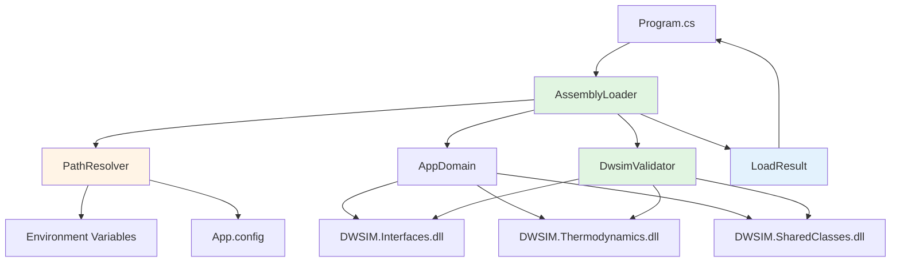

# Design Document

## Overview

The DWSIM Assembly Loader is a foundational component that provides reliable, configurable loading and validation of DWSIM .NET Framework assemblies. It serves as the critical first layer of the DWSIM MCP Server's C# engine worker, ensuring that DWSIM libraries can be programmatically accessed in a headless, server environment.

This component is designed as a reusable module that will be integrated into the main DwsimWorker application. It implements defensive loading strategies, comprehensive diagnostics, and graceful error handling to ensure deployment reliability across different Windows environments.

**Key Design Goals:**
- **Defensive Loading**: Gracefully handle missing assemblies, version conflicts, and dependency issues
- **Observable**: Provide detailed diagnostics about assembly loading process
- **Configurable**: Support multiple assembly source locations (installed DWSIM, bundled assemblies, custom paths)
- **Reusable**: Design as a module that can be used by other components (session manager, engine host)
- **Testable**: Isolated logic that can be unit tested independently

## Steering Document Alignment

### Technical Standards (tech.md)

**Language and Runtime:**
- **C# 10+** with .NET Framework 4.8 compatibility (as specified in tech.md)
- Targets Windows x64 platform (primary deployment target)
- Uses .NET Framework BCL only (no external dependencies except DWSIM assemblies)

**Logging Standards:**
- Leverages **Serilog** (already configured in Program.cs)
- Structured logging with context properties (assembly name, version, path)
- Log levels: Information (success), Warning (version mismatch), Error (failures)

**Naming Conventions (from structure.md):**
- **Classes**: `PascalCase` (e.g., `AssemblyLoader`, `LoadResult`)
- **Methods**: `PascalCase` (e.g., `LoadDwsimAssemblies`, `ValidateInstantiation`)
- **Fields**: `_camelCase` with underscore prefix (e.g., `_logger`, `_assemblyPaths`)
- **Constants**: `PascalCase` or `UPPER_SNAKE_CASE` (e.g., `DefaultAssemblyPath`, `TIMEOUT_SECONDS`)

**Error Handling Patterns:**
- Catch specific exceptions (FileNotFoundException, FileLoadException, TypeLoadException)
- Use custom exception types for domain errors (DwsimLoadException)
- Structured error responses with error codes
- Never swallow exceptions silently

### Project Structure (structure.md)

**Directory Organization:**
Following the structure defined in structure.md, this spec will create files in:

```
mcp_service/dwsim_worker/DwsimWorker/
├── Engine/
│   ├── AssemblyLoader.cs          # NEW: Assembly loading logic
│   ├── LoadResult.cs               # NEW: Result object for load operations
│   └── DwsimValidator.cs           # NEW: Object instantiation validation
├── Utilities/
│   └── PathResolver.cs             # NEW: Path resolution and validation
└── Program.cs                      # MODIFIED: Integrate assembly loader
```

**One File Per Class Rule:**
- Each class in its own dedicated file (AssemblyLoader.cs, LoadResult.cs, etc.)
- Improves readability, maintainability, and git history tracking

**Module Boundaries:**
- `Engine/`: DWSIM engine hosting logic (includes assembly loading)
- `Utilities/`: Helper utilities for path resolution
- Loader has no dependencies on IPC, Adapters, or other modules (pure engine concern)

## Code Reuse Analysis

### Existing Components to Leverage

- **Serilog (Program.cs)**:
  - Already configured in Program.cs with console and file sinks
  - Reuse the Log.Logger singleton for all logging in assembly loader
  - Leverage structured logging: `Log.Information("Assembly loaded: {AssemblyName} v{Version}", name, version)`

- **DwsimWorker.csproj**:
  - Already targets .NET Framework 4.8
  - Already includes Newtonsoft.Json (useful for future DTO serialization)
  - Already has folder structure defined (Engine, Utilities, etc.)
  - Build configuration (Debug/Release) already set up

- **App.config**:
  - Will be extended with binding redirects for DWSIM dependencies
  - Will add appSettings for DWSIM_PATH configuration

### Integration Points

- **Program.cs**:
  - Will call `AssemblyLoader.LoadDwsimAssemblies()` during startup
  - Will use `LoadResult` to determine exit code (0 = success, 1 = failure)
  - Will integrate validation into initialization sequence

- **Future Integration (Session Manager)**:
  - Session manager will reuse `AssemblyLoader` to verify assemblies before creating sessions
  - LoadResult will inform session manager if DWSIM is available

- **Future Integration (Engine Host)**:
  - Engine host will use validated assemblies to instantiate DWSIM flowsheets
  - Will rely on AssemblyLoader ensuring types are available

### No External Code to Reuse (Yet)

This is the first component being implemented, so there's no existing DWSIM-related code to reuse. However, this component will establish patterns for:
- Error handling (DwsimLoadException pattern)
- Result objects (LoadResult pattern)
- Logging structure (context properties pattern)

These patterns will be reused by all subsequent components.

## Architecture

### Design Pattern: Facade + Builder

**Facade Pattern:**
- `AssemblyLoader` provides a simple interface (`LoadDwsimAssemblies()`) hiding complex assembly loading logic
- Encapsulates assembly resolution, dependency handling, and validation
- Client code (Program.cs) doesn't need to know about AppDomain, AssemblyName, or binding redirects

**Builder Pattern (for configuration):**
- `AssemblyLoaderConfig` builder allows flexible configuration:
  ```csharp
  var config = AssemblyLoaderConfig.Create()
      .WithAssemblyPath(customPath)
      .WithValidationEnabled(true)
      .Build();
  var loader = new AssemblyLoader(config);
  ```

### Modular Design Principles

- **Single File Responsibility**:
  - `AssemblyLoader.cs`: Assembly loading orchestration only
  - `LoadResult.cs`: Result data structure only
  - `DwsimValidator.cs`: Object instantiation validation only
  - `PathResolver.cs`: Path resolution and validation only

- **Component Isolation**:
  - AssemblyLoader has no dependencies on IPC, Adapters, or Sessions
  - Pure engine concern: load DWSIM assemblies into AppDomain
  - Can be unit tested independently

- **Service Layer Separation**:
  - AssemblyLoader: Core logic (engine layer)
  - PathResolver: Utility layer (configuration resolution)
  - LoadResult: Data layer (result objects)

- **Utility Modularity**:
  - PathResolver is a focused utility for path operations
  - Can be reused by other components needing path validation

### Architecture Diagram



### Component Interaction Flow

1. **Initialization**: Program.cs creates AssemblyLoader with default configuration
2. **Path Resolution**: AssemblyLoader calls PathResolver to find DWSIM assemblies
3. **Assembly Loading**: AssemblyLoader loads each required assembly into AppDomain
4. **Validation**: AssemblyLoader calls DwsimValidator to verify object instantiation
5. **Result**: LoadResult returned to Program.cs with success/failure details
6. **Logging**: Each step logs structured information via Serilog

## Components and Interfaces

### Component 1: AssemblyLoader

**File**: `Engine/AssemblyLoader.cs`

**Purpose**: Orchestrates the loading and validation of DWSIM assemblies. Main entry point for assembly loading operations.

**Public Interface:**
```csharp
public sealed class AssemblyLoader
{
    // Constructor
    public AssemblyLoader(ILogger logger, AssemblyLoaderConfig config);

    // Main loading method
    public LoadResult LoadDwsimAssemblies();

    // Individual assembly loading (for advanced scenarios)
    public Assembly LoadAssembly(string assemblyName, string assemblyPath);
}
```

**Key Responsibilities:**
- Resolve DWSIM assembly paths using PathResolver
- Load each required assembly (Interfaces, Thermodynamics, SharedClasses, CapeOpen)
- Handle assembly load failures gracefully
- Coordinate validation via DwsimValidator
- Construct LoadResult with detailed status

**Dependencies:**
- `Serilog.ILogger`: For structured logging
- `PathResolver`: For assembly path resolution
- `DwsimValidator`: For post-load validation
- `AssemblyLoaderConfig`: Configuration object

**Error Handling:**
- Catches `FileNotFoundException`: Assembly file not found at expected path
- Catches `FileLoadException`: Assembly found but cannot load (version conflict, corruption)
- Catches `BadImageFormatException`: Assembly is not .NET or wrong bitness (x86 vs x64)
- Catches `TypeLoadException`: Assembly loaded but types cannot be resolved
- Wraps all exceptions in `DwsimLoadException` with context

**Reuses**: Serilog (from Program.cs)

### Component 2: LoadResult

**File**: `Engine/LoadResult.cs`

**Purpose**: Immutable data structure representing the result of an assembly loading operation. Provides detailed status, loaded assemblies, and error information.

**Public Interface:**
```csharp
public sealed class LoadResult
{
    // Properties
    public bool Success { get; }
    public string Message { get; }
    public IReadOnlyList<AssemblyInfo> LoadedAssemblies { get; }
    public Exception Error { get; }
    public int ExitCode { get; }

    // Factory methods
    public static LoadResult SuccessResult(IEnumerable<AssemblyInfo> assemblies);
    public static LoadResult FailureResult(string message, Exception error);
}

public sealed class AssemblyInfo
{
    public string Name { get; }
    public Version Version { get; }
    public string Path { get; }
    public DateTime LoadedAt { get; }
}
```

**Key Responsibilities:**
- Represent success or failure state
- Provide list of successfully loaded assemblies with metadata
- Include error details for failures
- Map result to exit code for Program.cs

**Dependencies**: None (pure data structure)

**Reuses**: None (foundational type)

### Component 3: DwsimValidator

**File**: `Engine/DwsimValidator.cs`

**Purpose**: Validates that loaded DWSIM assemblies are functional by attempting to instantiate core types. Proves that assemblies are not just loaded, but actually usable.

**Public Interface:**
```csharp
public sealed class DwsimValidator
{
    // Constructor
    public DwsimValidator(ILogger logger);

    // Validation methods
    public ValidationResult ValidateInstantiation();
    public ValidationResult ValidateFlowsheetCreation();
    public ValidationResult ValidateMaterialStreamCreation();
}

public sealed class ValidationResult
{
    public bool Success { get; }
    public string Message { get; }
    public IReadOnlyList<string> ValidatedTypes { get; }
    public Exception Error { get; }
}
```

**Key Responsibilities:**
- Instantiate DWSIM.SharedClasses.Flowsheet
- Instantiate DWSIM.Thermodynamics.Streams.MaterialStream
- Verify objects are not null and have expected properties
- Report validation success or failure with type names

**Dependencies:**
- `Serilog.ILogger`: For logging validation steps
- DWSIM assemblies (must be loaded in AppDomain before validation)

**Error Handling:**
- Catches `TypeLoadException`: Type not found in assembly
- Catches `MissingMethodException`: Constructor not accessible
- Catches `TargetInvocationException`: Exception during object construction
- Returns ValidationResult with error details (does not throw)

**Reuses**: Serilog (from Program.cs)

### Component 4: PathResolver

**File**: `Utilities/PathResolver.cs`

**Purpose**: Resolves the file system paths to DWSIM assemblies using multiple fallback strategies. Handles environment variables, config files, and standard installation paths.

**Public Interface:**
```csharp
public static class PathResolver
{
    // Main resolution method
    public static string ResolveDwsimPath();

    // Specific path resolution strategies
    public static string GetEnvironmentPath();
    public static string GetConfigPath();
    public static string GetDefaultInstallPath();

    // Validation
    public static bool ValidatePath(string path);
    public static IEnumerable<string> FindAssemblies(string basePath);
}
```

**Key Responsibilities:**
- Check `DWSIM_PATH` environment variable
- Check `appSettings["DwsimPath"]` in App.config
- Check default Windows installation paths (C:\Program Files\DWSIM, etc.)
- Validate that resolved path contains expected assemblies
- Return first valid path or throw exception if none found

**Dependencies**: None (pure utility)

**Error Handling:**
- Throws `DirectoryNotFoundException`: No valid DWSIM path found
- Validates paths before returning (checks for expected DLL files)

**Reuses**: None (foundational utility)

### Component 5: AssemblyLoaderConfig

**File**: `Engine/AssemblyLoaderConfig.cs`

**Purpose**: Configuration object for AssemblyLoader using builder pattern. Allows customization of loading behavior.

**Public Interface:**
```csharp
public sealed class AssemblyLoaderConfig
{
    public string AssemblyPath { get; }
    public bool ValidateAfterLoad { get; }
    public TimeSpan LoadTimeout { get; }

    // Builder
    public static AssemblyLoaderConfigBuilder Create();
}

public sealed class AssemblyLoaderConfigBuilder
{
    public AssemblyLoaderConfigBuilder WithAssemblyPath(string path);
    public AssemblyLoaderConfigBuilder WithValidationEnabled(bool enabled);
    public AssemblyLoaderConfigBuilder WithTimeout(TimeSpan timeout);
    public AssemblyLoaderConfig Build();
}
```

**Dependencies**: None

**Reuses**: None

### Component 6: DwsimLoadException

**File**: `Engine/DwsimLoadException.cs`

**Purpose**: Custom exception type for assembly loading failures. Provides structured error information.

**Public Interface:**
```csharp
public sealed class DwsimLoadException : Exception
{
    public string AssemblyName { get; }
    public string AttemptedPath { get; }
    public ErrorCode Code { get; }

    public DwsimLoadException(string message, string assemblyName, string path, ErrorCode code, Exception innerException);
}

public enum ErrorCode
{
    AssemblyNotFound,
    AssemblyLoadFailure,
    DependencyMissing,
    TypeLoadFailure,
    ValidationFailure
}
```

**Dependencies**: None

**Reuses**: Standard .NET Exception base class

## Data Models

### LoadResult Model

```csharp
/// <summary>
/// Represents the result of a DWSIM assembly loading operation.
/// Immutable data structure containing success status, loaded assemblies, and error details.
/// </summary>
public sealed class LoadResult
{
    /// <summary>
    /// Indicates whether assembly loading succeeded.
    /// </summary>
    public bool Success { get; }

    /// <summary>
    /// Human-readable message describing the result.
    /// Success: "Successfully loaded 4 DWSIM assemblies"
    /// Failure: "Failed to load DWSIM.Interfaces.dll: File not found"
    /// </summary>
    public string Message { get; }

    /// <summary>
    /// List of successfully loaded assemblies with metadata.
    /// Empty if Success is false.
    /// </summary>
    public IReadOnlyList<AssemblyInfo> LoadedAssemblies { get; }

    /// <summary>
    /// Exception that caused the failure (null if Success is true).
    /// </summary>
    public Exception Error { get; }

    /// <summary>
    /// Exit code for Program.cs:
    /// 0 = Success
    /// 1 = Assembly loading failed
    /// 2 = Validation failed
    /// </summary>
    public int ExitCode { get; }
}
```

### AssemblyInfo Model

```csharp
/// <summary>
/// Metadata about a loaded DWSIM assembly.
/// </summary>
public sealed class AssemblyInfo
{
    /// <summary>
    /// Assembly name (e.g., "DWSIM.Interfaces")
    /// </summary>
    public string Name { get; }

    /// <summary>
    /// Assembly version (e.g., "6.5.3.0")
    /// </summary>
    public Version Version { get; }

    /// <summary>
    /// Full file path where assembly was loaded from.
    /// </summary>
    public string Path { get; }

    /// <summary>
    /// Timestamp when assembly was loaded.
    /// </summary>
    public DateTime LoadedAt { get; }
}
```

### ValidationResult Model

```csharp
/// <summary>
/// Result of DWSIM assembly validation (object instantiation tests).
/// </summary>
public sealed class ValidationResult
{
    /// <summary>
    /// Indicates whether validation succeeded.
    /// </summary>
    public bool Success { get; }

    /// <summary>
    /// Human-readable validation message.
    /// </summary>
    public string Message { get; }

    /// <summary>
    /// List of type names that were successfully instantiated.
    /// Example: ["DWSIM.SharedClasses.Flowsheet", "DWSIM.Thermodynamics.Streams.MaterialStream"]
    /// </summary>
    public IReadOnlyList<string> ValidatedTypes { get; }

    /// <summary>
    /// Exception if validation failed (null if Success is true).
    /// </summary>
    public Exception Error { get; }
}
```

### AssemblyLoaderConfig Model

```csharp
/// <summary>
/// Configuration for AssemblyLoader behavior.
/// </summary>
public sealed class AssemblyLoaderConfig
{
    /// <summary>
    /// Path to DWSIM assemblies directory.
    /// If null, PathResolver will auto-detect using environment variables and defaults.
    /// </summary>
    public string AssemblyPath { get; }

    /// <summary>
    /// Whether to validate assemblies after loading (instantiate test objects).
    /// Default: true
    /// </summary>
    public bool ValidateAfterLoad { get; }

    /// <summary>
    /// Maximum time to wait for assembly loading to complete.
    /// Default: 30 seconds
    /// </summary>
    public TimeSpan LoadTimeout { get; }

    /// <summary>
    /// Required assemblies to load.
    /// Default: ["DWSIM.Interfaces", "DWSIM.Thermodynamics", "DWSIM.SharedClasses", "CapeOpen"]
    /// </summary>
    public IReadOnlyList<string> RequiredAssemblies { get; }
}
```

## Error Handling

### Error Scenario 1: DWSIM Assemblies Not Found

**Description**: DWSIM is not installed, or the assembly path is incorrect.

**Handling**:
1. PathResolver tries multiple strategies (environment variable, config, default paths)
2. If all strategies fail, throws `DwsimLoadException` with code `AssemblyNotFound`
3. AssemblyLoader catches exception, logs error with all attempted paths
4. Returns `LoadResult.FailureResult()` with exit code 1
5. Program.cs logs error and exits with code 1

**User Impact**:
- Application exits immediately with clear error message
- Error message includes attempted paths and remediation steps:
  - "DWSIM assemblies not found. Attempted paths: [list]. Please install DWSIM or set DWSIM_PATH environment variable."

**Logging**:
```csharp
Log.Error("DWSIM assemblies not found. Attempted paths: {@AttemptedPaths}", attemptedPaths);
```

### Error Scenario 2: Assembly Version Mismatch

**Description**: DWSIM assemblies are found, but a dependency (e.g., Newtonsoft.Json) has version conflict.

**Handling**:
1. AssemblyLoader attempts to load assembly
2. .NET throws `FileLoadException` with version details
3. AssemblyLoader catches exception, checks if binding redirect can resolve
4. If binding redirect exists in App.config, logs warning and continues
5. If no binding redirect, returns `LoadResult.FailureResult()` with exit code 1

**User Impact**:
- If resolvable via binding redirect: Warning logged, loading continues
- If not resolvable: Application exits with error message suggesting to update App.config or reinstall DWSIM

**Logging**:
```csharp
Log.Warning("Assembly version mismatch: {AssemblyName}. Expected {ExpectedVersion}, found {ActualVersion}. Binding redirect may be required.",
    assemblyName, expectedVersion, actualVersion);
```

### Error Scenario 3: Assembly Loads But Types Are Inaccessible

**Description**: Assembly file loads successfully, but DWSIM types cannot be instantiated (broken assembly, corrupted file).

**Handling**:
1. AssemblyLoader successfully loads assemblies
2. DwsimValidator attempts to instantiate Flowsheet
3. TypeLoadException thrown (type not found)
4. DwsimValidator catches exception, returns `ValidationResult` with Success=false
5. AssemblyLoader logs error and returns `LoadResult.FailureResult()` with exit code 2

**User Impact**:
- Application exits with error indicating validation failure
- Error message suggests reinstalling DWSIM or verifying file integrity

**Logging**:
```csharp
Log.Error("Failed to instantiate DWSIM types. Assembly loaded but types are inaccessible. Type: {TypeName}, Error: {ErrorMessage}",
    typeName, ex.Message);
```

### Error Scenario 4: Wrong Bitness (x86 vs x64)

**Description**: Application is compiled for x64, but DWSIM assemblies are x86 (or vice versa).

**Handling**:
1. AssemblyLoader attempts to load assembly
2. .NET throws `BadImageFormatException`
3. AssemblyLoader catches exception, checks bitness mismatch
4. Logs error with clear message about bitness mismatch
5. Returns `LoadResult.FailureResult()` with exit code 1

**User Impact**:
- Application exits with error explaining bitness mismatch
- Error message suggests recompiling application with correct platform target (AnyCPU, x64, or x86)

**Logging**:
```csharp
Log.Error("Assembly bitness mismatch: {AssemblyName}. Application is {AppBitness}, assembly is {AssemblyBitness}.",
    assemblyName, appBitness, assemblyBitness);
```

### Error Scenario 5: Timeout During Assembly Loading

**Description**: Assembly loading takes too long (network drive, slow disk, antivirus scanning).

**Handling**:
1. AssemblyLoader starts loading with timeout configured (default 30s)
2. If timeout expires, cancels operation
3. Logs error with elapsed time
4. Returns `LoadResult.FailureResult()` with exit code 1

**User Impact**:
- Application exits with timeout error
- Error message suggests checking disk performance or antivirus settings

**Logging**:
```csharp
Log.Error("Assembly loading timed out after {ElapsedSeconds} seconds. Assembly: {AssemblyName}",
    elapsedSeconds, assemblyName);
```

## Testing Strategy

### Unit Testing

**Framework**: xUnit (already set up in DwsimWorker.Tests.csproj)

**Test Structure**:
- `AssemblyLoaderTests.cs`: Tests for AssemblyLoader class
- `PathResolverTests.cs`: Tests for PathResolver utility
- `DwsimValidatorTests.cs`: Tests for DwsimValidator
- `LoadResultTests.cs`: Tests for LoadResult factory methods

**Key Test Cases**:

1. **AssemblyLoader Tests**:
   - `LoadDwsimAssemblies_WithValidPath_ReturnsSuccess()`: Happy path test
   - `LoadDwsimAssemblies_WithInvalidPath_ReturnsFailure()`: Assembly not found
   - `LoadDwsimAssemblies_WithMissingAssembly_ReturnsFailureWithDetails()`: Partial load
   - `LoadAssembly_WithVersionMismatch_LogsWarning()`: Version conflict handling

2. **PathResolver Tests**:
   - `ResolveDwsimPath_WithEnvironmentVariable_ReturnsEnvPath()`: DWSIM_PATH set
   - `ResolveDwsimPath_WithConfigSetting_ReturnsConfigPath()`: App.config path
   - `ResolveDwsimPath_WithDefaultInstall_ReturnsDefaultPath()`: Standard installation
   - `ResolveDwsimPath_WithNoValidPath_ThrowsException()`: No DWSIM found
   - `ValidatePath_WithValidPath_ReturnsTrue()`: Path contains expected DLLs
   - `ValidatePath_WithInvalidPath_ReturnsFalse()`: Path missing DLLs

3. **DwsimValidator Tests**:
   - `ValidateInstantiation_WithLoadedAssemblies_ReturnsSuccess()`: Objects instantiate
   - `ValidateInstantiation_WithoutAssemblies_ReturnsFailure()`: Assemblies not loaded
   - `ValidateFlowsheetCreation_Success()`: Flowsheet object created
   - `ValidateMaterialStreamCreation_Success()`: MaterialStream object created

4. **LoadResult Tests**:
   - `SuccessResult_ContainsAssemblyInfo()`: Success result with metadata
   - `FailureResult_ContainsErrorDetails()`: Failure result with exception
   - `ExitCode_Success_ReturnsZero()`: Exit code mapping
   - `ExitCode_Failure_ReturnsNonZero()`: Exit code mapping

**Mocking Strategy**:
- Mock `ILogger` for testing logging calls
- Use test assemblies or mock Assembly objects for testing load logic
- For PathResolver, use temporary directories with test DLL files

**Test Coverage Goal**: >80% code coverage

### Integration Testing

**Test Scenario 1: End-to-End Assembly Loading**

**Setup**:
- Actual DWSIM installation on test machine
- Or bundled DWSIM assemblies in test directory

**Test Steps**:
1. Run DwsimWorker.exe from command line
2. Verify exit code is 0
3. Verify console output contains success messages
4. Verify log file contains expected assembly names and versions

**Expected Result**:
- Application exits with code 0
- Logs show "Successfully loaded 4 DWSIM assemblies"
- Logs contain assembly names: DWSIM.Interfaces, DWSIM.Thermodynamics, DWSIM.SharedClasses, CapeOpen

**Test Scenario 2: Missing Assembly Handling**

**Setup**:
- Remove one DWSIM assembly (e.g., delete DWSIM.Thermodynamics.dll)

**Test Steps**:
1. Run DwsimWorker.exe
2. Verify exit code is 1
3. Verify error message is clear and actionable

**Expected Result**:
- Application exits with code 1
- Error message: "Failed to load DWSIM.Thermodynamics.dll: File not found at path [path]"
- Remediation steps included in error message

**Test Scenario 3: Environment Variable Configuration**

**Setup**:
- Set DWSIM_PATH environment variable to custom path
- Place DWSIM assemblies in custom path

**Test Steps**:
1. Run DwsimWorker.exe
2. Verify assemblies loaded from custom path (check logs)
3. Verify exit code is 0

**Expected Result**:
- Application uses DWSIM_PATH environment variable
- Logs show assemblies loaded from custom path
- Application exits with code 0

### End-to-End Testing

**Test Scenario 1: Deployment on Clean Windows Server**

**Environment**: Windows Server 2022, fresh install, .NET Framework 4.8 pre-installed

**Test Steps**:
1. Install DWSIM (standard installer)
2. Deploy DwsimWorker.exe (no additional configuration)
3. Run DwsimWorker.exe
4. Verify successful execution

**Expected Result**:
- DWSIM assemblies auto-detected from default installation path
- Application runs successfully without configuration
- Exit code 0

**Test Scenario 2: Headless Operation Validation**

**Environment**: Windows Server Core (no GUI)

**Test Steps**:
1. Deploy DwsimWorker.exe and DWSIM assemblies
2. Run DwsimWorker.exe via PowerShell
3. Verify no windows or dialogs appear
4. Verify application exits automatically

**Expected Result**:
- No GUI components displayed
- No blocking prompts
- Application exits with code 0
- All output to console only

**Test Scenario 3: Multiple Concurrent Instances**

**Setup**: Test that multiple instances don't interfere with each other

**Test Steps**:
1. Run DwsimWorker.exe instance 1
2. Run DwsimWorker.exe instance 2
3. Verify both load assemblies successfully
4. Verify no file locking or resource conflicts

**Expected Result**:
- Both instances load assemblies independently
- No conflicts or errors
- Both exit with code 0

## Configuration and Deployment

### App.config Additions

The following will be added to App.config for binding redirects and settings:

```xml
<?xml version="1.0" encoding="utf-8"?>
<configuration>
  <appSettings>
    <!-- Optional: Override auto-detection of DWSIM path -->
    <!-- <add key="DwsimPath" value="C:\CustomPath\DWSIM" /> -->
  </appSettings>

  <runtime>
    <assemblyBinding xmlns="urn:schemas-microsoft-com:asm.v1">
      <!-- Newtonsoft.Json binding redirect (DWSIM may reference older version) -->
      <dependentAssembly>
        <assemblyIdentity name="Newtonsoft.Json" publicKeyToken="30ad4fe6b2a6aeed" culture="neutral" />
        <bindingRedirect oldVersion="0.0.0.0-13.0.0.0" newVersion="13.0.3.0" />
      </dependentAssembly>
    </assemblyBinding>
  </runtime>
</configuration>
```

### Environment Variables

- **DWSIM_PATH**: Path to directory containing DWSIM assemblies
  - Example: `DWSIM_PATH=C:\DWSIM\Assemblies`
  - Priority: Environment variable > App.config > Default paths

### Command-Line Arguments

```bash
DwsimWorker.exe [options]

Options:
  --dwsim-path <path>    Override DWSIM assembly path
  --no-validation        Skip post-load validation (faster startup, less safe)
  --help                 Display help message
```

### Deployment Checklist

1. **Prerequisites**:
   - .NET Framework 4.8 Runtime installed
   - DWSIM installed OR DWSIM assemblies bundled with application

2. **Configuration**:
   - If DWSIM not in default location, set DWSIM_PATH environment variable
   - Or add DwsimPath to App.config appSettings

3. **Verification**:
   - Run DwsimWorker.exe
   - Check exit code (0 = success)
   - Check logs for assembly load confirmation

4. **Troubleshooting**:
   - If exit code 1: Check DWSIM installation and path configuration
   - If exit code 2: Reinstall DWSIM (assembly validation failed)
   - Enable verbose logging by modifying Serilog config in Program.cs

## Performance Considerations

### Startup Time

- **Target**: Assembly loading completes in < 5 seconds
- **Typical**: Expect 1-2 seconds on modern hardware (SSD, 4+ cores)
- **Optimization**:
  - Load assemblies in parallel (if dependencies allow)
  - Lazy-load non-critical assemblies (future enhancement)

### Memory Footprint

- **Target**: < 200MB after loading all assemblies
- **Typical**: Expect 100-150MB (DWSIM assemblies are large)
- **Monitoring**: Log memory usage after loading

### Assembly Caching

- .NET automatically caches loaded assemblies in AppDomain
- Subsequent type instantiations are fast (no reload)
- No manual caching required at this stage

## Future Enhancements

1. **Parallel Assembly Loading**: Load independent assemblies concurrently to reduce startup time
2. **Assembly Preloading**: Load assemblies in background during application startup
3. **Assembly Hot-Reload**: Support reloading assemblies without restarting process (for DWSIM updates)
4. **Assembly Versioning**: Support multiple DWSIM versions simultaneously (version-specific paths)
5. **Telemetry**: Send assembly loading metrics to monitoring system (OpenTelemetry)

## Security Considerations

- **Path Validation**: PathResolver validates paths to prevent directory traversal
- **Trusted Sources Only**: Only load assemblies from trusted paths (no arbitrary user paths)
- **No Dynamic Code Execution**: Assembly loading only, no runtime code generation
- **Logging Sanitization**: Don't log sensitive paths in production (option to redact paths)

## Documentation

### Code Documentation

- XML documentation comments for all public classes and methods
- Example usage in class summaries
- Inline comments for complex logic (assembly resolution strategy, binding redirect handling)

### User Documentation

- README in DwsimWorker folder explaining assembly loading requirements
- Troubleshooting guide for common errors (assembly not found, version mismatch)
- Configuration examples for different deployment scenarios

## Success Criteria

This design is successful if:
1. ✅ Assemblies load reliably on Windows Server without manual configuration
2. ✅ Clear, actionable error messages for all failure modes
3. ✅ No COM registration or manual setup required
4. ✅ Validation proves assemblies are functional (object instantiation works)
5. ✅ Code is modular, testable, and follows project structure conventions
6. ✅ Comprehensive logging enables troubleshooting in production
7. ✅ Unit tests achieve >80% code coverage
8. ✅ Integration tests pass on clean Windows Server 2022 installation
