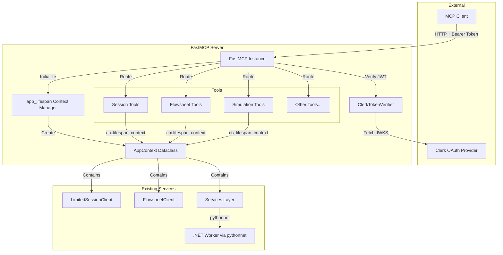

# Design Document: FastMCP OAuth Migration

## Overview

This design details the migration from the current low-level MCP Python SDK architecture to FastMCP with Clerk OAuth integration. The migration transforms 33 tools from verbose `@server.call_tool()` handlers to clean `@mcp.tool()` decorators while adding JWT-based authentication via Clerk.

**Key Changes:**
1. Replace `Server` + `StreamableHTTPSessionManager` with `FastMCP`
2. Convert tool definitions to decorator-based pattern
3. Add `ClerkTokenVerifier` implementing MCP SDK's `TokenVerifier` interface
4. Introduce `AppContext` dataclass with lifespan context manager for dependency injection

## Steering Document Alignment

### Technical Standards (tech.md)

- **Python MCP Server**: Continues using Python 3.11+ with asyncio
- **Pydantic Models**: All request/response DTOs remain Pydantic-based
- **Structured Logging**: Maintains structlog integration
- **Type Safety**: Full type hints with mypy compatibility
- **pythonnet Integration**: No changes to .NET interop layer

### Project Structure (structure.md)

The migration follows existing conventions:
- New `auth/` module under `dwsim_mcp_server/` for authentication components
- Tool files remain in `tools/` directory with same module organization
- One class per file principle maintained for auth components
- Configuration via Pydantic settings as per existing patterns

**New Directory Structure:**
```
mcp_service/server/dwsim_mcp_server/
├── auth/                          # NEW: Authentication module
│   ├── __init__.py
│   ├── settings.py               # AuthConfig pydantic settings
│   └── clerk_verifier.py         # ClerkTokenVerifier class
├── context.py                     # NEW: AppContext and lifespan
├── server.py                      # MODIFIED: FastMCP bootstrap
├── tools/                         # MODIFIED: Decorator-based tools
│   ├── session.py
│   ├── flowsheet.py
│   ├── simulation.py
│   ├── compound.py
│   ├── analysis.py
│   ├── sensitivity.py
│   ├── export.py
│   └── diagnostics.py
└── ... (existing modules unchanged)
```

## Code Reuse Analysis

### Existing Components to Leverage

- **`ServerDependencies`**: Current dependency container pattern migrates to `AppContext` dataclass
- **`LimitedSessionClient`**: No changes - accessed via context
- **`FlowsheetClient`**: No changes - accessed via context
- **`FlowsheetService`**: No changes - accessed via context
- **`ThermodynamicsService`**: No changes - accessed via context
- **`SensitivityService`**: No changes - accessed via context
- **`DiagnosticsService`**: No changes - accessed via context
- **All Pydantic models**: Request/response DTOs remain unchanged
- **Observability module**: Logging, tracing, metrics unchanged

### Integration Points

- **MCP SDK `TokenVerifier`**: New `ClerkTokenVerifier` implements this abstract base class
- **MCP SDK `AuthSettings`**: Configuration passed to FastMCP for OAuth metadata
- **Existing tool handlers**: Logic extracted and wrapped with `@mcp.tool()` decorators

## Architecture



### Modular Design Principles

- **Single File Responsibility**: Auth module split into `settings.py` (config) and `clerk_verifier.py` (verification)
- **Component Isolation**: OAuth verification completely isolated from tool logic
- **Service Layer Separation**: Tools access services via typed `AppContext`, not global state
- **Utility Modularity**: JWKS caching encapsulated within `ClerkTokenVerifier`

## Components and Interfaces

### Component 1: AuthConfig (Settings)

- **Purpose**: Pydantic settings model for Clerk OAuth configuration
- **File**: `dwsim_mcp_server/auth/settings.py`
- **Interfaces**:
  ```python
  class AuthConfig(BaseSettings):
      enabled: bool
      issuer_url: AnyHttpUrl
      jwks_url: str | None
      audience: str | None
      required_scopes: list[str]

      @property
      def effective_jwks_url(self) -> str
  ```
- **Dependencies**: pydantic, pydantic-settings
- **Reuses**: Existing Pydantic settings pattern from `config/`

### Component 2: ClerkTokenVerifier

- **Purpose**: Verify Clerk-issued JWT tokens using JWKS
- **File**: `dwsim_mcp_server/auth/clerk_verifier.py`
- **Interfaces**:
  ```python
  class ClerkTokenVerifier(TokenVerifier):
      def __init__(self, config: AuthConfig) -> None
      async def verify_token(self, token: str) -> AccessToken | None
  ```
- **Dependencies**: mcp.server.auth.provider, pyjwt, httpx
- **Reuses**: Existing observability logging

### Component 3: AppContext

- **Purpose**: Type-safe dependency container for FastMCP lifespan
- **File**: `dwsim_mcp_server/context.py`
- **Interfaces**:
  ```python
  @dataclass
  class AppContext:
      settings: ServerSettings
      session_client: LimitedSessionClient
      flowsheet_client: FlowsheetClient
      flowsheet_service: FlowsheetService
      thermodynamics_service: ThermodynamicsService
      sensitivity_service: SensitivityService
      diagnostics_service: DiagnosticsService

  @asynccontextmanager
  async def app_lifespan(server: FastMCP) -> AsyncIterator[AppContext]
  ```
- **Dependencies**: All existing service classes
- **Reuses**: Current `ServerDependencies` initialization logic

### Component 4: FastMCP Server Bootstrap

- **Purpose**: Create and configure FastMCP instance with optional OAuth
- **File**: `dwsim_mcp_server/server.py` (modified)
- **Interfaces**:
  ```python
  def create_mcp_server() -> FastMCP
  def run() -> None
  ```
- **Dependencies**: FastMCP, auth module, all tool registration functions
- **Reuses**: Existing `ServerSettings`, observability setup

### Component 5: Tool Registration Functions

- **Purpose**: Register tools with FastMCP using decorators
- **Files**: `dwsim_mcp_server/tools/*.py` (modified)
- **Interface Pattern**:
  ```python
  def register_{domain}_tools(mcp: FastMCP) -> None:
      @mcp.tool(description="...")
      async def tool_name(
          param1: type,
          ctx: Context[ServerSession, AppContext] = None,
      ) -> dict:
          app = ctx.request_context.lifespan_context
          # Use app.session_client, app.flowsheet_service, etc.
  ```
- **Dependencies**: FastMCP, existing service classes
- **Reuses**: All existing tool handler logic

## Data Models

### AuthConfig Model

```python
class AuthConfig(BaseSettings):
    model_config = SettingsConfigDict(env_prefix="CLERK_", case_sensitive=False)

    enabled: bool = False                    # DWSIM_AUTH_ENABLED
    issuer_url: AnyHttpUrl                   # CLERK_ISSUER_URL
    jwks_url: str | None = None              # CLERK_JWKS_URL (optional override)
    audience: str | None = None              # CLERK_AUDIENCE
    required_scopes: list[str] = ["user"]    # CLERK_REQUIRED_SCOPES
```

### AppContext Model

```python
@dataclass
class AppContext:
    settings: ServerSettings
    session_client: LimitedSessionClient
    flowsheet_client: FlowsheetClient
    flowsheet_service: FlowsheetService
    thermodynamics_service: ThermodynamicsService
    sensitivity_service: SensitivityService
    diagnostics_service: DiagnosticsService
```

### AccessToken (from MCP SDK)

```python
# mcp.server.auth.provider.AccessToken
@dataclass
class AccessToken:
    token: str
    scopes: list[str]
    expires_at: int | None
```

## Error Handling

### Error Scenarios

1. **Invalid JWT Token**
   - **Handling**: `ClerkTokenVerifier.verify_token()` returns `None`
   - **User Impact**: HTTP 401 Unauthorized response
   - **Logging**: Warning with token validation failure reason

2. **Expired JWT Token**
   - **Handling**: pyjwt raises `ExpiredSignatureError`, caught and logged
   - **User Impact**: HTTP 401 Unauthorized response
   - **Logging**: Warning "token_expired"

3. **JWKS Fetch Failure**
   - **Handling**: `PyJWKClientError` caught, use cached keys if available
   - **User Impact**: HTTP 401 if no cached keys, otherwise continue
   - **Logging**: Warning "jwks_fetch_failed" with error details

4. **Missing Required Scopes**
   - **Handling**: Scope check fails, return `None` from verifier
   - **User Impact**: HTTP 401 Unauthorized response
   - **Logging**: Warning "token_missing_scopes" with required vs present

5. **OAuth Disabled but Token Provided**
   - **Handling**: Token ignored, request proceeds
   - **User Impact**: Normal operation
   - **Logging**: None (expected behavior)

6. **Tool Execution Error**
   - **Handling**: Existing error handling preserved
   - **User Impact**: MCP error response with details
   - **Logging**: Error with full context

## Testing Strategy

### Unit Testing

**Auth Module Tests** (`tests/unit/auth/`):
- `test_auth_settings.py`: AuthConfig loading from environment
- `test_clerk_verifier.py`:
  - Valid token verification with mocked JWKS
  - Expired token rejection
  - Invalid signature rejection
  - Missing scopes rejection
  - JWKS caching behavior
  - JWKS fetch failure handling

**Context Tests** (`tests/unit/`):
- `test_context.py`:
  - AppContext initialization
  - Lifespan startup/shutdown
  - Dependency disposal

### Integration Testing

**OAuth Flow Tests** (`tests/integration/`):
- `test_oauth_flow.py`:
  - OAuth discovery endpoint (`/.well-known/oauth-protected-resource`)
  - Unauthenticated request rejection (when auth enabled)
  - Authenticated request acceptance
  - Stdio mode bypass (no auth)

**Tool Migration Tests**:
- Run existing integration tests against new FastMCP server
- Verify all 33 tools return identical results

### End-to-End Testing

**Manual Testing Checklist**:
1. Start server with `DWSIM_AUTH_ENABLED=false` - verify tools work
2. Start server with `DWSIM_AUTH_ENABLED=true` - verify 401 without token
3. Configure `mcp-remote` with Clerk - verify OAuth flow
4. Run simulation workflow end-to-end with authentication
5. Test stdio transport mode (should bypass OAuth)

## Migration Strategy

### Phase 1: Add Auth Module (No Breaking Changes)
1. Create `auth/` directory with `settings.py` and `clerk_verifier.py`
2. Add pyjwt dependency to `pyproject.toml`
3. Add unit tests for auth module
4. **Checkpoint**: Auth module tested independently

### Phase 2: Add AppContext and Lifespan
1. Create `context.py` with `AppContext` and `app_lifespan`
2. Keep existing `server.py` functional
3. Add unit tests for context
4. **Checkpoint**: Context module tested independently

### Phase 3: Convert Tools (One Module at a Time)
1. Convert `session.py` tools first (4 tools, critical path)
2. Test session tools with new context
3. Convert remaining modules in order:
   - `flowsheet.py` (10 tools)
   - `simulation.py` (3 tools)
   - `compound.py` (2 tools)
   - `analysis.py` (3 tools)
   - `sensitivity.py` (5 tools)
   - `export.py` (3 tools)
   - `diagnostics.py` (3 tools)
4. **Checkpoint**: All tools converted and tested

### Phase 4: Update Server Bootstrap
1. Replace `server.py` with FastMCP version
2. Wire up auth (optional based on config)
3. Run full integration test suite
4. **Checkpoint**: Server fully migrated

### Phase 5: Documentation and Cleanup
1. Update `.env.example` with OAuth settings
2. Create Clerk setup documentation
3. Update README with authentication section
4. Remove deprecated code (if any)
5. **Checkpoint**: Migration complete

## Rollback Plan

1. **Immediate**: Revert `server.py` to previous version (git checkout)
2. **Partial**: Set `DWSIM_AUTH_ENABLED=false` to disable OAuth only
3. **Transport**: Switch to `DWSIM_TRANSPORT_MODE=stdio` which bypasses HTTP/OAuth entirely

All existing code paths remain functional - the migration is additive until final cutover.
