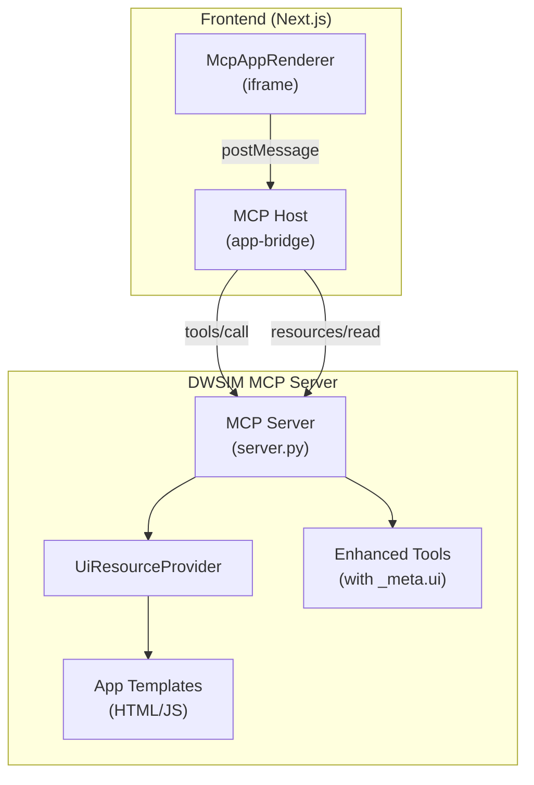

# MCP Apps Backend - Design Document

## Overview

This design enables the DWSIM MCP Server to deliver interactive UI applications alongside tool results, following the MCP Apps Extension specification (SEP-1865). The backend is responsible for:

1. **UI Resource Provider**: Serving `ui://dwsim/*` resources containing HTML applications
2. **Tool Enhancement**: Adding `_meta.ui` metadata to tools that benefit from visualization
3. **App Development**: Building domain-specific HTML/JS applications for simulation visualization
4. **Test Harness**: Enabling local app development without requiring the full frontend stack

This implements **Option C (Hybrid)** from the integration proposal, where the backend owns tool definitions and domain-specific apps while the frontend owns the MCP host/renderer.

## Steering Document Alignment

### Technical Standards (tech.md)

**Architecture Alignment:**
- **Resource Provider Pattern**: Follows existing `BaseResourceProvider` pattern used by `DocsProvider`
- **pythonnet Interop**: Apps access simulation data through existing pythonnet bridge
- **Session-Based State**: Apps receive data through tool results, maintaining stateless tool model
- **Observability**: Resource access logged via structlog with correlation IDs

**Technology Stack:**
- **Python MCP Server**: UI resource provider implemented in Python
- **HTML/JS Apps**: Vanilla JS with optional Plotly.js for charts (no build step required)
- **Pydantic Models**: Resource metadata validated with Pydantic
- **CAPE-OPEN**: App data structures follow CAPE-OPEN vocabulary for consistency

### Project Structure (structure.md)

**File Organization:**
```
mcp_service/server/dwsim_mcp_server/
├── resources/
│   ├── __init__.py
│   ├── base.py           # Existing BaseResourceProvider
│   ├── docs.py           # Existing DocsProvider (pattern to follow)
│   └── ui_resource_provider.py  # NEW: UiResourceProvider
├── apps/
│   ├── __init__.py
│   ├── templates/        # HTML app templates
│   │   ├── base.html     # Shared base with MCP Apps SDK
│   │   ├── simulation-results/
│   │   │   └── index.html
│   │   ├── stream-properties/
│   │   │   └── index.html
│   │   ├── flowsheet-viewer/
│   │   │   └── index.html
│   │   └── diagnostics/
│   │       └── index.html
│   ├── static/           # Shared JS/CSS assets
│   │   ├── app-client.js # MCP Apps client wrapper
│   │   └── theme.css     # Shared theming
│   └── test-harness/     # Local development harness
│       ├── index.html
│       ├── mock-bridge.js
│       └── mocks/
│           ├── simulation-result.json
│           ├── stream-properties.json
│           └── flowsheet-topology.json
├── models/
│   └── resources/
│       └── ui_resource_metadata.py  # NEW: UI metadata models
└── tools/
    └── [existing tool files - enhanced with _meta.ui]
```

**Naming Conventions:**
- Resource URIs: `ui://dwsim/{app-name}` (kebab-case)
- Templates: `{app-name}/index.html`
- One class per file following structure.md guidelines

## Code Reuse Analysis

### Existing Components to Leverage

**BaseResourceProvider (`resources/base.py`):**
- Abstract base class for resource providers
- Provides `create_resource()`, `create_json_result()`, `create_text_result()` helpers
- Handles URI parsing with `parse_uri()` method
- Includes structured logging via `self._logger`

**DocsProvider (`resources/docs.py`):**
- Pattern to follow for UiResourceProvider implementation
- Demonstrates file-based resource serving with caching
- Shows metadata extraction from content files

**Existing Tool Definitions:**
- `tools/simulation.py`: `run_simulation` tool to enhance
- `tools/flowsheet.py`: Flowsheet tools to enhance
- Tools already return structured JSON results compatible with app consumption

**Session Client (`ipc/session_client.py`):**
- Provides access to simulation results
- Apps indirectly access data through tool results (not direct session access)

### Integration Points

**MCP Protocol Layer:**
- `server.py` registers resource providers
- Resources listed via `resources/list` method
- Resources read via `resources/read` method

**Tool Result Enhancement:**
- Tool handlers return `_meta.ui` in result annotations
- Frontend detects `_meta.ui.resourceUri` and renders app

## Architecture

### High-Level Architecture



### Resource Flow

```mermaid
sequenceDiagram
    participant LLM as LLM Agent
    participant Host as MCP Host
    participant Server as DWSIM Server
    participant UiProv as UiResourceProvider

    LLM->>Host: Call tool (run_simulation)
    Host->>Server: tools/call
    Server-->>Host: Result + _meta.ui.resourceUri
    Host->>Host: Detect ui:// resource
    Host->>Server: resources/read(ui://dwsim/simulation-results)
    Server->>UiProv: read_resource()
    UiProv-->>Server: HTML content + CSP metadata
    Server-->>Host: HTML with text/html;profile=mcp-app
    Host->>Host: Render in sandboxed iframe
    Host->>Host: postMessage tool result to app
```

### Modular Design Principles

**Single File Responsibility:**
- `ui_resource_provider.py`: Only handles UI resource serving
- Each app template is self-contained in its own directory
- Shared assets in `static/` for reuse across apps

**Component Isolation:**
- Apps are fully isolated (run in sandboxed iframes)
- No direct access to Python runtime from apps
- Communication only via MCP Apps protocol (postMessage)

**Service Layer Separation:**
- Resource provider handles URI routing and content serving
- Apps handle presentation and user interaction
- Tool handlers provide data transformation

## Components and Interfaces

### Component 1: UiResourceProvider

**Purpose:** Serves HTML applications as MCP resources with `ui://dwsim/*` URI scheme

**Interfaces:**
```python
class UiResourceProvider(BaseResourceProvider):
    SCHEME = "ui"
    AUTHORITY = "dwsim"

    def __init__(self, apps_path: str) -> None:
        """Initialize with path to apps directory."""

    def get_resource_templates(self) -> List[types.ResourceTemplate]:
        """Return URI templates for UI resources."""

    async def list_resources(self) -> List[types.Resource]:
        """List all available UI apps."""

    async def read_resource(self, uri: str) -> types.ReadResourceResult:
        """Read and return app HTML with metadata."""

    def _build_csp_metadata(self, app_config: dict) -> dict:
        """Build CSP metadata from app configuration."""
```

**Dependencies:**
- `BaseResourceProvider` from `resources/base.py`
- `aiofiles` for async file reading
- Pydantic models for validation

**Reuses:**
- `BaseResourceProvider.create_text_result()` for response formatting
- `BaseResourceProvider.parse_uri()` for URI handling
- Caching pattern from `DocsProvider`

### Component 2: ToolMetadataEnhancer

**Purpose:** Utility to add `_meta.ui` to tool definitions

**Interfaces:**
```python
def add_ui_metadata(
    tool: types.Tool,
    resource_uri: str,
    visibility: List[str] = ["model", "app"],
    csp: Optional[CspConfig] = None,
    prefers_border: bool = False
) -> types.Tool:
    """Add _meta.ui to a tool definition."""

def get_ui_result_annotation(
    resource_uri: str,
    visibility: List[str] = ["model", "app"]
) -> dict:
    """Get _meta.ui dict for tool results."""
```

**Dependencies:**
- MCP types from `mcp.types`
- Pydantic `CspConfig` model

**Reuses:**
- Existing tool definition patterns in `tools/*.py`

### Component 3: App Templates

**Purpose:** Self-contained HTML/JS applications for specific visualization needs

**App: simulation-results**
- Displays simulation status (converged/failed)
- Shows key metrics (energy balance, mass balance)
- Lists unit operation summaries
- Expandable stream details

**App: stream-properties**
- Property table (T, P, flow rates)
- Composition pie chart (Plotly.js)
- Phase distribution bar chart

**App: flowsheet-viewer**
- SVG-based flowsheet diagram
- Clickable units (trigger tool calls)
- Zoom/pan controls

**App: diagnostics**
- Server status display
- Session list with details
- Resource usage metrics

**Shared Interface (via MCP Apps SDK):**
```javascript
// All apps implement this pattern
McpApp.initialize().then((context) => {
    // context.hostContext: theme, dimensions, locale
    // context.capabilities: what host supports
});

McpApp.onToolResult((result) => {
    // Handle tool result data
    renderData(result.structuredContent);
});

McpApp.onHostContextChanged((changes) => {
    // Handle theme/size changes
    applyTheme(changes.theme);
});
```

### Component 4: Test Harness

**Purpose:** Enable local app development without MCP server

**Interfaces:**
```javascript
// mock-bridge.js
class MockAppBridge {
    constructor(iframe, config) { }

    sendToolResult(result) { }
    sendHostContext(context) { }

    static loadMockData(path) { }
}

// Control panel functions
function loadApp(appName) { }
function sendMockResult(mockName) { }
function toggleTheme() { }
```

**Dependencies:**
- None (standalone HTML/JS)

**Reuses:**
- Same app template loading as production

## Data Models

### UiResourceMetadata

```python
class CspConfig(BaseModel):
    """Content Security Policy configuration for an app."""
    connect_domains: List[str] = Field(default_factory=list)
    resource_domains: List[str] = Field(default_factory=list)
    frame_domains: List[str] = Field(default_factory=list)

class UiResourceMetadata(BaseModel):
    """Metadata for UI resources returned with tool results."""
    resource_uri: str = Field(
        ...,
        description="URI of the UI resource (ui://dwsim/...)"
    )
    visibility: List[Literal["model", "app"]] = Field(
        default=["model", "app"],
        description="Who can see/call the associated tool"
    )
    csp: Optional[CspConfig] = Field(
        default=None,
        description="CSP configuration for the app"
    )
    permissions: List[str] = Field(
        default_factory=list,
        description="Required browser permissions"
    )
    prefers_border: bool = Field(
        default=False,
        description="Whether app prefers visual border"
    )
```

### AppConfig

```python
class AppConfig(BaseModel):
    """Configuration for an app read from app.json."""
    name: str
    title: str
    description: str
    version: str = "1.0.0"
    csp: Optional[CspConfig] = None
    prefers_border: bool = False
    entry_point: str = "index.html"
```

### ToolResultWithUi

```python
# Tool results include _meta.ui when visualization is available
{
    "content": [
        {"type": "text", "text": "Simulation converged successfully."}
    ],
    "structuredContent": {
        "status": "converged",
        "iterations": 15,
        "streams": [...],
        "units": [...]
    },
    "_meta": {
        "ui": {
            "resourceUri": "ui://dwsim/simulation-results",
            "visibility": ["model", "app"],
            "csp": {
                "connectDomains": []
            }
        }
    }
}
```

## Error Handling

### Error Scenarios

**1. Resource Not Found**
- **Trigger:** Request for non-existent `ui://dwsim/{unknown}` resource
- **Handling:** Return `ResourceNotFoundError` with list of available apps
- **User Impact:** Frontend shows error, suggests valid resources

**2. Invalid Resource URI**
- **Trigger:** URI doesn't match `ui://dwsim/*` pattern
- **Handling:** Return 400-level error with valid URI format hint
- **User Impact:** Developer sees clear error message

**3. Template File Missing**
- **Trigger:** App directory exists but `index.html` missing
- **Handling:** Log error, return 500 with "App misconfigured" message
- **User Impact:** Admin notified via logs to fix deployment

**4. CSP Configuration Error**
- **Trigger:** Invalid CSP domains in `app.json`
- **Handling:** Validate on server start, fall back to restrictive defaults
- **User Impact:** App may have limited functionality, logged for admin

**5. App JavaScript Error**
- **Trigger:** App code throws unhandled exception
- **Handling:** Contained to iframe sandbox, doesn't affect host
- **User Impact:** App shows error state, can retry or dismiss

### Error Response Format

```python
class UiResourceError(Exception):
    """Base error for UI resource operations."""
    def __init__(self, message: str, code: str, suggestions: List[str] = None):
        self.message = message
        self.code = code
        self.suggestions = suggestions or []
```

## Testing Strategy

### Unit Testing

**UiResourceProvider Tests:**
```python
# tests/unit/test_ui_resource_provider.py
class TestUiResourceProvider:
    async def test_list_resources_returns_all_apps(self):
        """Verify all configured apps are listed."""

    async def test_read_resource_returns_html(self):
        """Verify HTML content is returned with correct MIME type."""

    async def test_read_resource_includes_csp_metadata(self):
        """Verify CSP metadata is included in response."""

    async def test_read_invalid_uri_raises_error(self):
        """Verify proper error for invalid URIs."""

    async def test_parameterized_uri_handling(self):
        """Verify ui://dwsim/stream/{id} works correctly."""
```

**Tool Enhancement Tests:**
```python
# tests/unit/test_tool_ui_metadata.py
class TestToolUiMetadata:
    def test_add_ui_metadata_to_tool(self):
        """Verify _meta.ui is correctly added to tool definition."""

    def test_get_ui_result_annotation(self):
        """Verify result annotation structure is correct."""
```

### Integration Testing

**Resource Protocol Tests:**
```python
# tests/integration/test_ui_resources.py
class TestUiResourceIntegration:
    async def test_resources_list_includes_ui_resources(self):
        """Verify UI resources appear in resources/list response."""

    async def test_resources_read_returns_valid_html(self):
        """Verify resources/read returns valid HTML content."""

    async def test_tool_result_includes_ui_metadata(self):
        """Verify enhanced tools include _meta.ui in results."""
```

### End-to-End Testing

**Test Harness Validation:**
1. Load each app in test harness
2. Send mock tool results
3. Verify app renders without errors
4. Verify theme switching works
5. Verify tool calls from app work (in harness mode)

**Browser Compatibility:**
- Test apps in Chrome 90+, Firefox 90+, Edge 90+, Safari 15+
- Verify iframe sandbox restrictions are respected
- Verify CSP headers are enforced

### App-Specific Tests

**Simulation Results App:**
- Renders converged status correctly
- Renders failed status with error details
- Displays metrics table
- Handles empty/minimal results

**Stream Properties App:**
- Renders property table
- Renders composition chart
- Handles missing composition data
- Theme switching updates chart colors

**Flowsheet Viewer App:**
- Renders simple flowsheet
- Click events trigger tool calls
- Zoom/pan controls work
- Handles empty flowsheet

### Test Data

**Mock Data Files:**
```
apps/test-harness/mocks/
├── simulation-result-converged.json
├── simulation-result-failed.json
├── stream-properties-full.json
├── stream-properties-minimal.json
├── flowsheet-simple.json
└── flowsheet-complex.json
```

## Implementation Priority

### Phase 1: Infrastructure (P0)
1. `UiResourceProvider` class
2. Resource registration in server
3. Base HTML template with MCP Apps SDK
4. Tool metadata enhancement utilities

### Phase 2: First App (P1)
1. `simulation-results` app (most valuable visualization)
2. Enhance `run_simulation` tool with `_meta.ui`
3. Test harness for local development

### Phase 3: Additional Apps (P2)
1. `stream-properties` app
2. `flowsheet-viewer` app
3. `diagnostics` app
4. Enhance remaining tools

### Phase 4: Polish (P3)
1. Documentation for creating new apps
2. App template generator script
3. Performance optimization (caching, minification)
