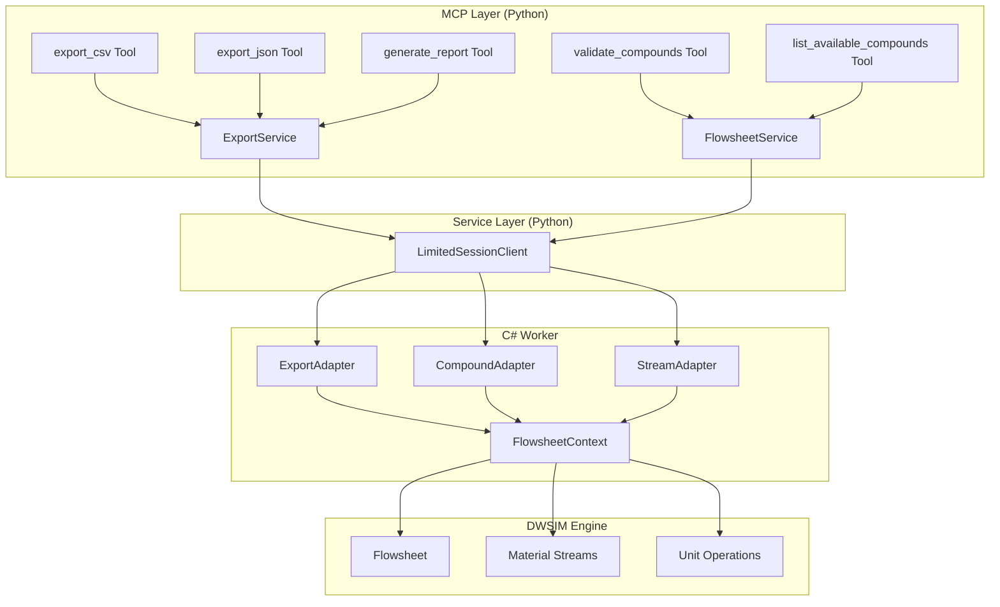

# Design Document: MCP Export Tools and LLM Usability Improvements

## Overview

This design document specifies the technical implementation for export tools (CSV, JSON, reports) and LLM usability improvements (compound validation, auto-composition, alias support) in the DWSIM MCP Server. The implementation follows the established patterns in the codebase, extending the existing tool/service/adapter architecture.

The design addresses two categories of features:
1. **Export & Reporting**: Tools for persisting and sharing simulation results
2. **LLM Usability**: Improvements to reduce friction when LLM agents build flowsheets

## Steering Document Alignment

### Technical Standards (tech.md)

- **Python MCP Server**: New tools follow existing `build_*_tools()` pattern in `tools/` directory
- **Pydantic Models**: All inputs/outputs use typed BaseModel subclasses with validators
- **pythonnet Interop**: Export functionality leverages existing C# adapters via `FlowsheetService`
- **Structured Logging**: All operations logged via structlog with session context
- **Error Handling**: Uses `SessionError` model with machine-readable codes

### Project Structure (structure.md)

New files follow established conventions:
```
models/mcp_inputs/
├── export_inputs.py          # New: Export tool input/output models
├── compound_validation.py    # New: Compound validation models

mcp_service/server/dwsim_mcp_server/
├── tools/
│   └── export.py             # New: Export tool builders and handlers
├── service/
│   └── export_service.py     # New: Export service layer (optional)

mcp_service/dwsim_worker/DwsimWorker/
├── Adapters/
│   ├── CompoundAdapter.cs    # Modified: Add validation, aliases, listing
│   ├── StreamAdapter.cs      # Modified: Auto-composition for outlets
│   └── ExportAdapter.cs      # New: Export functionality
```

## Code Reuse Analysis

### Existing Components to Leverage

- **`CompoundAdapter`**: Extend with alias mapping, fuzzy matching, and listing methods
- **`StreamAdapter`**: Modify `AddStream` to auto-generate composition when `is_source=false`
- **`FlowsheetService`**: Add export methods following existing service pattern
- **`SessionError`**: Reuse for all error responses
- **`FlowsheetContext`**: Access flowsheet state for export operations
- **Pydantic validators**: Follow patterns in `flowsheet_build.py` for composition validation

### Integration Points

- **MCP Tool Registry**: Register new tools via `build_export_tools()`
- **Tool Dispatcher**: Add `handle_export_tool()` to route export tool calls
- **Session Management**: Export operations are session-scoped
- **File Sandboxing**: Leverage existing path validation patterns

## Architecture

The export tools integrate into the existing layered architecture:



### Modular Design Principles

- **Single File Responsibility**: Each tool category (export, compound validation) in separate file
- **Component Isolation**: ExportAdapter handles only export logic; CompoundAdapter handles only compound logic
- **Service Layer Separation**: Python service orchestrates C# adapter calls; adapters perform DWSIM operations
- **Utility Modularity**: Alias mapping and fuzzy matching as separate utility classes in C#

## Components and Interfaces

### Component 1: Export Input/Output Models

**Purpose:** Define typed Pydantic models for export tool inputs and outputs

**Location:** `models/mcp_inputs/export_inputs.py`

**Interfaces:**
```python
class ExportCsvInput(BaseModel):
    session_id: str = Field(..., min_length=1)
    file_path: str = Field(..., min_length=1)
    object_ids: Optional[List[str]] = None

class ExportCsvOutput(BaseModel):
    file_path: str
    rows_exported: int
    objects_exported: List[str]

class ExportJsonInput(BaseModel):
    session_id: str = Field(..., min_length=1)
    format: Literal["summary", "full"] = "full"

class ExportJsonOutput(BaseModel):
    session_id: str
    export_timestamp: datetime
    dwsim_version: str
    property_package: str
    flowsheet: Dict[str, Any]

class GenerateReportInput(BaseModel):
    session_id: str = Field(..., min_length=1)
    template: Literal["markdown", "html"] = "markdown"
    file_path: Optional[str] = None

class GenerateReportOutput(BaseModel):
    file_path: Optional[str]
    content: Optional[str]
    format: str

class SaveCaseInput(BaseModel):
    session_id: str = Field(..., min_length=1)
    file_path: str = Field(..., min_length=1)

    @field_validator("file_path")
    @classmethod
    def validate_extension(cls, v: str) -> str:
        if not v.endswith((".dwxmz", ".dwxml")):
            raise ValueError("file_path must end with .dwxmz or .dwxml")
        return v

class SaveCaseOutput(BaseModel):
    file_path: str
    saved: bool
```

**Dependencies:** pydantic, typing
**Reuses:** Pattern from `flowsheet_build.py`

### Component 2: Compound Validation Models

**Purpose:** Define models for compound validation and listing

**Location:** `models/mcp_inputs/compound_validation.py`

**Interfaces:**
```python
class ValidateCompoundsInput(BaseModel):
    session_id: str = Field(..., min_length=1)
    compound_names: List[str] = Field(..., min_items=1)

class CompoundValidationResult(BaseModel):
    input_name: str
    valid: bool
    canonical_name: Optional[str] = None
    alias_used: Optional[str] = None
    suggestions: List[str] = []

class ValidateCompoundsOutput(BaseModel):
    results: List[CompoundValidationResult]
    all_valid: bool

class ListCompoundsInput(BaseModel):
    session_id: str = Field(..., min_length=1)
    pattern: Optional[str] = None
    category: Optional[str] = None
    limit: int = Field(default=100, ge=1, le=500)
    offset: int = Field(default=0, ge=0)

class CompoundInfo(BaseModel):
    name: str
    formula: Optional[str] = None
    molecular_weight: Optional[float] = None
    cas_number: Optional[str] = None
    category: Optional[str] = None

class ListCompoundsOutput(BaseModel):
    compounds: List[CompoundInfo]
    total_count: int
    has_more: bool
```

**Dependencies:** pydantic, typing
**Reuses:** Validation pattern from `flowsheet_build.py`

### Component 3: Export Tool Builders

**Purpose:** Register export MCP tools with the server

**Location:** `mcp_service/server/dwsim_mcp_server/tools/export.py`

**Interfaces:**
```python
def build_export_tools() -> list[types.Tool]:
    """Build and return all export-related MCP tools."""

async def handle_export_tool(
    tool_name: str,
    arguments: Dict[str, Any],
    dependencies: ToolDependencies
) -> Dict[str, Any]:
    """Handle export tool invocations."""
```

**Dependencies:** mcp.types, FlowsheetService
**Reuses:** Pattern from `tools/flowsheet.py`

### Component 4: CompoundAdapter Extensions (C#)

**Purpose:** Add compound validation, alias mapping, and listing to existing adapter

**Location:** `DwsimWorker/Adapters/CompoundAdapter.cs`

**New Methods:**
```csharp
public class CompoundAdapter
{
    // Existing...

    // New: Validate compounds with fuzzy matching
    public CompoundValidationResult ValidateCompound(string compoundName);

    // New: List available compounds with filtering
    public CompoundListResult ListCompounds(string pattern, string category, int limit, int offset);

    // New: Resolve alias to canonical name
    public string ResolveAlias(string alias);

    // New: Get fuzzy suggestions for unknown compound
    public List<string> GetSuggestions(string unknownCompound, int maxSuggestions = 5);
}
```

**Dependencies:** DWSIM.Thermodynamics, Serilog
**Reuses:** Existing `KnownCompounds` HashSet

### Component 5: StreamAdapter Auto-Composition (C#)

**Purpose:** Auto-generate placeholder composition for outlet streams

**Location:** `DwsimWorker/Adapters/StreamAdapter.cs`

**Modified Method:**
```csharp
public AddStreamResult AddStream(
    string name,
    double? temperature,
    double? pressure,
    double? molarFlow,
    double? massFlow,
    Dictionary<string, double> composition,  // Now nullable for outlets
    bool isSource,
    string phaseHint)
{
    // If isSource=false and composition is null/empty:
    //   1. Get compounds from context
    //   2. Generate equal mole fractions
    //   3. Use as placeholder
}
```

**Dependencies:** FlowsheetContext
**Reuses:** Existing stream creation logic

### Component 6: ExportAdapter (C#)

**Purpose:** Handle export operations (CSV, JSON, report, save)

**Location:** `DwsimWorker/Adapters/ExportAdapter.cs` (New)

**Interfaces:**
```csharp
public sealed class ExportAdapter
{
    public ExportAdapter(ILogger logger, FlowsheetContext context);

    // Export to CSV
    public ExportCsvResult ExportToCsv(string filePath, List<string> objectIds);

    // Export to JSON
    public ExportJsonResult ExportToJson(string format);

    // Generate report
    public GenerateReportResult GenerateReport(string template, string filePath);

    // Save case to DWSIM format
    public SaveCaseResult SaveCase(string filePath);
}
```

**Dependencies:** FlowsheetContext, DWSIM.Flowsheet, Newtonsoft.Json
**Reuses:** FlowsheetContext for accessing streams/units

### Component 7: Alias Mapping Utility (C#)

**Purpose:** Map common compound aliases to DWSIM canonical names

**Location:** `DwsimWorker/Utilities/CompoundAliasMapper.cs` (New)

**Interfaces:**
```csharp
public static class CompoundAliasMapper
{
    // Dictionary of alias -> canonical name
    private static readonly Dictionary<string, string> Aliases;

    public static bool TryResolveAlias(string input, out string canonicalName);
    public static IEnumerable<string> GetAliasesFor(string canonicalName);
}
```

**Alias Mappings:**
| Aliases | Canonical Name |
|---------|---------------|
| isobutane, i-butane, i-C4, iC4, 2-methylpropane | Isobutane |
| isopentane, i-pentane, i-C5, iC5, 2-methylbutane | Isopentane |
| CO2, co2, carbon-dioxide | Carbon Dioxide |
| N2, n2 | Nitrogen |
| H2O, h2o | Water |
| H2S, h2s, hydrogen-sulfide | Hydrogen Sulfide |
| nC4, n-C4, normal-butane | n-Butane |
| nC5, n-C5, normal-pentane | n-Pentane |
| nC6, n-C6, normal-hexane | n-Hexane |

**Dependencies:** None (pure static utility)

### Component 8: Fuzzy Matching Utility (C#)

**Purpose:** Find similar compound names using edit distance

**Location:** `DwsimWorker/Utilities/FuzzyMatcher.cs` (New)

**Interfaces:**
```csharp
public static class FuzzyMatcher
{
    // Levenshtein distance-based matching
    public static List<string> FindSimilar(
        string input,
        IEnumerable<string> candidates,
        int maxResults = 5,
        int maxDistance = 3);
}
```

**Dependencies:** None (pure algorithm)

## Data Models

### Export Result Models (C#)

```csharp
public record ExportCsvResult(
    bool Success,
    string FilePath,
    int RowsExported,
    List<string> ObjectsExported,
    string ErrorMessage = null);

public record ExportJsonResult(
    bool Success,
    string JsonContent,
    string ErrorMessage = null);

public record GenerateReportResult(
    bool Success,
    string Content,
    string FilePath,
    string Format,
    string ErrorMessage = null);

public record SaveCaseResult(
    bool Success,
    string FilePath,
    string ErrorMessage = null);

public record CompoundValidationResult(
    string InputName,
    bool Valid,
    string CanonicalName,
    string AliasUsed,
    List<string> Suggestions);

public record CompoundListResult(
    List<CompoundInfo> Compounds,
    int TotalCount,
    bool HasMore);

public record CompoundInfo(
    string Name,
    string Formula,
    double? MolecularWeight,
    string CasNumber,
    string Category);
```

### CSV Export Format

Stream properties exported as rows:
```csv
ObjectId,ObjectType,Name,Temperature_K,Pressure_Pa,MolarFlow_mol_s,MassFlow_kg_s,VaporFraction,Phase,...
S1,MaterialStream,Feed,350.0,4500000,1000.0,21.38,0.858,TwoPhase,...
S2,MaterialStream,Vapor Out,350.0,4500000,858.1,18.82,1.0,Vapor,...
```

### JSON Export Format (Summary)

```json
{
  "session_id": "abc-123",
  "export_timestamp": "2026-01-23T14:30:00Z",
  "dwsim_version": "8.6.0",
  "property_package": "Peng-Robinson",
  "compounds": ["Methane", "Ethane", "Water"],
  "streams": {
    "S1": {
      "name": "Feed",
      "temperature_k": 350.0,
      "pressure_pa": 4500000,
      "molar_flow_mol_s": 1000.0,
      "vapor_fraction": 0.858,
      "composition": {"Methane": 0.667, "Ethane": 0.183, "Water": 0.15}
    }
  },
  "units": {
    "U1": {
      "name": "HP Separator",
      "type": "ThreePhaseSeparator",
      "inlet": "S1",
      "outlets": ["S2", "S3", "S4"]
    }
  },
  "convergence": {
    "status": "converged",
    "iterations": 12,
    "mass_balance_error_percent": 0.0001
  }
}
```

### Report Format (Markdown)

```markdown
# Simulation Report

**Session ID:** abc-123
**Generated:** 2026-01-23 14:30:00
**Property Package:** Peng-Robinson

## Feed Streams

| Stream | T (K) | P (Pa) | Flow (mol/s) | Vapor Fraction |
|--------|-------|--------|--------------|----------------|
| Feed   | 350.0 | 4.5e6  | 1000.0       | 0.858          |

## Product Streams

| Stream    | T (K) | P (Pa) | Flow (mol/s) | Phase  |
|-----------|-------|--------|--------------|--------|
| Vapor Out | 350.0 | 4.5e6  | 858.1        | Vapor  |
| Water Out | 350.0 | 4.5e6  | 141.9        | Liquid |

## Mass Balance

| Component | In (mol/s) | Out (mol/s) | Error (%) |
|-----------|------------|-------------|-----------|
| Methane   | 667.0      | 667.0       | 0.00      |
| ...       | ...        | ...         | ...       |

## Convergence Status

**Status:** Converged
**Mass Balance Error:** < 0.01%
```

## Error Handling

### Error Scenarios

1. **Invalid File Path (Directory Traversal)**
   - **Code:** `PATH_VIOLATION`
   - **Handling:** Validate path against allowed roots before any I/O
   - **User Impact:** "File path must be within allowed directories. Attempted: {path}"

2. **Compound Not Found**
   - **Code:** `COMPOUND_NOT_FOUND`
   - **Handling:** Run fuzzy matching, return suggestions
   - **User Impact:** "Compound 'methne' not found. Did you mean: Methane, Methanol?"

3. **Session Not Found**
   - **Code:** `SESSION_NOT_FOUND`
   - **Handling:** Check session registry before operation
   - **User Impact:** "Session '{id}' not found. Create a session first."

4. **No Compounds in Session (Auto-Composition)**
   - **Code:** `NO_COMPOUNDS`
   - **Handling:** Return error if creating outlet with no compounds registered
   - **User Impact:** "Cannot create outlet stream: no compounds in session. Add compounds first."

5. **Save Case Failed**
   - **Code:** `SAVE_FAILED`
   - **Handling:** Catch DWSIM save exceptions, return descriptive message
   - **User Impact:** "Failed to save case: {dwsim_error_message}"

6. **Export Failed (Partial)**
   - **Code:** `PARTIAL_EXPORT`
   - **Handling:** Continue with valid objects, report failures
   - **User Impact:** "Exported 8/10 objects. Failed: S3 (not calculated), U2 (missing properties)"

## Testing Strategy

### Unit Testing

**Python (pytest):**
- Test Pydantic model validation (valid/invalid inputs)
- Test tool handler dispatch with mock service
- Test error code generation for each failure case
- Test alias resolution mapping

**C# (xUnit):**
- Test `CompoundAliasMapper.TryResolveAlias()` for all alias mappings
- Test `FuzzyMatcher.FindSimilar()` with known edit distances
- Test `ExportAdapter` methods with mock FlowsheetContext
- Test auto-composition generation in `StreamAdapter`

### Integration Testing

- **Export CSV**: Create session, add streams, run simulation, export to CSV, verify file contents
- **Export JSON**: Create session, export JSON, verify structure and values
- **Compound Validation**: Test various aliases and typos, verify suggestions
- **Auto-Composition**: Create outlet stream without composition, verify placeholder generated
- **Save Case**: Create session, build flowsheet, save to .dwxmz, reload in new session

### End-to-End Testing

- **LLM Workflow Simulation**:
  1. Create session
  2. Validate and add compounds (including aliases)
  3. Create feed stream with composition
  4. Create outlet streams (auto-composition)
  5. Add separator, connect streams
  6. Run simulation
  7. Export results to CSV and JSON
  8. Generate Markdown report
  9. Save case

- **Error Recovery**:
  1. Attempt invalid compound → verify suggestions
  2. Attempt path traversal → verify rejection
  3. Export before simulation → verify warning
