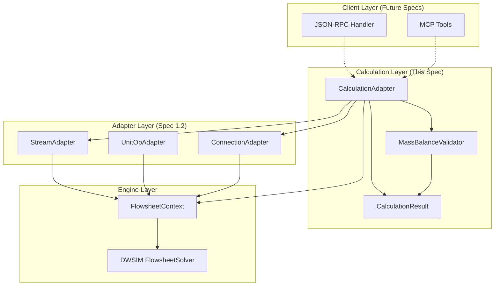
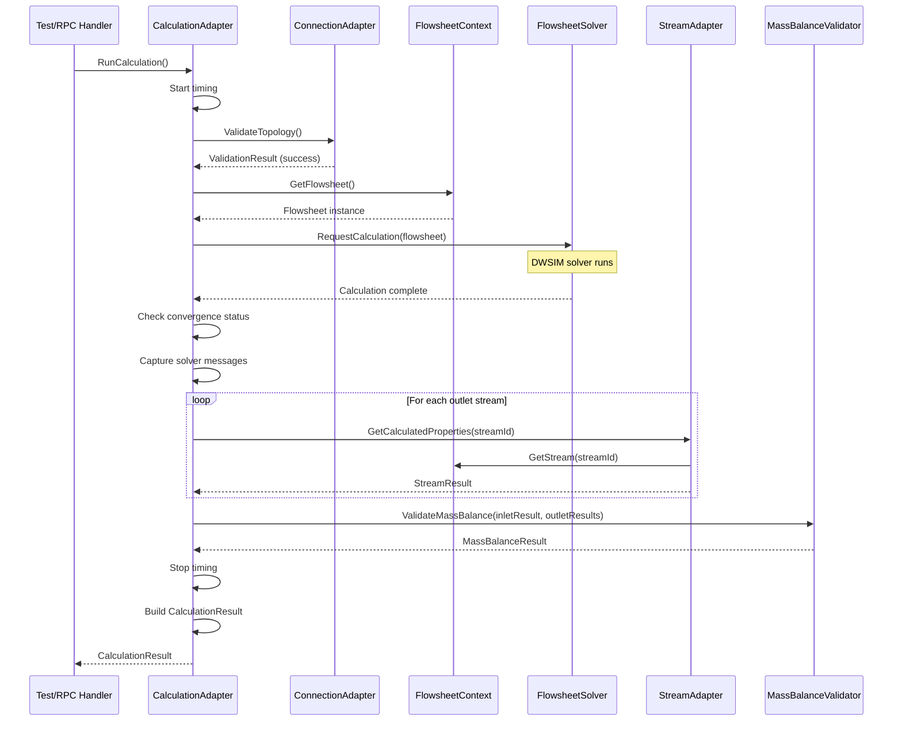

# Design Document

## Overview

This design document describes the implementation approach for Spec 1.3 (three-phase-separator-calculation), which builds calculation execution capabilities on top of the property-setting infrastructure established in Spec 1.2 (three-phase-separator-properties).

The implementation introduces a **CalculationAdapter** that wraps DWSIM's flowsheet solver, providing a clean interface for invoking calculations, handling convergence, and extracting results. It also introduces a **MassBalanceValidator** for verifying that simulation results satisfy fundamental conservation laws, and a comprehensive **CalculationResult** model that encapsulates all outputs from a calculation.

The design follows the established patterns from Specs 1.1 and 1.2: one file per class, dependency injection with Serilog logging, immutable result objects, result-based error handling, and comprehensive unit/integration testing.

## Steering Document Alignment

### Technical Standards (tech.md)

This design adheres to the technical standards documented in tech.md:

1. **Polyglot Architecture**: Continues building the .NET Framework 4.8 engine worker that will communicate with the Python MCP server via JSON-RPC (future specs).

2. **CAPE-OPEN as Domain Model**: Result extraction uses CAPE-OPEN interfaces where possible:
   - `ICapeThermoMaterialObject.GetProp()` for retrieving calculated stream properties
   - Standard CAPE-OPEN property names: "temperature", "pressure", "totalFlow", "phaseFraction"
   - Phase identifiers following CAPE-OPEN conventions

3. **Dependency Inversion**: CalculationAdapter depends on abstractions (ILogger, FlowsheetContext interface). Validators are injected, not instantiated directly.

4. **Layered Architecture**:
   ```
   Calculation Layer (new)        ← CalculationAdapter, MassBalanceValidator
   ↓
   Adapters Layer (existing)      ← StreamAdapter, UnitOpAdapter, ConnectionAdapter
   ↓
   Engine Layer (existing)        ← FlowsheetContext, AssemblyLoader
   ↓
   DWSIM Engine (external)        ← DWSIM.FlowsheetSolver, DWSIM.SharedClasses
   ```

5. **Session-Based Isolation (future)**: The design operates on a FlowsheetContext object that will later be managed by SessionManager (Spec 2.2).

6. **Technology Stack Compliance**:
   - .NET Framework 4.8
   - Serilog for logging
   - xUnit for testing
   - Follows C# naming conventions

### Project Structure (structure.md)

The implementation follows the project structure conventions:

1. **One File Per Class**: Each adapter, model, validator, and result type is in its own file.

2. **Directory Organization**:
   ```
   DwsimWorker/
   ├── Engine/
   │   ├── FlowsheetContext.cs (existing)
   │   └── FlowsheetContextConfig.cs (existing)
   ├── Adapters/
   │   ├── FlowsheetAdapter.cs (existing)
   │   ├── StreamAdapter.cs (existing, extended)
   │   ├── UnitOpAdapter.cs (existing)
   │   ├── ConnectionAdapter.cs (existing)
   │   └── CalculationAdapter.cs (new)
   ├── Models/
   │   ├── StreamProperties.cs (existing)
   │   ├── Composition.cs (existing)
   │   ├── CalculationResult.cs (new)
   │   ├── ConvergenceStatus.cs (new)
   │   ├── StreamResult.cs (new)
   │   ├── CalculationTiming.cs (new)
   │   └── SolverMessage.cs (new)
   ├── Validators/ (new folder)
   │   └── MassBalanceValidator.cs (new)
   ├── Converters/
   │   └── CapeOpenPropertyConverter.cs (existing)
   └── Exceptions/
       ├── CalculationException.cs (new)
       └── ConvergenceException.cs (new)
   ```

3. **Namespace Structure**:
   - `DwsimWorker.Adapters`: CalculationAdapter
   - `DwsimWorker.Models`: CalculationResult, ConvergenceStatus, StreamResult, CalculationTiming
   - `DwsimWorker.Validators`: MassBalanceValidator
   - `DwsimWorker.Exceptions`: CalculationException, ConvergenceException

4. **Testing Organization**:
   ```
   DwsimWorker.Tests/
   ├── Adapters/
   │   └── CalculationAdapterTests.cs (new)
   ├── Validators/
   │   └── MassBalanceValidatorTests.cs (new)
   ├── Integration/
   │   ├── ThreePhaseSeparatorCalculationTests.cs (new - golden test)
   │   └── ConvergenceScenarioTests.cs (new)
   └── Performance/
       └── CalculationPerformanceTests.cs (new)
   ```

## Code Reuse Analysis

### Existing Components to Leverage

The implementation builds directly on infrastructure from Specs 1.1 and 1.2:

1. **FlowsheetContext** (`Engine/FlowsheetContext.cs`):
   - **How it will be used**: CalculationAdapter receives FlowsheetContext and accesses the DWSIM Flowsheet object to invoke the solver.
   - **Methods used**: `GetFlowsheet()`, `GetStream()`, `GetUnit()`, `GetConnections()`

2. **StreamAdapter** (`Adapters/StreamAdapter.cs`):
   - **How it will be extended**: Add methods for extracting calculated properties from streams after solver runs.
   - **New methods**: `GetCalculatedProperties(streamId)` - retrieves properties including phase information after calculation.

3. **ConnectionAdapter** (`Adapters/ConnectionAdapter.cs`):
   - **How it will be used**: Validate flowsheet topology before calculation via `ValidateTopology()`.

4. **PropertySetResult** (`Engine/PropertySetResult.cs`):
   - **How it will be extended**: CalculationResult follows the same factory method pattern.

5. **StreamProperties** (`Models/StreamProperties.cs`):
   - **How it will be used**: Used as base for StreamResult which adds phase-specific information.

6. **Logging Infrastructure** (Serilog):
   - **How it will be used**: All new classes accept `ILogger` via constructor. Structured logging for calculation events: `logger.Information("calculation_started", flowsheetId=..., unitCount=...)`.

7. **Exception Pattern** (`DwsimException` hierarchy):
   - **How it will be extended**: Add `CalculationException` and `ConvergenceException` to the hierarchy.

### Integration Points

1. **DWSIM Solver API**:
   - `DWSIM.FlowsheetSolver.FlowsheetSolver` - Main solver class
   - `Flowsheet.RequestCalculation()` or equivalent method to trigger calculation
   - `Flowsheet.Solved` / `Flowsheet.ErrorMessage` for status
   - `UnitOperation.Calculated` property to check calculation state

2. **DWSIM Stream API**:
   - `MaterialStream.GetPhase()` - Access phase-specific properties
   - `MaterialStream.Phases` collection - Iterate over calculated phases
   - Phase identifiers: "Vapor", "Liquid1", "Liquid2", "Overall"

3. **Future RPC Integration** (Spec 3.x):
   - `simulation.run` JSON-RPC method will call `CalculationAdapter.RunCalculation()`
   - `simulation.get_results` will call result extraction methods
   - `simulation.get_status` will use ConvergenceStatus

4. **Future MCP Tools** (Spec 5.x):
   - `run` MCP tool → `CalculationAdapter.RunCalculation()`
   - `get_results` MCP tool → `CalculationAdapter.GetResults()`
   - `get_status` MCP tool → `CalculationAdapter.GetConvergenceStatus()`

## Architecture

### Modular Design Principles

1. **Single File Responsibility**: Each file handles one specific concern:
   - `CalculationAdapter.cs`: Solver invocation and orchestration
   - `MassBalanceValidator.cs`: Mass balance checking only
   - `CalculationResult.cs`: Calculation output data model
   - `StreamResult.cs`: Per-stream result data

2. **Component Isolation**: Components are independent:
   - CalculationAdapter uses StreamAdapter for property extraction but doesn't depend on its internals
   - MassBalanceValidator is stateless and receives data, not adapters
   - Result models are pure data with no behavior beyond validation

3. **Service Layer Separation**:
   - **Models**: Data classes (CalculationResult, StreamResult, CalculationTiming)
   - **Adapters**: Business logic for DWSIM operations (CalculationAdapter)
   - **Validators**: Validation logic (MassBalanceValidator)

### Architecture Diagram



### Data Flow: Calculation Execution



## Components and Interfaces

### Component 1: CalculationAdapter

- **Purpose**: Orchestrates flowsheet calculation execution, captures convergence status, extracts results, and validates outputs.

- **Interfaces**:
  ```csharp
  public sealed class CalculationAdapter
  {
      public CalculationAdapter(
          ILogger logger,
          FlowsheetContext context,
          StreamAdapter streamAdapter,
          ConnectionAdapter connectionAdapter,
          MassBalanceValidator massBalanceValidator);

      // Main calculation method
      public CalculationResult RunCalculation();

      // Run calculation with timeout
      public CalculationResult RunCalculation(TimeSpan timeout);

      // Get convergence status (can be called during or after calculation)
      public ConvergenceStatus GetConvergenceStatus();

      // Get results for specific stream
      public Result<StreamResult> GetStreamResult(string streamId);

      // Get results for all outlet streams
      public Result<IReadOnlyList<StreamResult>> GetAllStreamResults();

      // Get separator-specific metrics
      public Result<IDictionary<string, object>> GetUnitMetrics(string unitId);
  }
  ```

- **Dependencies**: FlowsheetContext, StreamAdapter, ConnectionAdapter, MassBalanceValidator, ILogger

- **Reuses**: FlowsheetContext for flowsheet access, StreamAdapter for property extraction, ConnectionAdapter for topology validation

### Component 2: MassBalanceValidator

- **Purpose**: Validates that simulation results satisfy mass conservation laws.

- **Interfaces**:
  ```csharp
  public sealed class MassBalanceValidator
  {
      public MassBalanceValidator(ILogger logger);

      // Validate overall mass balance
      public MassBalanceResult ValidateMassBalance(
          StreamResult inlet,
          IReadOnlyList<StreamResult> outlets);

      // Validate per-component mass balance
      public ComponentMassBalanceResult ValidateComponentMassBalance(
          StreamResult inlet,
          IReadOnlyList<StreamResult> outlets,
          IReadOnlyList<string> compounds);

      // Configurable tolerance (default 1%)
      public double Tolerance { get; set; }
  }
  ```

- **Dependencies**: ILogger only (stateless validator)

- **Reuses**: None (new component)

### Component 3: StreamAdapter Extension

- **Purpose**: Extend existing StreamAdapter with methods for extracting calculated properties including phase information.

- **New Methods**:
  ```csharp
  // Added to existing StreamAdapter class
  public sealed partial class StreamAdapter
  {
      // Get calculated properties after solver run
      public Result<StreamResult> GetCalculatedProperties(string streamId);

      // Get phase-specific properties
      public Result<PhaseProperties> GetPhaseProperties(string streamId, string phaseName);

      // Get all phase results for a stream
      public Result<IReadOnlyDictionary<string, PhaseProperties>> GetAllPhaseProperties(string streamId);
  }
  ```

- **Dependencies**: FlowsheetContext, ILogger (existing)

## Data Models

### Model 1: CalculationResult

The main result object encapsulating all calculation outputs.

```csharp
public sealed class CalculationResult
{
    // Overall status
    public bool Success { get; }
    public ConvergenceStatus ConvergenceStatus { get; }
    public string Message { get; }

    // Timing information
    public CalculationTiming Timing { get; }

    // Stream results (keyed by stream ID)
    public IReadOnlyDictionary<string, StreamResult> StreamResults { get; }

    // Mass balance validation
    public MassBalanceResult MassBalance { get; }

    // Solver messages (info, warnings, errors)
    public IReadOnlyList<SolverMessage> Messages { get; }

    // Exception if error occurred
    public Exception Error { get; }

    // Factory methods
    public static CalculationResult SuccessResult(
        ConvergenceStatus status,
        CalculationTiming timing,
        IDictionary<string, StreamResult> streamResults,
        MassBalanceResult massBalance,
        IList<SolverMessage> messages);

    public static CalculationResult FailureResult(
        string message,
        ConvergenceStatus status,
        CalculationTiming timing,
        IList<SolverMessage> messages,
        Exception error = null);

    public static CalculationResult NotConvergedResult(
        ConvergenceStatus status,
        CalculationTiming timing,
        IList<SolverMessage> messages);
}
```

### Model 2: ConvergenceStatus

Represents the solver convergence state.

```csharp
public sealed class ConvergenceStatus
{
    // Status enumeration
    public ConvergenceState State { get; }

    // Detailed message from solver
    public string Message { get; }

    // Number of iterations (if available)
    public int? Iterations { get; }

    // Residual error (if available)
    public double? ResidualError { get; }

    // Per-unit convergence status
    public IReadOnlyDictionary<string, bool> UnitConvergence { get; }

    // Constructor
    public ConvergenceStatus(
        ConvergenceState state,
        string message,
        int? iterations = null,
        double? residualError = null,
        IDictionary<string, bool> unitConvergence = null);
}

public enum ConvergenceState
{
    NotStarted,
    InProgress,
    Converged,
    NotConverged,
    Error
}
```

### Model 3: StreamResult

Represents calculated properties for a single stream.

```csharp
public sealed class StreamResult
{
    // Stream identification
    public string StreamId { get; }
    public string StreamName { get; }

    // Overall properties
    public double TemperatureK { get; }
    public double PressurePa { get; }
    public double MolarFlowMolPerSec { get; }
    public double MassFlowKgPerSec { get; }

    // Composition (overall)
    public Composition OverallComposition { get; }

    // Phase fractions
    public double VaporFraction { get; }
    public double LiquidFraction { get; }

    // Phase-specific results (keyed by phase name: "Vapor", "Liquid1", "Liquid2")
    public IReadOnlyDictionary<string, PhaseProperties> Phases { get; }

    // Constructor
    public StreamResult(
        string streamId,
        string streamName,
        double temperatureK,
        double pressurePa,
        double molarFlowMolPerSec,
        double massFlowKgPerSec,
        Composition overallComposition,
        double vaporFraction,
        double liquidFraction,
        IDictionary<string, PhaseProperties> phases);
}
```

### Model 4: PhaseProperties

Properties for a specific phase within a stream.

```csharp
public sealed class PhaseProperties
{
    // Phase identification
    public string PhaseName { get; }

    // Phase properties
    public double MolarFlowMolPerSec { get; }
    public double MassFlowKgPerSec { get; }
    public double PhaseFraction { get; }

    // Phase composition
    public Composition Composition { get; }

    // Physical properties
    public double? DensityKgPerM3 { get; }
    public double? ViscosityPaS { get; }
    public double? MolecularWeightKgPerKmol { get; }

    // Constructor
    public PhaseProperties(
        string phaseName,
        double molarFlowMolPerSec,
        double massFlowKgPerSec,
        double phaseFraction,
        Composition composition,
        double? densityKgPerM3 = null,
        double? viscosityPaS = null,
        double? molecularWeightKgPerKmol = null);
}
```

### Model 5: CalculationTiming

Timing information for calculation performance.

```csharp
public sealed class CalculationTiming
{
    // Total wall-clock time
    public TimeSpan TotalTime { get; }

    // Breakdown (may be approximate)
    public TimeSpan? InitializationTime { get; }
    public TimeSpan? SolverTime { get; }
    public TimeSpan? ResultExtractionTime { get; }

    // Timestamps
    public DateTime StartedAt { get; }
    public DateTime CompletedAt { get; }

    // Constructor
    public CalculationTiming(
        TimeSpan totalTime,
        DateTime startedAt,
        DateTime completedAt,
        TimeSpan? initializationTime = null,
        TimeSpan? solverTime = null,
        TimeSpan? resultExtractionTime = null);

    // Total milliseconds (convenience)
    public long TotalMilliseconds => (long)TotalTime.TotalMilliseconds;
}
```

### Model 6: MassBalanceResult

Results of mass balance validation.

```csharp
public sealed class MassBalanceResult
{
    // Overall status
    public bool IsValid { get; }

    // Total flows
    public double InletMolarFlow { get; }
    public double OutletMolarFlow { get; }
    public double AbsoluteError { get; }
    public double RelativeErrorPercent { get; }

    // Per-component results (optional)
    public IReadOnlyDictionary<string, ComponentMassBalance> ComponentBalances { get; }

    // Tolerance used
    public double TolerancePercent { get; }

    // Factory methods
    public static MassBalanceResult Valid(
        double inletFlow,
        double outletFlow,
        double tolerancePercent,
        IDictionary<string, ComponentMassBalance> componentBalances = null);

    public static MassBalanceResult Invalid(
        double inletFlow,
        double outletFlow,
        double tolerancePercent,
        IDictionary<string, ComponentMassBalance> componentBalances = null);
}

public sealed class ComponentMassBalance
{
    public string CompoundName { get; }
    public double InletMoles { get; }
    public double OutletMoles { get; }
    public double RelativeErrorPercent { get; }
    public bool IsValid { get; }
}
```

### Model 7: SolverMessage

Represents a message from the solver.

```csharp
public sealed class SolverMessage
{
    public SolverMessageLevel Level { get; }
    public string Message { get; }
    public string Source { get; }  // Unit operation or solver component
    public DateTime Timestamp { get; }

    public SolverMessage(
        SolverMessageLevel level,
        string message,
        string source = null,
        DateTime? timestamp = null);
}

public enum SolverMessageLevel
{
    Debug,
    Info,
    Warning,
    Error
}
```

## Error Handling

### Error Scenarios

1. **Scenario: Flowsheet not properly configured (missing connections)**
   - **Handling**: CalculationAdapter calls ConnectionAdapter.ValidateTopology() before calculation. If invalid, returns CalculationResult.FailureResult() with descriptive message.
   - **User Impact**: Clear error indicating what's missing (e.g., "Stream S1 is not connected to any unit operation").

2. **Scenario: Property package not set**
   - **Handling**: CalculationAdapter checks for property package before calculation. Returns failure if not set.
   - **User Impact**: Error message: "No property package configured. Call PropertyPackageAdapter.SetPropertyPackage() first."

3. **Scenario: Solver fails to converge**
   - **Handling**: CalculationAdapter captures ConvergenceState.NotConverged, retrieves solver messages explaining why.
   - **User Impact**: CalculationResult with Success=false, ConvergenceStatus showing non-convergence, Messages containing solver diagnostics.

4. **Scenario: DWSIM solver throws exception**
   - **Handling**: CalculationAdapter catches exception, logs full details, returns CalculationResult.FailureResult() with error information.
   - **User Impact**: Error message with exception type and message. Stack trace logged but not returned to user.

5. **Scenario: Calculation times out**
   - **Handling**: CalculationAdapter uses CancellationToken with timeout. On timeout, attempts to abort solver and returns timeout error.
   - **User Impact**: Error message: "Calculation timed out after {timeout} seconds. Consider simplifying the flowsheet or increasing timeout."

6. **Scenario: Mass balance validation fails**
   - **Handling**: MassBalanceValidator returns MassBalanceResult.Invalid() with actual error percentage.
   - **User Impact**: CalculationResult includes MassBalance showing failed validation. This is a warning, not a failure - results are still returned.

7. **Scenario: Stream result extraction fails**
   - **Handling**: StreamAdapter.GetCalculatedProperties() returns failure result. CalculationAdapter includes partial results with error indication.
   - **User Impact**: Results include what could be extracted, with warnings for failed extractions.

8. **Scenario: Phase does not exist (e.g., no vapor phase)**
   - **Handling**: StreamResult includes only existing phases. Missing phases are simply not in the Phases dictionary.
   - **User Impact**: Normal behavior - not all streams have all phases. Zero flow phases may or may not be present depending on DWSIM behavior.

### Exception Hierarchy

```csharp
// New exceptions for Spec 1.3
public sealed class CalculationException : DwsimException
{
    public ConvergenceStatus ConvergenceStatus { get; }
    public IReadOnlyList<SolverMessage> Messages { get; }

    public CalculationException(
        string message,
        ConvergenceStatus convergenceStatus,
        IReadOnlyList<SolverMessage> messages,
        Exception innerException = null)
        : base(message, innerException)
    {
        ConvergenceStatus = convergenceStatus;
        Messages = messages;
    }
}

public sealed class CalculationTimeoutException : CalculationException
{
    public TimeSpan Timeout { get; }
    public TimeSpan ElapsedTime { get; }

    public CalculationTimeoutException(
        TimeSpan timeout,
        TimeSpan elapsedTime,
        ConvergenceStatus convergenceStatus,
        IReadOnlyList<SolverMessage> messages)
        : base($"Calculation timed out after {elapsedTime.TotalSeconds:F1} seconds (timeout: {timeout.TotalSeconds:F1}s)",
               convergenceStatus, messages)
    {
        Timeout = timeout;
        ElapsedTime = elapsedTime;
    }
}
```

## Testing Strategy

### Unit Testing

**Approach**: Test each component in isolation with mocked dependencies where appropriate.

**Test Organization** (following Spec 1.2 pattern):
- One test file per component
- Use xUnit framework with test fixtures
- Mock ILogger for all tests

**Key Components to Test**:

1. **CalculationAdapter**:
   - RunCalculation returns success for properly configured flowsheet
   - RunCalculation returns failure for invalid topology
   - RunCalculation respects timeout
   - GetConvergenceStatus returns correct state
   - GetStreamResult returns data for valid stream ID
   - GetStreamResult returns failure for invalid stream ID

2. **MassBalanceValidator**:
   - ValidateMassBalance returns valid for balanced flows (within tolerance)
   - ValidateMassBalance returns invalid for unbalanced flows
   - ValidateComponentMassBalance checks per-component balance
   - Tolerance is configurable and respected
   - Handles edge cases (zero flow, single component)

3. **StreamAdapter (extensions)**:
   - GetCalculatedProperties returns all properties after calculation
   - GetPhaseProperties returns correct phase data
   - Handles missing phases gracefully

4. **Data Models**:
   - CalculationResult factory methods create correct objects
   - ConvergenceStatus serializes/deserializes correctly
   - StreamResult validates composition
   - CalculationTiming calculates TotalMilliseconds correctly

### Integration Testing

**Approach**: Test the complete calculation workflow with real DWSIM assemblies.

**Key Flows to Test**:

1. **Golden Test: Three-Phase Separator Calculation**:
   - File: `ThreePhaseSeparatorCalculationTests.cs`
   - Setup: Use configuration from Spec 1.2 validation test
   - Execute: Run calculation via CalculationAdapter
   - Verify:
     - Convergence status is Converged
     - All outlet streams have results
     - Mass balance is valid (< 1% error)
     - Timing is reasonable (< 5 seconds)
     - No error messages
   - Golden values: Verify outlet flows and compositions are physically reasonable

2. **Convergence Scenarios**:
   - File: `ConvergenceScenarioTests.cs`
   - Test various scenarios that may affect convergence:
     - Standard case (should converge)
     - Extreme conditions (very high/low pressure - may not converge)
     - Edge compositions (pure component - should converge)

3. **Error Handling Integration**:
   - Invalid flowsheet (missing connections) returns clear error
   - Missing property package returns clear error
   - Timeout handling works correctly

### End-to-End Testing

**Approach**: Validate performance and full workflow under realistic conditions.

**Performance Testing** (`CalculationPerformanceTests.cs`):
- Measure calculation time for standard three-phase separator
- Target: < 5 seconds total
- Measure result extraction time separately
- Target: < 500 ms for all streams
- Memory profiling: No leaks after calculation

**User Scenarios**:
1. **Typical Workflow**: Configure separator (Spec 1.2) → Calculate → Extract results → Validate mass balance
2. **Retry After Failure**: Attempt calculation → Fix issue → Retry → Success
3. **Multiple Calculations**: Run calculation → Modify parameters → Recalculate

**Test Coverage Goals**:
- CalculationAdapter: > 85% line coverage
- MassBalanceValidator: > 90% line coverage
- Integration tests: Cover all 7 requirements from requirements.md

## Implementation Notes

### DWSIM Solver Integration

The CalculationAdapter will use DWSIM's solver API:

```csharp
// Typical solver invocation pattern (actual API may vary)
var flowsheet = _context.GetFlowsheet();

// Option 1: Direct solver call
var solver = new DWSIM.FlowsheetSolver.FlowsheetSolver();
solver.SolveFlowsheet(flowsheet);

// Option 2: Flowsheet method
flowsheet.RequestCalculation();

// Check convergence
bool converged = flowsheet.Solved;
string errorMessage = flowsheet.ErrorMessage;
```

### Phase Property Extraction

DWSIM stores phase-specific properties in the MaterialStream.Phases collection:

```csharp
// Phase names in DWSIM
const string OVERALL_PHASE = "0";   // Overall/mixed
const string VAPOR_PHASE = "2";     // Vapor
const string LIQUID1_PHASE = "3";   // Liquid 1 (light)
const string LIQUID2_PHASE = "4";   // Liquid 2 (heavy/water)

// Access phase properties
var stream = (MaterialStream)_context.GetStream(streamId);
var vaporPhase = stream.Phases[VAPOR_PHASE];
var molarFlow = vaporPhase.Properties.molarflow.GetValueOrDefault();
```

### Timeout Implementation

Use CancellationTokenSource with timeout:

```csharp
public CalculationResult RunCalculation(TimeSpan timeout)
{
    using var cts = new CancellationTokenSource(timeout);
    var stopwatch = Stopwatch.StartNew();

    try
    {
        // Run calculation (may need to be on separate thread for cancellation)
        var task = Task.Run(() => ExecuteCalculation(), cts.Token);
        task.Wait(cts.Token);
        return task.Result;
    }
    catch (OperationCanceledException)
    {
        return CalculationResult.FailureResult(
            $"Calculation timed out after {stopwatch.Elapsed.TotalSeconds:F1} seconds",
            ConvergenceStatus.TimedOut(...),
            _timing,
            _messages);
    }
}
```

### Logging Strategy

All operations log at appropriate levels:
- **Debug**: Detailed solver parameters, phase property values
- **Information**: Calculation start/complete, convergence status, timing
- **Warning**: Mass balance near tolerance, minor solver warnings
- **Error**: Calculation failures, exceptions, timeout

Structured logging format:
```csharp
_logger.Information("calculation_completed",
    flowsheetId: flowsheetId,
    converged: result.ConvergenceStatus.State == ConvergenceState.Converged,
    totalTimeMs: result.Timing.TotalMilliseconds,
    massBalanceErrorPct: result.MassBalance.RelativeErrorPercent);
```

### Thread Safety

Same as Spec 1.2:
- CalculationAdapter is **not thread-safe**
- Single-threaded usage assumed
- Future: Session-level locking in SessionManager (Spec 2.2)

## Dependencies

### New NuGet Packages

No new NuGet packages required beyond Spec 1.2 dependencies:
- Serilog (existing)
- xUnit (existing)
- DWSIM assemblies referenced locally

### DWSIM Assemblies Required

In addition to Spec 1.2 assemblies:
- `DWSIM.FlowsheetSolver.dll` - Flowsheet solver
- `DWSIM.MathOps.dll` - Mathematical operations (may be needed by solver)

## Success Criteria

This design is considered complete when:

1. **CalculationAdapter implemented**: Can invoke solver and capture results
2. **MassBalanceValidator implemented**: Can validate mass conservation
3. **All models defined**: CalculationResult, StreamResult, ConvergenceStatus, etc.
4. **StreamAdapter extended**: Can extract calculated properties including phases
5. **Unit tests pass**: > 85% coverage on new code
6. **Integration test passes**: Golden three-phase separator calculation completes successfully
7. **Performance targets met**: Calculation < 5 seconds, extraction < 500 ms
8. **Mass balance validated**: Results satisfy < 1% mass balance error
9. **Code review approved**: Adheres to structure.md conventions
